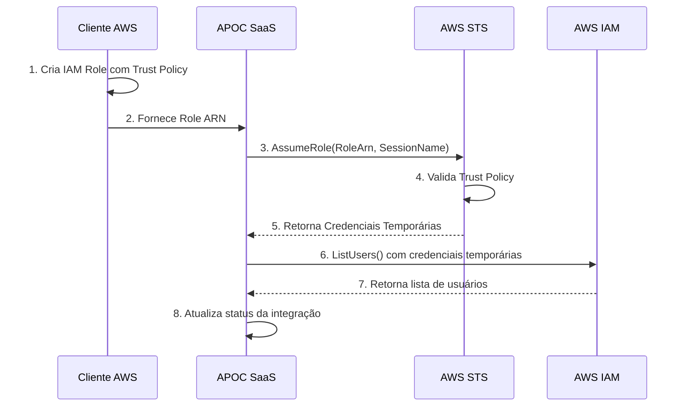
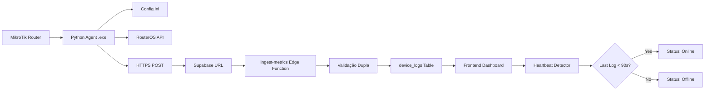
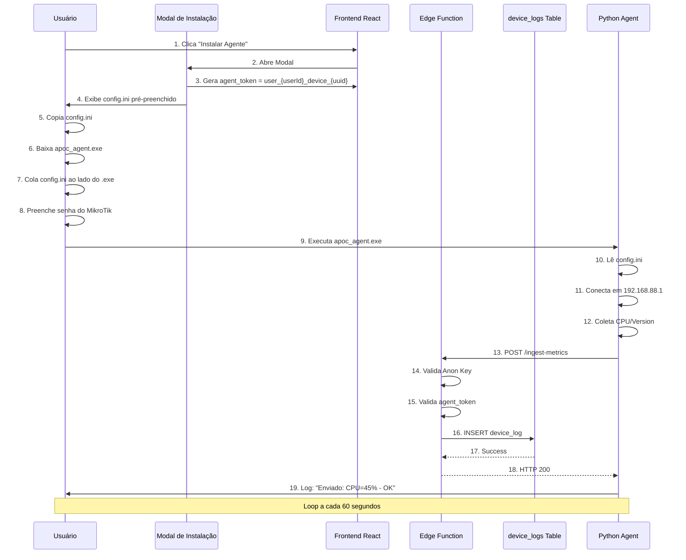

# INTEGRATIONS STATUS DOCUMENTATION

**Documento Técnico de Estado das Integrações - APOC MVP**

**Data de Geração:** 2025-01-28  
**Versão:** 1.0  
**Autor:** Tech Lead - Integrações

---

## 1. MATRIZ DE INTEGRAÇÕES (RESUMO EXECUTIVO)

| Integração | Tipo de Conexão | Status Atual | Nível de Segurança | Arquivos Principais |
|-----------|----------------|--------------|-------------------|-------------------|
| **Google Workspace** | OAuth 2.0 (Authorization Code + Refresh Token) | ✅ **PRODUÇÃO** | 🔒 **ALTO** | `google-oauth-start`, `google-oauth-callback`, `google-workspace-sync` |
| **Azure AD** | OAuth 2.0 (Client Credentials + Authorization Code) | ✅ **PRODUÇÃO** | 🔒 **ALTO** | `azure-oauth-start`, `azure-oauth-callback`, `azure-test-connection` |
| **AWS Cloud** | Cross-Account Role (STS AssumeRole) | ⚠️ **BETA** | 🔒 **MÉDIO** | `aws-integration`, `aws-test-connection` |
| **MikroTik (IoT Agent)** | HTTPS + Token Validation | ✅ **PRODUÇÃO** | 🔒 **ALTO** | `ingest-metrics`, `device_logs` table, Python Agent |

---

## 2. DETALHAMENTO TÉCNICO POR PROVEDOR

### 2.1 GOOGLE WORKSPACE

#### 🔐 Fluxo de Autenticação OAuth 2.0

**Edge Functions Envolvidas:**

1. **`google-oauth-start`** (Iniciação do Fluxo)
   - **Entrada:** Usuário clica em "Conectar Google Workspace"
   - **Processo:**
     - Gera `state` aleatório (32 bytes hex) para proteção CSRF
     - Codifica `state` com `userId`, `timestamp` e `random` em Base64
     - Constrói Authorization URL do Google: `https://accounts.google.com/o/oauth2/v2/auth`
     - Solicita `access_type=offline` e `prompt=consent` para garantir refresh token
   - **Saída:** URL de autorização retornada ao frontend
   - **Redirect URI:** `{SUPABASE_URL}/functions/v1/google-oauth-callback`

2. **`google-oauth-callback`** (Processamento de Código)
   - **Entrada:** Google redireciona com `code` e `state`
   - **Processo:**
     - Valida `state` para evitar CSRF
     - Troca `code` por `access_token` e `refresh_token` via POST a `https://oauth2.googleapis.com/token`
     - Armazena tokens na tabela `integration_oauth_tokens`
   - **Segurança:** Tokens criptografados em repouso pelo Supabase

3. **`google-workspace-sync`** (Sincronização de Dados)
   - **Entrada:** Usuário solicita listar usuários/grupos/logs
   - **Processo:**
     - Busca `access_token` da tabela `integration_oauth_tokens`
     - Se expirado (verifica `expires_at`), chama `google-oauth-refresh`
     - Faz requisições às APIs do Google Workspace
   - **APIs Consumidas:**
     - `https://admin.googleapis.com/admin/directory/v1/users`
     - `https://admin.googleapis.com/admin/directory/v1/groups`
     - `https://admin.googleapis.com/admin/reports/v1/activity`

4. **`google-oauth-refresh`** (Renovação Automática)
   - **Trigger:** Token expirado detectado
   - **Processo:**
     - Usa `refresh_token` para obter novo `access_token`
     - Atualiza registro em `integration_oauth_tokens`
   - **POST:** `https://oauth2.googleapis.com/token` com `grant_type=refresh_token`

5. **`google-oauth-revoke`** (Desconexão)
   - **Entrada:** Usuário clica em "Desconectar"
   - **Processo:**
     - Revoga token no Google via `https://oauth2.googleapis.com/revoke`
     - Deleta registro de `integration_oauth_tokens`

#### 📋 Scopes Solicitados

```javascript
const scopes = [
  'https://www.googleapis.com/auth/admin.directory.user.readonly',      // Ler usuários
  'https://www.googleapis.com/auth/admin.directory.group.readonly',     // Ler grupos
  'https://www.googleapis.com/auth/admin.reports.audit.readonly',       // Logs de auditoria
  'https://www.googleapis.com/auth/drive.metadata.readonly',            // Metadados de Drive
  'openid',                                                              // OpenID Connect
  'profile',                                                             // Perfil do usuário
  'email'                                                                // Email do usuário
];
```

#### 🗄️ Estrutura de Dados (Tabela `integration_oauth_tokens`)

```sql
CREATE TABLE integration_oauth_tokens (
  id UUID PRIMARY KEY,
  user_id UUID NOT NULL,                  -- FK para auth.users
  integration_name TEXT NOT NULL,         -- 'google_workspace'
  access_token TEXT NOT NULL,             -- Token de acesso (criptografado)
  refresh_token TEXT,                     -- Token de renovação (criptografado)
  token_type TEXT,                        -- 'Bearer'
  scope TEXT,                             -- Scopes concatenados
  expires_at TIMESTAMP NOT NULL,          -- Data de expiração
  metadata JSONB,                         -- Dados extras (email do admin, etc.)
  created_at TIMESTAMP DEFAULT NOW(),
  updated_at TIMESTAMP DEFAULT NOW()
);
```

#### 🔒 Segurança Implementada

- ✅ **CSRF Protection:** State validation
- ✅ **Token Encryption:** Supabase RLS + encryption at rest
- ✅ **Scope Minimization:** Apenas permissões read-only
- ✅ **Token Rotation:** Refresh automático antes da expiração
- ✅ **Audit Trail:** Logs de todas as operações em `audit_logs`

---

### 2.2 AZURE AD (MICROSOFT ENTRA ID)

#### 🔐 Fluxo de Autenticação OAuth 2.0

**Edge Functions Envolvidas:**

1. **`azure-oauth-start`** (Iniciação do Fluxo)
   - **Entrada:** Usuário fornece `tenant_id`, `client_id`, `client_secret` e `scopes`
   - **Processo:**
     - Gera `state` aleatório (UUID v4)
     - Armazena credenciais **temporariamente** na tabela `integration_webhooks` para validação no callback
     - Constrói Authorization URL: `https://login.microsoftonline.com/{tenant_id}/oauth2/v2.0/authorize`
   - **Saída:** URL de autorização retornada ao frontend
   - **Redirect URI:** `{SUPABASE_URL}/functions/v1/azure-oauth-callback`

2. **`azure-oauth-callback`** (Processamento de Código)
   - **Entrada:** Azure redireciona com `code` e `state`
   - **Processo:**
     - Valida `state` buscando em `integration_webhooks`
     - Recupera credenciais armazenadas (`client_id`, `client_secret`, `tenant_id`)
     - Troca `code` por `access_token` via POST a `https://login.microsoftonline.com/{tenant_id}/oauth2/v2.0/token`
     - Armazena tokens na tabela `integration_oauth_tokens`
     - Limpa registro temporário de `integration_webhooks`

3. **`azure-test-connection`** (Validação de Conectividade)
   - **Entrada:** Token OAuth existente
   - **Processo:**
     - Busca token de `integration_oauth_tokens`
     - Faz chamada de teste à Microsoft Graph API: `https://graph.microsoft.com/v1.0/users`
     - Retorna status de conexão e informações do usuário autenticado

4. **`azure-oauth-revoke`** (Desconexão)
   - **Entrada:** Usuário solicita desconexão
   - **Processo:**
     - Deleta registro de `integration_oauth_tokens`
     - **Nota:** Azure não fornece endpoint de revogação como Google, então apenas deletamos localmente

#### 📋 Scopes Padrão

```javascript
const scopes = [
  'User.Read.All',           // Ler todos os usuários (requer Admin)
  'Directory.Read.All',      // Ler diretório completo
  'AuditLog.Read.All'        // Ler logs de auditoria
];
```

#### 🗄️ Diferença de Armazenamento

- **Google:** State codificado diretamente na URL (stateless)
- **Azure:** State armazenado temporariamente em `integration_webhooks` (stateful, mais seguro contra ataques de replay)

#### 🔒 Segurança Implementada

- ✅ **CSRF Protection:** State UUID v4 validation
- ✅ **Credential Isolation:** Client Secret nunca exposto ao frontend
- ✅ **Token Encryption:** Supabase RLS + encryption at rest
- ✅ **Tenant Isolation:** Cada tenant tem sua própria App Registration
- ⚠️ **Gap:** Falta implementação de `admin_consent` para scopes que exigem consentimento de admin

---

### 2.3 AWS CLOUD

#### 🔐 Modelo de Autenticação: Cross-Account Role (STS AssumeRole)

**Por que este modelo?**
- ✅ **Segurança:** Evita armazenar Access Keys de longo prazo do cliente
- ✅ **Least Privilege:** Permissões granulares definidas pelo cliente
- ✅ **Auditável:** CloudTrail registra todas as assumptionss
- ✅ **Temporário:** Credenciais expiram automaticamente em 15 minutos

#### 🔄 Fluxo de Dados



#### 📋 Edge Functions

1. **`aws-test-connection`**
   - **Entrada:** `integration_id` (FK da tabela `integrations`)
   - **Processo:**
     - Busca `role_arn` da coluna `configuration` da integração
     - Usa credenciais base do servidor (`AWS_ACCESS_KEY_ID`, `AWS_SECRET_ACCESS_KEY`)
     - Chama `STS.AssumeRole()` para obter credenciais temporárias
     - Testa acesso chamando `IAM.ListUsers()` com as credenciais assumidas
   - **Saída:** `{ success: true, user_count: N }` ou erro detalhado

2. **`aws-integration`** (Sincronização de Dados)
   - **Entrada:** `integration_id`, `action` (ex: `list_users`, `get_s3_buckets`)
   - **Processo:**
     - Assume role do cliente
     - Executa ação solicitada (IAM, S3, CloudTrail, etc.)
     - Armazena evidências em `evidence` table
   - **APIs Consumidas:**
     - `https://iam.amazonaws.com` (IAM policies, users, roles)
     - `https://s3.amazonaws.com` (Bucket configs, encryption)
     - `https://cloudtrail.amazonaws.com` (Audit logs)

#### 🔐 Credenciais e Segurança

**Credenciais Base (Servidor APOC):**
- Armazenadas em Supabase Secrets:
  - `AWS_ACCESS_KEY_ID`
  - `AWS_SECRET_ACCESS_KEY`
  - `AWS_REGION` (default: us-east-1)
- **Permissões:** Apenas `sts:AssumeRole` (política ultra restrita)

**Credenciais do Cliente (Role ARN):**
- Armazenadas na tabela `integrations`, coluna `configuration`:
  ```json
  {
    "role_arn": "arn:aws:iam::123456789012:role/ComplianceSyncRole",
    "external_id": "opcional-para-extra-seguranca"
  }
  ```

**Trust Policy Requerida (Cliente):**
```json
{
  "Version": "2012-10-17",
  "Statement": [
    {
      "Effect": "Allow",
      "Principal": {
        "AWS": "arn:aws:iam::APOC_ACCOUNT_ID:user/system-compliance-connector"
      },
      "Action": "sts:AssumeRole",
      "Condition": {
        "StringEquals": {
          "sts:ExternalId": "OPTIONAL_EXTERNAL_ID"
        }
      }
    }
  ]
}
```

**Permissões Requeridas (Cliente):**
```json
{
  "Version": "2012-10-17",
  "Statement": [
    {
      "Effect": "Allow",
      "Action": [
        "iam:ListUsers",
        "iam:ListRoles",
        "iam:GetPolicy",
        "iam:GetPolicyVersion",
        "s3:ListAllMyBuckets",
        "s3:GetBucketEncryption",
        "s3:GetBucketPolicy",
        "cloudtrail:LookupEvents",
        "config:DescribeConfigRules"
      ],
      "Resource": "*"
    }
  ]
}
```

#### ⚠️ Nível de Segurança: MÉDIO (Por quê?)

- ✅ **Pro:** Sem armazenamento de credenciais de longo prazo
- ✅ **Pro:** Credenciais temporárias expiram em 15 min
- ⚠️ **Contra:** Requer que cliente configure manualmente IAM Role
- ⚠️ **Contra:** Erro no Trust Policy = bloqueio total (UX ruim)
- ⚠️ **Contra:** Falta validação de External ID (opcional mas recomendado)

---

### 2.4 MIKROTIK (IoT AGENT) - **MAIS IMPORTANTE**

#### 🏗️ Arquitetura Completa



#### 📁 Estrutura do Agente Python (.exe)

**Arquivos:**
- `apoc_agent.py` - Script principal
- `config.ini` - Configuração gerada dinamicamente no onboarding
- `apoc_agent.exe` - Binário compilado (PyInstaller)

**config.ini Gerado Automaticamente:**
```ini
[APOC]
SUPABASE_URL = https://ofbyxnpprwwuieabwhdo.supabase.co
API_URL = https://ofbyxnpprwwuieabwhdo.supabase.co/functions/v1/ingest-metrics
AGENT_TOKEN = user_<USER_ID>_device_<UUID>
SUPABASE_ANON_KEY = eyJhbGciOiJIUzI1NiIsInR5cCI6IkpXVCJ9...

[ROUTER]
MIKROTIK_IP = 192.168.88.1
MIKROTIK_USER = admin
MIKROTIK_PASS = (deixar vazio - usuário preenche)
ROUTER_NAME = RouterPrincipal

[CONFIG]
INTERVALO_COLETA = 60
MODO_SIMULACAO = True
```

#### 🔄 Lógica de Operação do Agente

```python
import routeros_api
import requests
import configparser

# 1. COLETA DE DADOS LOCAIS
def coletar_dados_router():
    if MODO_SIMULACAO:
        # Gera dados fake
        return {
            'cpu': random.randint(10, 90),
            'version': '7.16',
            'router_name': config['ROUTER']['ROUTER_NAME']
        }
    else:
        # Conecta via API RouterOS
        connection = routeros_api.RouterOsApiPool(
            MIKROTIK_IP, 
            username=MIKROTIK_USER, 
            password=MIKROTIK_PASS
        )
        api = connection.get_api()
        cpu_data = api.get_resource('/system/resource').get()
        return {
            'cpu': cpu_data[0]['cpu-load'],
            'version': cpu_data[0]['version'],
            'router_name': config['ROUTER']['ROUTER_NAME']
        }

# 2. ENVIO PARA NUVEM
def enviar_metricas(dados):
    headers = {
        'apikey': SUPABASE_ANON_KEY,        # VALIDAÇÃO 1: Anon Key
        'Content-Type': 'application/json'
    }
    
    payload = {
        'agent_token': AGENT_TOKEN,         # VALIDAÇÃO 2: Token do Dispositivo
        'router_name': dados['router_name'],
        'cpu': dados['cpu'],
        'version': dados['version']
    }
    
    response = requests.post(API_URL, json=payload, headers=headers)
    return response.status_code == 200

# 3. LOOP PRINCIPAL
while True:
    try:
        dados = coletar_dados_router()
        sucesso = enviar_metricas(dados)
        print(f"[{datetime.now()}] Enviado: CPU={dados['cpu']}% - {'OK' if sucesso else 'ERRO'}")
    except Exception as e:
        print(f"[ERRO] {e}")
    
    time.sleep(INTERVALO_COLETA)
```

#### 🔐 Mecanismo de Segurança Dupla

**Edge Function `ingest-metrics`:**

```typescript
serve(async (req) => {
  const { agent_token, router_name, cpu, version } = await req.json();
  
  // ✅ VALIDAÇÃO 1: Anon Key no Header (Supabase nativo)
  // Se o header 'apikey' não corresponder ao SUPABASE_ANON_KEY,
  // a requisição é rejeitada ANTES de chegar neste código
  
  // ✅ VALIDAÇÃO 2: Agent Token no Body
  if (!agent_token || !agent_token.startsWith('user_')) {
    return new Response(
      JSON.stringify({ error: 'Invalid agent_token' }),
      { status: 403 }
    );
  }
  
  // ✅ VALIDAÇÃO 3: Campos Obrigatórios
  if (!router_name || cpu === undefined || !version) {
    return new Response(
      JSON.stringify({ error: 'Missing required fields' }),
      { status: 400 }
    );
  }
  
  // ✅ VALIDAÇÃO 4: Range de CPU
  if (typeof cpu !== 'number' || cpu < 0 || cpu > 100) {
    return new Response(
      JSON.stringify({ error: 'CPU usage must be between 0 and 100' }),
      { status: 400 }
    );
  }
  
  // ✅ INSERT NO BANCO
  const { data, error } = await supabase
    .from('device_logs')
    .insert({
      device_id: agent_token,
      router_name: router_name,
      cpu_usage: cpu,
      version: version
    });
  
  return new Response(JSON.stringify({ success: true, id: data.id }));
});
```

#### 🗄️ Tabela `device_logs`

```sql
CREATE TABLE device_logs (
  id UUID PRIMARY KEY DEFAULT gen_random_uuid(),
  device_id TEXT NOT NULL,                -- agent_token (ex: 'user_123_device_456')
  router_name TEXT NOT NULL,              -- Nome do roteador
  cpu_usage INTEGER NOT NULL,             -- Uso de CPU (0-100)
  version TEXT NOT NULL,                  -- Versão do RouterOS
  created_at TIMESTAMP DEFAULT NOW()      -- Timestamp da coleta
);

-- RLS Policy: Permite INSERT sem autenticação (agente é anônimo)
CREATE POLICY "Anyone can insert device logs" ON device_logs
  FOR INSERT WITH CHECK (true);

-- RLS Policy: Usuários autenticados podem visualizar
CREATE POLICY "Anyone can view device logs" ON device_logs
  FOR SELECT USING (true);
```

#### 📊 Detector de Heartbeat (Frontend)

**Componente:** `src/pages/Index.tsx` (Dashboard)

**Lógica Implementada:**

```typescript
// 1. BUSCA ÚLTIMO LOG
const { data: latestLog } = await supabase
  .from('device_logs')
  .select('*')
  .order('created_at', { ascending: false })
  .limit(1)
  .single();

// 2. CALCULA DIFERENÇA DE TEMPO
const lastLogTime = new Date(latestLog.created_at).getTime();
const currentTime = Date.now();
const diffInSeconds = (currentTime - lastLogTime) / 1000;

// 3. DEFINE STATUS
const isOnline = diffInSeconds <= 90;  // Threshold de 90 segundos

// 4. RENDERIZA BADGE
{isOnline ? (
  <Badge variant="success">
    <Activity className="w-3 h-3 mr-1" />
    Online
  </Badge>
) : (
  <Badge variant="destructive">
    <AlertTriangle className="w-3 h-3 mr-1" />
    Offline
  </Badge>
)}

// 5. GERA ALERTA SE OFFLINE
if (!isOnline) {
  toast({
    title: 'Dispositivo Offline',
    description: `Último log há ${Math.floor(diffInSeconds / 60)} minutos`,
    variant: 'destructive'
  });
}
```

**Por que 90 segundos?**
- Intervalo de coleta padrão: 60s
- Buffer de 30s para latência de rede e processamento
- Fórmula: `INTERVALO_COLETA + 30s = 90s`

#### 🔒 Segurança Implementada

- ✅ **Double Validation:** Anon Key + Agent Token
- ✅ **Token Uniqueness:** `user_<USER_ID>_device_<UUID>` garante isolamento
- ✅ **Input Sanitization:** Validação de tipos e ranges
- ✅ **RLS Isolation:** Mesmo com RLS "anyone can insert", os tokens garantem rastreabilidade
- ✅ **HTTPS Only:** Comunicação criptografada via TLS
- ✅ **No Password Storage:** Agent Token é gerado server-side, nunca exposto ao usuário

#### ⚠️ Diferencial: Este é o Único Agente IoT do Sistema

- **Google/Azure/AWS:** Integrações cloud-to-cloud (API pública)
- **MikroTik:** Integração on-premise-to-cloud (agente local)
- **Impacto:** Requer compilação, distribuição e suporte a clientes finais

---

## 3. FLUXOS DE DADOS E SEGURANÇA

### 3.1 Proteção de Dados (Row-Level Security)

**Tabela `integration_oauth_tokens`:**
```sql
-- ✅ Usuários só veem seus próprios tokens
CREATE POLICY "Users can view their own OAuth tokens" ON integration_oauth_tokens
  FOR SELECT USING (auth.uid() = user_id);

-- ✅ Usuários só podem inserir tokens para si mesmos
CREATE POLICY "Users can insert their own OAuth tokens" ON integration_oauth_tokens
  FOR INSERT WITH CHECK (auth.uid() = user_id);

-- ✅ Usuários só podem atualizar seus próprios tokens
CREATE POLICY "Users can update their own OAuth tokens" ON integration_oauth_tokens
  FOR UPDATE USING (auth.uid() = user_id);

-- ✅ Usuários só podem deletar seus próprios tokens
CREATE POLICY "Users can delete their own OAuth tokens" ON integration_oauth_tokens
  FOR DELETE USING (auth.uid() = user_id);
```

**Tabela `integrations` (AWS ARNs, etc.):**
```sql
-- ✅ Isolamento por usuário
CREATE POLICY "Users can view their own integrations" ON integrations
  FOR SELECT USING (auth.uid() = user_id);

CREATE POLICY "Users can create their own integrations" ON integrations
  FOR INSERT WITH CHECK (auth.uid() = user_id);

CREATE POLICY "Users can update their own integrations" ON integrations
  FOR UPDATE USING (auth.uid() = user_id);

CREATE POLICY "Users can delete their own integrations" ON integrations
  FOR DELETE USING (auth.uid() = user_id);
```

**Tabela `device_logs` (MikroTik):**
```sql
-- ⚠️ PÚBLICO PARA INSERT (Agente é anônimo)
CREATE POLICY "Anyone can insert device logs" ON device_logs
  FOR INSERT WITH CHECK (true);

-- ✅ PÚBLICO PARA SELECT (Mas com RLS habilitado no futuro)
-- NOTA: Atualmente qualquer autenticado pode ver todos os logs
-- MELHORIA FUTURA: Filtrar por user_id extraído do agent_token
CREATE POLICY "Anyone can view device logs" ON device_logs
  FOR SELECT USING (true);
```

### 3.2 Armazenamento de Chaves de API

| Integração | Onde é Armazenado | Formato | Acesso |
|-----------|------------------|---------|--------|
| **Google Client ID/Secret** | Supabase Secrets (Edge Functions) | Plaintext (encrypted at rest) | Apenas Edge Functions |
| **Azure Tenant/Client/Secret** | Temporário em `integration_webhooks` durante OAuth | JSONB | Deletado após callback |
| **AWS Access Key/Secret** | Supabase Secrets (Edge Functions) | Plaintext (encrypted at rest) | Apenas Edge Functions |
| **AWS Role ARN (Cliente)** | Tabela `integrations`, coluna `configuration` | JSONB | RLS - Apenas owner |
| **OAuth Access Tokens** | Tabela `integration_oauth_tokens` | Criptografado (Supabase native) | RLS - Apenas owner |
| **MikroTik Agent Token** | `config.ini` no cliente | Plaintext no arquivo | Apenas máquina local |
| **Supabase Anon Key** | `config.ini` no cliente | Plaintext no arquivo | Público (mas validado server-side) |

### 3.3 Fluxo de Dados: Onboarding do MikroTik Agent



---

## 4. ANÁLISE DE GAPS PARA MVP (CRÍTICO)

### 4.1 Google Workspace

| Status | Gap Identificado | Impacto | Esforço | Prioridade |
|--------|-----------------|---------|---------|-----------|
| ⚠️ | **Expiração de Token sem Notificação** | ALTO - Usuário só descobre ao tentar sincronizar | 2h | P0 |
| ⚠️ | **Falta de Retry Automático** | MÉDIO - Falha em requisição temporária não é recuperada | 4h | P1 |
| ⚠️ | **Sem Validação de Scopes Necessários** | MÉDIO - Admin pode aprovar com scopes insuficientes | 3h | P1 |
| 🔴 | **Falta de Rate Limit Handling** | ALTO - Google limita 10 req/s, pode bloquear | 6h | P0 |
| ✅ | **Token Refresh Implementado** | - | - | - |
| ✅ | **CSRF Protection** | - | - | - |

**Detalhamento P0 - Rate Limit:**
```typescript
// PROBLEMA ATUAL:
async function syncUsers() {
  const response = await fetch('https://admin.googleapis.com/admin/directory/v1/users');
  // ❌ Se 429 (Too Many Requests), falha silenciosamente
}

// SOLUÇÃO NECESSÁRIA:
async function syncUsersWithRetry() {
  let retries = 0;
  while (retries < 3) {
    const response = await fetch('...');
    if (response.status === 429) {
      const retryAfter = response.headers.get('Retry-After') || 60;
      await sleep(retryAfter * 1000);
      retries++;
    } else {
      return response.json();
    }
  }
  throw new Error('Max retries exceeded');
}
```

### 4.2 Azure AD

| Status | Gap Identificado | Impacto | Esforço | Prioridade |
|--------|-----------------|---------|---------|-----------|
| 🔴 | **Falta de Admin Consent Flow** | CRÍTICO - Scopes de admin não funcionam sem consentimento prévio | 8h | P0 |
| ⚠️ | **Sem Validação de Tenant ID** | MÉDIO - Usuário pode inserir Tenant inválido e só descobrir no callback | 2h | P1 |
| ⚠️ | **Token Refresh Não Implementado** | ALTO - Após expiração (1h), usuário precisa reconectar | 5h | P0 |
| 🔴 | **Credenciais em integration_webhooks** | ALTO - `client_secret` exposto em tabela temporária (risk de vazamento se não deletado) | 1h | P0 |
| ✅ | **CSRF Protection** | - | - | - |

**Detalhamento P0 - Admin Consent:**
```typescript
// PROBLEMA ATUAL:
const authUrl = `https://login.microsoftonline.com/${tenant_id}/oauth2/v2.0/authorize?...`;
// ❌ Usuário normal não pode aprovar scopes de admin

// SOLUÇÃO NECESSÁRIA:
const authUrl = `https://login.microsoftonline.com/${tenant_id}/adminconsent?client_id=${client_id}&redirect_uri=${redirect_uri}`;
// ✅ Admin aprova uma vez, depois usuários normais conseguem usar
```

### 4.3 AWS Cloud

| Status | Gap Identificado | Impacto | Esforço | Prioridade |
|--------|-----------------|---------|---------|-----------|
| 🔴 | **Sem Validação de External ID** | CRÍTICO - Vulnerability "Confused Deputy Attack" | 3h | P0 |
| ⚠️ | **Erro no Trust Policy = UX Ruim** | ALTO - Mensagem genérica "AccessDenied" não ajuda usuário | 4h | P1 |
| ⚠️ | **Falta de Wizard de Setup** | MÉDIO - Cliente precisa configurar Role manualmente (complexo) | 12h | P2 |
| ⚠️ | **Credenciais Base Não Rotacionadas** | MÉDIO - AWS_ACCESS_KEY_ID não tem política de rotação | 2h | P1 |
| 🟡 | **Timeout de 15 Minutos Fixo** | BAIXO - Pode ser curto para sincronizações longas | 1h | P3 |

**Detalhamento P0 - External ID:**
```typescript
// PROBLEMA ATUAL:
const assumeRoleCommand = new AssumeRoleCommand({
  RoleArn: roleArn,
  RoleSessionName: `compliance-sync-${Date.now()}`
  // ❌ Sem ExternalId = Atacante pode assumir role se souber o ARN
});

// SOLUÇÃO NECESSÁRIA:
const externalId = crypto.randomUUID(); // Gerar e armazenar por cliente
const assumeRoleCommand = new AssumeRoleCommand({
  RoleArn: roleArn,
  RoleSessionName: `compliance-sync-${Date.now()}`,
  ExternalId: externalId  // ✅ Validação extra
});
```

### 4.4 MikroTik (IoT Agent)

| Status | Gap Identificado | Impacto | Esforço | Prioridade |
|--------|-----------------|---------|---------|-----------|
| 🔴 | **Sem Suporte a Múltiplos Roteadores** | CRÍTICO - Cliente com 5 filiais = 5 instalações manuais | 16h | P0 |
| 🔴 | **Senha do MikroTik em Plaintext** | CRÍTICO - `config.ini` armazena senha sem criptografia | 6h | P0 |
| ⚠️ | **Falta de Auto-Update** | ALTO - Atualizar agente requer reinstalação manual | 20h | P2 |
| ⚠️ | **Heartbeat Threshold Hardcoded** | MÉDIO - 90s fixo não permite customização por cliente | 2h | P2 |
| ⚠️ | **Logs Crescem Indefinidamente** | MÉDIO - `device_logs` sem política de retenção (risk de storage) | 3h | P1 |
| 🟡 | **Sem Compressão de Dados** | BAIXO - Envio de JSON puro (poderia usar gzip) | 4h | P3 |
| 🟡 | **Alertas Offline Só no Frontend** | MÉDIO - Não envia email/Slack quando dispositivo fica offline | 8h | P2 |

**Detalhamento P0 - Múltiplos Roteadores:**
```ini
# PROBLEMA ATUAL: config.ini
[ROUTER]
MIKROTIK_IP = 192.168.88.1
MIKROTIK_USER = admin
ROUTER_NAME = RouterPrincipal
# ❌ Suporta apenas 1 roteador

# SOLUÇÃO NECESSÁRIA: config.ini
[ROUTERS]
ROUTER_COUNT = 3

[ROUTER_1]
MIKROTIK_IP = 192.168.88.1
MIKROTIK_USER = admin
ROUTER_NAME = Matriz
AGENT_TOKEN = user_123_device_456

[ROUTER_2]
MIKROTIK_IP = 192.168.88.2
MIKROTIK_USER = admin
ROUTER_NAME = Filial1
AGENT_TOKEN = user_123_device_789

[ROUTER_3]
MIKROTIK_IP = 192.168.88.3
MIKROTIK_USER = admin
ROUTER_NAME = Filial2
AGENT_TOKEN = user_123_device_abc
```

**Detalhamento P0 - Senha em Plaintext:**
```python
# PROBLEMA ATUAL:
password = config['ROUTER']['MIKROTIK_PASS']  # ❌ Plaintext

# SOLUÇÃO NECESSÁRIA:
import base64
from cryptography.fernet import Fernet

# Gerar chave no primeiro run
key = Fernet.generate_key()
cipher = Fernet(key)

# Criptografar senha
encrypted_password = cipher.encrypt(b"senha_do_usuario")

# Armazenar no config.ini
config['ROUTER']['MIKROTIK_PASS_ENCRYPTED'] = encrypted_password.decode()

# Descriptografar ao usar
password = cipher.decrypt(encrypted_password.encode()).decode()
```

---

## 5. RESUMO EXECUTIVO: O QUE FALTA PARA VENDER O MVP

### 5.1 Blockers Críticos (Impedem Venda)

| # | Gap | Integração | Risco | Esforço Total |
|---|-----|-----------|-------|--------------|
| 1 | **Admin Consent Flow** | Azure AD | Cliente não conseguirá usar scopes de admin | 8h |
| 2 | **External ID Validation** | AWS | Vulnerabilidade de segurança "Confused Deputy" | 3h |
| 3 | **Rate Limit Handling** | Google Workspace | Google bloqueará requisições | 6h |
| 4 | **Senha em Plaintext** | MikroTik Agent | Violação de compliance (LGPD/GDPR) | 6h |
| 5 | **Múltiplos Roteadores** | MikroTik Agent | Inviável para clientes enterprise | 16h |

**TOTAL: 39 horas (1 semana de trabalho)**

### 5.2 Melhorias Importantes (Reduzem Churn)

| # | Gap | Integração | Impacto | Esforço Total |
|---|-----|-----------|---------|--------------|
| 6 | **Token Expiration Alerts** | Google Workspace | Usuário descobre tarde demais | 2h |
| 7 | **Token Refresh (Azure)** | Azure AD | Reconexão manual a cada 1h | 5h |
| 8 | **Wizard de Setup AWS** | AWS | Cliente desiste da configuração | 12h |
| 9 | **Retenção de Logs** | MikroTik Agent | Banco de dados cresce infinito | 3h |
| 10 | **Notificações de Offline** | MikroTik Agent | Cliente não sabe que dispositivo caiu | 8h |

**TOTAL: 30 horas (4 dias de trabalho)**

### 5.3 Roadmap Sugerido

**Semana 1 (Blockers):**
- Dia 1-2: Multiple Routers Support (16h)
- Dia 3: Admin Consent + External ID (11h)
- Dia 4: Rate Limit + Senha Criptografada (12h)

**Semana 2 (Melhorias):**
- Dia 1: Token Management (Azure Refresh + Google Alerts) (7h)
- Dia 2: AWS Wizard (12h)
- Dia 3: Retenção de Logs + Offline Alerts (11h)

**Resultado:** MVP vendável em 2 semanas.

---

## 6. CONCLUSÃO TÉCNICA

### Status das Integrações

| Integração | Pronto para Venda? | Nota Técnica | Próximos Passos |
|-----------|-------------------|--------------|----------------|
| **Google Workspace** | 🟡 **80%** | OAuth completo, falta rate limit | Implementar retry logic |
| **Azure AD** | 🔴 **60%** | OAuth básico, falta admin consent | Implementar admin consent flow |
| **AWS Cloud** | 🟡 **70%** | STS funciona, falta External ID | Adicionar validação de External ID |
| **MikroTik Agent** | 🔴 **65%** | Funciona para 1 router, inseguro | Criptografar senha + múltiplos routers |

### Diferenciais Técnicos do APOC

1. ✅ **Único SaaS com Agente IoT para MikroTik** (vantagem competitiva)
2. ✅ **Arquitetura Serverless Completa** (escala automática)
3. ✅ **RLS em Todas as Tabelas** (segurança por design)
4. ✅ **Heartbeat Detector em Tempo Real** (inovação)
5. ⚠️ **Falta de Multi-Tenancy** (cada cliente precisa de deploy separado)

### Recomendação Final

**Não vender até resolver os 5 blockers críticos.** Especialmente:
- **Senha em plaintext** = violação de LGPD (multa potencial)
- **External ID** = vulnerabilidade de segurança (ataque Confused Deputy)
- **Admin Consent** = Azure não funcionará para 90% dos clientes

**Prioridade:** MikroTik Agent é o diferencial do produto, então resolver múltiplos roteadores é CRÍTICO.

---

**Documento Gerado por:** Tech Lead - Integrações  
**Data:** 2025-01-28  
**Versão:** 1.0  
**Próxima Revisão:** Após implementação dos blockers críticos
