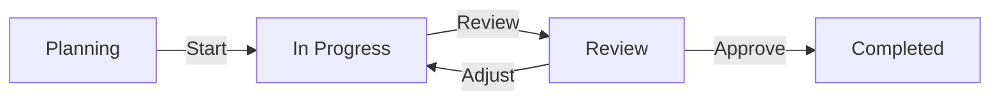

# 📋 Documentação Completa: Módulo de Auditorias Contínuas

## 📑 Índice

1. [Visão Geral](#visão-geral)
2. [Arquitetura](#arquitetura)
3. [Fluxo de Auditoria](#fluxo-de-auditoria)
4. [Operações CRUD](#operações-crud)
5. [Upload de Evidências](#upload-de-evidências)
6. [Geração de Relatórios](#geração-de-relatórios)
7. [Atribuição de Responsáveis](#atribuição-de-responsáveis)
8. [Exemplos de JSON](#exemplos-de-json)
9. [Tratamento de Erros](#tratamento-de-erros)
10. [Edge Cases](#edge-cases)
11. [Checklist de Validação](#checklist-de-validação)

---

## 🎯 Visão Geral

Sistema completo de auditorias contínuas com gerenciamento de ciclo de vida, upload seguro de evidências, geração automatizada de relatórios e portal para auditores externos.

### Funcionalidades Principais

- ✅ **CRUD completo** de auditorias
- 📊 **Workflow visual** com feedback em tempo real
- 📁 **Upload seguro** de evidências com validação
- 📄 **Geração de relatórios** PDF/Excel mockados
- 👥 **Atribuição** de auditores e responsáveis
- 🔒 **Portal** para auditores externos
- 📈 **Tracking** de progresso automático
- 🔍 **Checklists** por framework
- 📝 **Logs de auditoria** completos

---

## 🏗️ Arquitetura

### Componentes Principais

```
src/
├── hooks/
│   └── useAudits.tsx                    # Hook principal CRUD
├── components/
│   └── audit/
│       ├── CreateAuditModal.tsx         # Criar auditoria
│       ├── EditAuditModal.tsx           # Editar auditoria
│       ├── AuditWorkflowVisualizer.tsx  # Fluxo visual
│       ├── AuditReportGenerator.tsx     # Geração de relatórios
│       ├── EvidenceUploadModal.tsx      # Upload evidências
│       ├── EvidenceLocker.tsx           # Cofre de evidências
│       ├── FrameworkChecklists.tsx      # Checklists
│       ├── AuditorAccess.tsx            # Portal auditor
│       └── AuditStats.tsx               # Estatísticas
└── pages/
    └── AuditPortal.tsx                  # Página principal
```

### Banco de Dados (Supabase)

**Tabela: `audits`**
```sql
CREATE TABLE audits (
  id UUID PRIMARY KEY DEFAULT gen_random_uuid(),
  user_id UUID NOT NULL REFERENCES auth.users(id),
  name TEXT NOT NULL,
  framework TEXT NOT NULL,
  status TEXT NOT NULL DEFAULT 'planning' CHECK (status IN ('planning', 'in_progress', 'review', 'completed')),
  progress INTEGER DEFAULT 0 CHECK (progress >= 0 AND progress <= 100),
  start_date DATE,
  end_date DATE,
  auditor TEXT,
  created_at TIMESTAMPTZ NOT NULL DEFAULT now(),
  updated_at TIMESTAMPTZ NOT NULL DEFAULT now(),
  CONSTRAINT end_after_start CHECK (end_date IS NULL OR start_date IS NULL OR end_date >= start_date)
);

CREATE INDEX idx_audits_user_id ON audits(user_id);
CREATE INDEX idx_audits_status ON audits(status);
CREATE INDEX idx_audits_framework ON audits(framework);
```

**Tabela: `evidence`**
```sql
CREATE TABLE evidence (
  id UUID PRIMARY KEY DEFAULT gen_random_uuid(),
  user_id UUID NOT NULL REFERENCES auth.users(id),
  audit_id UUID REFERENCES audits(id),
  name TEXT NOT NULL,
  type TEXT NOT NULL,
  status TEXT NOT NULL DEFAULT 'pending' CHECK (status IN ('pending', 'pending_review', 'verified', 'rejected')),
  file_url TEXT,
  uploaded_by TEXT,
  created_at TIMESTAMPTZ NOT NULL DEFAULT now(),
  updated_at TIMESTAMPTZ NOT NULL DEFAULT now()
);

CREATE INDEX idx_evidence_user_id ON evidence(user_id);
CREATE INDEX idx_evidence_audit_id ON evidence(audit_id);
CREATE INDEX idx_evidence_status ON evidence(status);
```

**Storage Buckets:**
- `evidence`: Armazena arquivos de evidência
- `documents`: Relatórios gerados

---

## 🔄 Fluxo de Auditoria

### Etapas do Ciclo de Vida



### 1. **Planning** (0-25% progress)

**Atividades:**
- Definir escopo da auditoria
- Selecionar framework (SOC 2, ISO 27001, LGPD, etc.)
- Atribuir auditor responsável
- Estabelecer cronograma
- Preparar checklist de controles

**Deliverables:**
- Audit plan document
- Control checklist
- Timeline milestones

**Duração Típica:** 1-2 semanas

### 2. **In Progress** (26-90% progress)

**Atividades:**
- Upload de evidências
- Testes de controles
- Entrevistas com stakeholders
- Revisão de documentação
- Documentação de findings

**Deliverables:**
- Evidence repository (completo)
- Testing workpapers
- Interview notes
- Preliminary findings

**Duração Típica:** 4-8 semanas

### 3. **Review** (91-99% progress)

**Atividades:**
- Revisão final de evidências
- Validação de findings
- Feedback de gestão
- Ajustes e correções
- Preparação de relatório

**Deliverables:**
- Final findings report
- Management response
- Remediation plan

**Duração Típica:** 1-2 semanas

### 4. **Completed** (100% progress)

**Atividades:**
- Emissão de relatório final
- Entrega para stakeholders
- Arquivamento de documentação
- Planejamento de follow-up

**Deliverables:**
- Executive summary
- Detailed audit report
- Compliance certificate (se aplicável)
- Follow-up schedule

---

## ⚙️ Operações CRUD

### 1. Criar Auditoria

**Arquivo**: `src/components/audit/CreateAuditModal.tsx`

**Função**:
```typescript
/**
 * Creates a new audit
 * 
 * @param auditData - Audit data
 * @returns Promise<Audit> - Created audit
 * @throws {Error} If validation fails
 * 
 * Validações:
 * - name: obrigatório, 5-200 caracteres
 * - framework: obrigatório, enum
 * - start_date: opcional, formato YYYY-MM-DD
 * - end_date: opcional, >= start_date
 * - auditor: opcional, max 100 caracteres
 * 
 * Valores Padrão:
 * - status: 'planning'
 * - progress: 0
 * - created_at: now()
 * - updated_at: now()
 */
async createAudit(auditData: AuditInsert): Promise<Audit>
```

**JSON de Entrada**:
```json
{
  "name": "SOC 2 Type II Audit - Q1 2024",
  "framework": "SOC 2",
  "start_date": "2024-01-15",
  "end_date": "2024-03-15",
  "auditor": "External Auditors LLC"
}
```

**JSON de Saída (Sucesso)**:
```json
{
  "success": true,
  "data": {
    "id": "uuid-here",
    "name": "SOC 2 Type II Audit - Q1 2024",
    "framework": "SOC 2",
    "status": "planning",
    "progress": 0,
    "start_date": "2024-01-15",
    "end_date": "2024-03-15",
    "auditor": "External Auditors LLC",
    "user_id": "user-uuid",
    "created_at": "2024-01-15T10:00:00Z",
    "updated_at": "2024-01-15T10:00:00Z"
  }
}
```

### 2. Atualizar Auditoria

**Arquivo**: `src/components/audit/EditAuditModal.tsx`

**Função**:
```typescript
/**
 * Updates an existing audit
 * 
 * @param auditId - Audit ID
 * @param updates - Fields to update
 * @returns Promise<void>
 * @throws {Error} If validation fails or audit not found
 * 
 * Regras de Validação:
 * - Progress não pode diminuir
 * - Status deve ser compatível com progress:
 *   - planning: 0-25%
 *   - in_progress: 26-90%
 *   - review: 91-99%
 *   - completed: 100%
 * - end_date >= start_date
 * - Auditorias completed são read-only
 * 
 * Auditoria:
 * - Registra todas as mudanças
 * - Captura valores old/new
 * - Registra user e timestamp
 */
async updateAudit(auditId: string, updates: AuditUpdate): Promise<void>
```

**Exemplo de Atualização de Progresso**:
```typescript
// Auditoria inicial: progress = 45%
await updateAudit('audit-uuid', {
  progress: 75,
  status: 'in_progress'
});
// Novo progress: 75%
// Status: ainda in_progress
```

**Exemplo de Conclusão**:
```typescript
await updateAudit('audit-uuid', {
  progress: 100,
  status: 'completed'
});
// Gera relatório automático
// Envia notificações
// Arquiva documentação
```

---

## 📁 Upload de Evidências

**Arquivo**: `src/components/audit/EvidenceUploadModal.tsx`

### Tipos de Evidência Aceitos

| Categoria | Tipos | Extensões | Uso |
|-----------|-------|-----------|-----|
| **Documentos** | PDF, Word, Excel | .pdf, .doc, .docx, .xls, .xlsx | Políticas, procedimentos |
| **Logs** | Text, JSON, CSV | .txt, .json, .csv, .log | Logs de sistema, auditoria |
| **Imagens** | JPG, PNG | .jpg, .png | Screenshots, diagramas |
| **Arquivos** | ZIP | .zip | Múltiplos arquivos |

### Validação de Upload

```typescript
/**
 * Validates evidence file before upload
 * 
 * **Regras:**
 * 1. Tamanho máximo: 50MB
 * 2. Tipos permitidos: verificados por MIME type
 * 3. Nome do arquivo: max 255 caracteres
 * 4. Scan de vírus: executado no server
 * 
 * **Segurança:**
 * - Validação client-side E server-side
 * - Nome de arquivo UUID (evita path traversal)
 * - RLS policies para acesso
 * - Criptografia em trânsito (HTTPS)
 * - Criptografia em repouso (S3)
 * 
 * @param file - File object
 * @param auditId - Audit to attach evidence to
 * @returns boolean - true if valid
 * @throws {Error} Se validação falhar
 */
function validateEvidence(file: File, auditId: string): boolean
```

### Exemplo de Upload Bem-Sucedido

**Request**:
```json
{
  "file": "File object",
  "audit_id": "audit-uuid",
  "name": "AWS CloudTrail Logs - Dec 2024",
  "type": "JSON",
  "uploaded_by": "Admin User"
}
```

**Response (Success)**:
```json
{
  "success": true,
  "data": {
    "id": "evidence-uuid",
    "audit_id": "audit-uuid",
    "name": "AWS CloudTrail Logs - Dec 2024",
    "type": "JSON",
    "status": "pending_review",
    "file_url": "https://...supabase.co/storage/v1/object/evidence/audit-uuid/file.json",
    "file_size": 2458624,
    "uploaded_by": "Admin User",
    "created_at": "2024-01-15T10:30:00Z"
  }
}
```

### Exemplo de Upload com Erro

**Response (Error - File Too Large)**:
```json
{
  "success": false,
  "error": {
    "code": "FILE_TOO_LARGE",
    "message": "Arquivo muito grande. Máximo: 50MB",
    "details": {
      "file_size": 62914560,
      "max_size": 52428800,
      "file_name": "large_log_file.json"
    },
    "suggestion": "Comprima o arquivo ou divida em partes menores"
  }
}
```

---

## 📄 Geração de Relatórios

**Arquivo**: `src/components/audit/AuditReportGenerator.tsx`

### Tipos de Relatório

| Tipo | Descrição | Público-Alvo | Páginas |
|------|-----------|--------------|---------|
| **Executive Summary** | Visão geral de alto nível | C-level, Board | 5-10 |
| **Detailed Technical** | Findings completos e evidências | Auditores, TI | 50-100 |
| **Compliance Certificate** | Certificado oficial | Clientes, Reguladores | 1-2 |
| **Gap Analysis** | Gaps e plano de remediação | Management, TI | 20-30 |

### Formatos de Exportação

**PDF:**
- ✅ Formato profissional
- ✅ Ready para apresentação
- ✅ Imagens embutidas
- ✅ Formatação preservada
- ❌ Não editável

**Excel:**
- ✅ Dados tabulares
- ✅ Fácil análise
- ✅ Filtros e gráficos
- ✅ Editável
- ❌ Sem formatação rica

**Both (ZIP):**
- ✅ PDF + Excel juntos
- ✅ Melhor dos dois
- ✅ Archive completo

### Estrutura do Relatório (PDF)

```
┌─────────────────────────────────────────────┐
│ COVER PAGE                                   │
├─────────────────────────────────────────────┤
│ - Audit Title                                │
│ - Framework                                  │
│ - Date Range                                 │
│ - Auditor Signature                          │
├─────────────────────────────────────────────┤
│ EXECUTIVE SUMMARY                            │
├─────────────────────────────────────────────┤
│ - Audit Scope                                │
│ - Compliance Score: 92%                      │
│ - Key Findings (3-5)                         │
│ - High-Level Recommendations                 │
├─────────────────────────────────────────────┤
│ DETAILED FINDINGS                            │
├─────────────────────────────────────────────┤
│ For each control:                            │
│   - Control ID & Description                 │
│   - Testing Procedure                        │
│   - Results (Pass/Fail)                      │
│   - Evidence Reviewed                        │
│   - Observations                             │
│   - Recommendations                          │
├─────────────────────────────────────────────┤
│ EVIDENCE SUMMARY                             │
├─────────────────────────────────────────────┤
│ - Total Evidence Count                       │
│ - Evidence by Type                           │
│ - Evidence by Control                        │
│ - Evidence Status                            │
├─────────────────────────────────────────────┤
│ GAP ANALYSIS                                 │
├─────────────────────────────────────────────┤
│ - Identified Gaps                            │
│ - Risk Rating                                │
│ - Remediation Plan                           │
│ - Timeline                                   │
├─────────────────────────────────────────────┤
│ APPENDICES                                   │
├─────────────────────────────────────────────┤
│ - Methodology                                │
│ - Scope & Limitations                        │
│ - References                                 │
│ - Glossary                                   │
└─────────────────────────────────────────────┘
```

### Geração Mockada

```typescript
/**
 * Generates mock PDF report
 * 
 * **Process:**
 * 1. Validate audit data
 * 2. Format content sections
 * 3. Generate PDF structure (mock)
 * 4. Apply styling
 * 5. Create downloadable blob
 * 
 * **Progress Stages:**
 * - 0%: Starting
 * - 30%: Content formatted
 * - 60%: PDF structure created
 * - 90%: Styling applied
 * - 100%: Ready for download
 * 
 * **Duration:** 2-5 seconds (mock)
 * 
 * @param audit - Audit to generate report for
 * @param reportType - Type of report
 * @returns Blob URL for download
 */
async function generatePDFReport(
  audit: Audit,
  reportType: 'executive' | 'detailed' | 'certificate' | 'gap'
): Promise<string>
```

---

## 👥 Atribuição de Responsáveis

### Roles de Auditoria

| Role | Permissões | Responsabilidades |
|------|------------|-------------------|
| **Audit Manager** | Full access | Planning, oversight, approval |
| **Lead Auditor** | Read/write audit & evidence | Conduct audit, review evidence |
| **Auditor** | Read audit, write evidence | Collect evidence, test controls |
| **Reviewer** | Read-only | Review findings, provide feedback |
| **Stakeholder** | View reports | Receive updates, approve remediations |

### Atribuição de Auditor

```typescript
/**
 * Assigns auditor to audit
 * 
 * **Process:**
 * 1. Validates user has auditor role
 * 2. Checks for conflicts (same auditor on overlapping audits)
 * 3. Updates audit record
 * 4. Sends notification to auditor
 * 5. Creates audit log entry
 * 
 * **Edge Cases:**
 * - Auditor already assigned: Shows confirmation dialog
 * - Audit in progress: Requires manager approval
 * - Completed audit: Not allowed
 * 
 * @param auditId - Audit ID
 * @param auditorId - User ID of auditor
 * @returns Promise<void>
 */
async function assignAuditor(auditId: string, auditorId: string): Promise<void>
```

---

## 🔧 Tratamento de Erros

### Códigos de Erro

| Código | Descrição | Ação Sugerida |
|--------|-----------|---------------|
| **AUD_001** | Nome da auditoria obrigatório | Preencher nome |
| **AUD_002** | Framework inválido | Selecionar framework válido |
| **AUD_003** | Data final antes da inicial | Ajustar datas |
| **AUD_004** | Progresso inválido (>100 ou <0) | Corrigir progresso |
| **AUD_005** | Status incompatível com progress | Ajustar status ou progress |
| **AUD_006** | Auditoria não encontrada | Verificar ID |
| **AUD_007** | Sem permissão | Verificar ownership |
| **AUD_008** | Auditoria concluída (read-only) | Não pode editar |
| **EV_001** | Arquivo muito grande | Reduzir tamanho (max 50MB) |
| **EV_002** | Tipo de arquivo não suportado | Usar tipo válido |
| **EV_003** | Scan de vírus falhou | Tentar novamente |
| **EV_004** | Upload falhou | Verificar conexão |
| **REP_001** | Auditoria não concluída | Concluir auditoria primeiro |
| **REP_002** | Formato inválido | Selecionar PDF ou Excel |
| **REP_003** | Geração falhou | Tentar novamente |

### Exemplo de Tratamento

```typescript
try {
  await createAudit(auditData);
} catch (error) {
  if (error.code === 'AUD_003') {
    toast({
      title: 'Datas inválidas',
      description: 'A data final deve ser posterior à data inicial',
      variant: 'destructive'
    });
  } else if (error.code === 'AUD_002') {
    toast({
      title: 'Framework inválido',
      description: 'Selecione um framework da lista',
      variant: 'warning'
    });
  } else {
    toast({
      title: 'Erro ao criar auditoria',
      description: error.message,
      variant: 'destructive'
    });
  }
}
```

---

## ⚠️ Edge Cases

### 1. Upload Durante Revisão Final

**Cenário**: Usuário tenta upload de evidência quando audit está em status 'review' (91-99%)

**Comportamento**:
- Mostra aviso: "Auditoria em revisão final. Evidência será marcada como 'late submission'"
- Permite upload mas marca como fora do prazo
- Notifica auditor sobre nova evidência

### 2. Mudança de Auditor em Auditoria Ativa

**Cenário**: Manager muda auditor quando audit está 50% completa

**Comportamento**:
- Requer confirmação: "Isso pode impactar o cronograma"
- Cria transição log
- Notifica novo e antigo auditor
- Oferece handover meeting

### 3. Evidência Rejeitada

**Cenário**: Auditor marca evidência como 'rejected'

**Comportamento**:
- Solicita motivo de rejeição
- Notifica uploader
- Reduz progress da auditoria
- Permite re-upload

### 4. Relatório de Auditoria Não Concluída

**Cenário**: Usuário tenta gerar relatório com progress < 100%

**Comportamento**:
- Mostra warning: "Auditoria incompleta. Relatório pode ter gaps"
- Marca relatório como "DRAFT"
- Inclui disclaimer no PDF
- Permite geração mas marca como preliminar

### 5. Concorrência (Múltiplos Uploads)

**Cenário**: Dois usuários fazem upload simultaneamente

**Comportamento**:
- Ambos uploads são aceitos
- Progress atualiza para ambos
- No race conditions (atomic operations)
- Evidence list atualiza em tempo real

---

## ✅ Checklist de Validação

### Funcionalidades

- [ ] **CRUD de Auditorias**
  - [ ] Criar auditoria
  - [ ] Editar auditoria
  - [ ] Listar auditorias
  - [ ] Filtrar por status/framework
  - [ ] Pesquisar por nome

- [ ] **Workflow Visual**
  - [ ] Exibe etapa atual
  - [ ] Mostra progresso (%)
  - [ ] Indica próximas ações
  - [ ] Feedback em tempo real

- [ ] **Upload de Evidências**
  - [ ] Validação de tipo
  - [ ] Validação de tamanho
  - [ ] Upload com progresso
  - [ ] Link a auditoria
  - [ ] Status tracking

- [ ] **Geração de Relatórios**
  - [ ] PDF mockado
  - [ ] Excel mockado
  - [ ] Múltiplos tipos
  - [ ] Download automático
  - [ ] Progress indicator

- [ ] **Atribuição**
  - [ ] Atribuir auditor
  - [ ] Notificações
  - [ ] Verificar conflitos
  - [ ] Audit log

### Testes E2E

```bash
# Teste Completo de Auditoria
describe('Audit End-to-End Flow', () => {
  it('creates audit, uploads evidence, generates report', async () => {
    // 1. Create audit
    const audit = await createAudit({
      name: 'Test Audit',
      framework: 'SOC 2',
      start_date: '2024-01-15',
      end_date: '2024-03-15'
    });
    
    expect(audit.status).toBe('planning');
    expect(audit.progress).toBe(0);
    
    // 2. Upload evidence
    const evidence = await uploadEvidence({
      file: mockFile,
      audit_id: audit.id,
      name: 'Test Evidence'
    });
    
    expect(evidence.status).toBe('pending_review');
    
    // 3. Update progress
    await updateAudit(audit.id, { progress: 100, status: 'completed' });
    
    // 4. Generate report
    const report = await generateReport(audit.id, 'pdf');
    
    expect(report.url).toBeDefined();
    expect(report.format).toBe('pdf');
  });
});
```

---

## 📊 Exemplos de Uso Completos

### Fluxo 1: Auditoria Completa de Ponta a Ponta

```typescript
// 1. Criar auditoria
const audit = await createAudit({
  name: 'SOC 2 Type II - Annual Audit 2024',
  framework: 'SOC 2',
  start_date: '2024-01-15',
  end_date: '2024-03-15',
  auditor: 'BigFour Auditors'
});

// 2. Upload evidências (fase de coleta)
const evidences = [
  { name: 'AWS CloudTrail', type: 'JSON', file: cloudtrailFile },
  { name: 'Security Policy', type: 'PDF', file: policyFile },
  { name: 'Access Logs', type: 'CSV', file: logsFile },
  { name: 'Screenshots', type: 'ZIP', file: screenshotsFile }
];

for (const ev of evidences) {
  await uploadEvidence({
    ...ev,
    audit_id: audit.id,
    uploaded_by: 'IT Team'
  });
}

// 3. Atualizar progresso conforme avança
await updateAudit(audit.id, { progress: 50, status: 'in_progress' });

// 4. Revisão final
await updateAudit(audit.id, { progress: 95, status: 'review' });

// 5. Concluir
await updateAudit(audit.id, { progress: 100, status: 'completed' });

// 6. Gerar relatório
await generateReport(audit.id, {
  type: 'detailed',
  format: 'both' // PDF + Excel
});
```

---

**Última atualização**: 2024-01-15  
**Versão**: 1.0.0  
**Autor**: Equipe de Compliance & Audit
