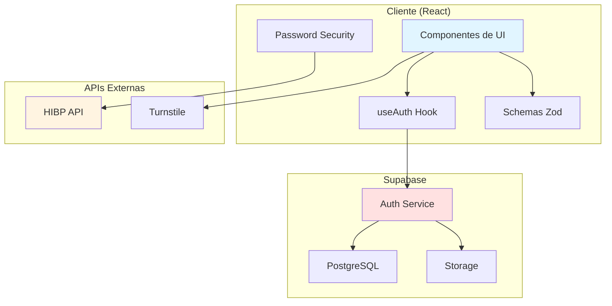
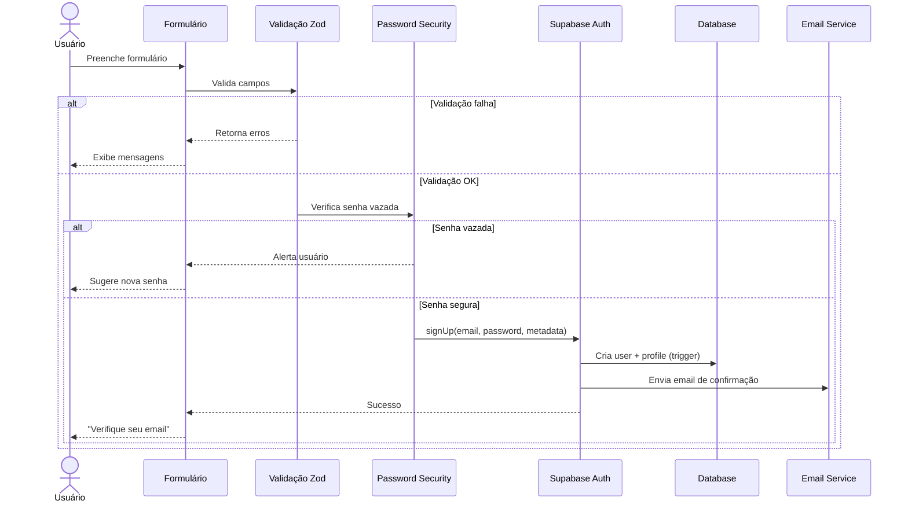
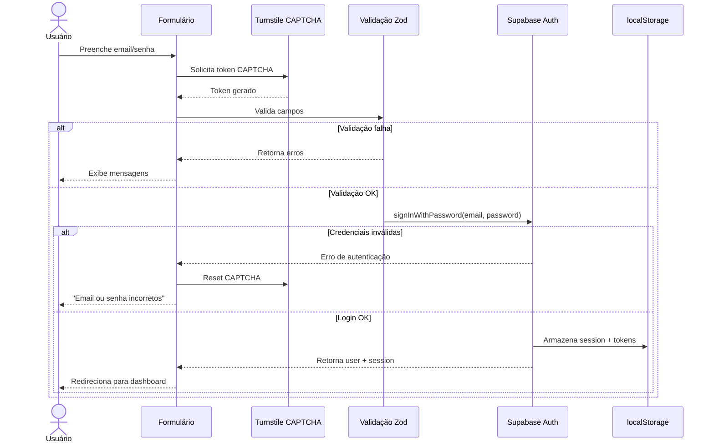
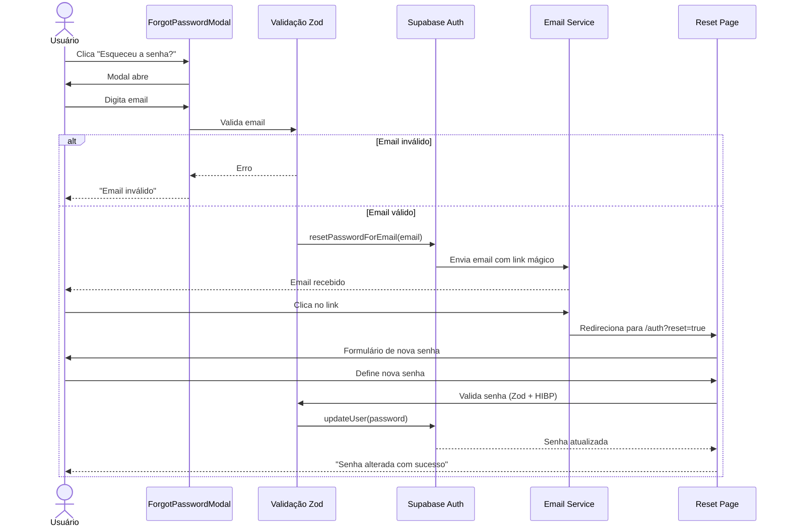
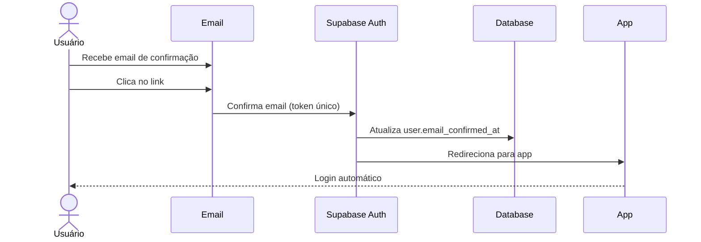
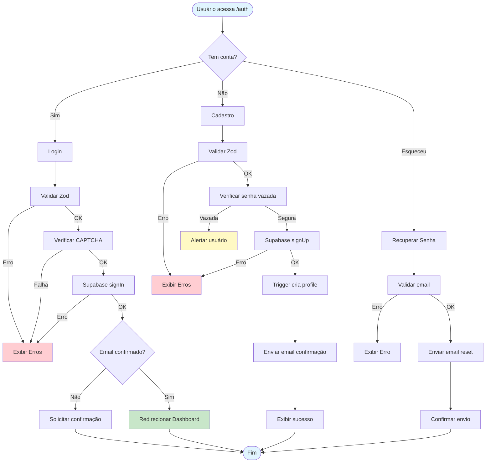

# Documentação Completa do Fluxo de Autenticação

## 📋 Índice

1. [Visão Geral](#visão-geral)
2. [Arquitetura](#arquitetura)
3. [Fluxos de Usuário](#fluxos-de-usuário)
4. [Schemas de Validação](#schemas-de-validação)
5. [Segurança de Senhas](#segurança-de-senhas)
6. [Exemplos de Uso](#exemplos-de-uso)
7. [Tratamento de Erros](#tratamento-de-erros)
8. [Testes Automatizados](#testes-automatizados)
9. [Variáveis de Ambiente](#variáveis-de-ambiente)

---

## Visão Geral

O sistema de autenticação do ComplianceSync utiliza **Supabase Auth** com JWT (JSON Web Tokens) para gerenciar login, cadastro, recuperação de senha e confirmação de email. A implementação inclui:

- ✅ Validação robusta com **Zod**
- ✅ Proteção contra **senhas vazadas** (Have I Been Pwned API)
- ✅ Análise de **força de senha** em tempo real
- ✅ **Confirmação de email** obrigatória
- ✅ **Recuperação de senha** segura
- ✅ **Persistência de sessão** com auto-refresh de tokens
- ✅ **CAPTCHA** (Cloudflare Turnstile) no login
- ✅ **RLS (Row Level Security)** no banco de dados

---

## Arquitetura



### Componentes Principais

| Componente | Arquivo | Responsabilidade |
|------------|---------|------------------|
| **useAuth Hook** | `src/hooks/useAuth.tsx` | Gerencia estado global de autenticação |
| **Auth Page** | `src/pages/Auth.tsx` | Página de login/cadastro com validação |
| **AuthModal** | `src/components/auth/AuthModal.tsx` | Modal reutilizável de autenticação |
| **ForgotPasswordModal** | `src/components/auth/ForgotPasswordModal.tsx` | Modal de recuperação de senha |
| **Schemas** | `src/lib/auth-schemas.ts` | Validação Zod de todos os formulários |
| **Password Security** | `src/lib/password-security.ts` | Verificação de senhas vazadas e força |
| **Protected Route** | `src/components/auth/ProtectedRoute.tsx` | HOC para proteger rotas autenticadas |

---

## Fluxos de Usuário

### 1. Cadastro (Sign Up)



**Campos Obrigatórios:**
- Email válido
- Senha forte (8+ chars, maiúscula, minúscula, número, especial)
- Confirmação de senha
- Nome de exibição (3-100 chars)
- Organização (3-200 chars)

**Processo:**
1. Usuário preenche formulário
2. Validação Zod no cliente
3. Verificação de senha vazada (HIBP API)
4. Envio para Supabase Auth
5. Trigger `handle_new_user()` cria perfil automaticamente
6. Email de confirmação enviado
7. Usuário clica no link do email
8. Conta ativada

### 2. Login (Sign In)



**Campos Obrigatórios:**
- Email
- Senha
- Token CAPTCHA (Turnstile)

**Processo:**
1. Usuário completa CAPTCHA
2. Validação básica dos campos
3. Envio para Supabase Auth
4. Session armazenada em localStorage
5. Auto-refresh de tokens configurado
6. Redirecionamento automático

### 3. Recuperação de Senha



**Processo:**
1. Usuário clica "Esqueceu a senha?"
2. Modal solicita email
3. Supabase envia email com link de redefinição
4. Usuário clica no link (válido por 1 hora)
5. Redireciona para página de reset
6. Usuário define nova senha (validada)
7. Verificação de senha vazada
8. Senha atualizada no banco

### 4. Confirmação de Email



**Configuração:**
- Link expira em 24 horas
- Redirect URL: `${window.location.origin}/`
- Pode ser desabilitado em desenvolvimento (Supabase Dashboard)

---

## Schemas de Validação

### Email Schema

```typescript
import { emailSchema } from '@/lib/auth-schemas';

// ✅ Válidos
emailSchema.parse("usuario@exemplo.com.br"); // OK
emailSchema.parse("nome.sobrenome@empresa.com"); // OK
emailSchema.parse("teste+tag@dominio.org"); // OK

// ❌ Inválidos
emailSchema.parse("usuario@"); // Erro: Email inválido
emailSchema.parse("@exemplo.com"); // Erro: Email inválido
emailSchema.parse("usuario@.com"); // Erro: Email inválido
```

### Password Schema

```typescript
import { passwordSchema } from '@/lib/auth-schemas';

// ✅ Válidas
passwordSchema.parse("SecurePass123!"); // OK
passwordSchema.parse("MyP@ssw0rd"); // OK
passwordSchema.parse("C0mpl3x!Pass"); // OK

// ❌ Inválidas
passwordSchema.parse("senha123"); // Erro: sem maiúscula e caractere especial
passwordSchema.parse("SENHA123!"); // Erro: sem minúscula
passwordSchema.parse("SenhaForte!"); // Erro: sem número
passwordSchema.parse("Curta1!"); // Erro: menos de 8 caracteres
```

### Login Schema

```typescript
import { loginSchema } from '@/lib/auth-schemas';

const result = loginSchema.safeParse({
  email: "user@example.com",
  password: "SecurePass123!"
});

if (result.success) {
  console.log("Dados válidos:", result.data);
} else {
  console.log("Erros:", result.error.flatten());
}
```

**Exemplo de erro:**
```json
{
  "fieldErrors": {
    "email": ["Email inválido. Use o formato: usuario@dominio.com"],
    "password": ["Senha deve ter no mínimo 8 caracteres"]
  }
}
```

### SignUp Schema

```typescript
import { signUpSchema } from '@/lib/auth-schemas';

const result = signUpSchema.safeParse({
  email: "novo@empresa.com",
  password: "MySecure123!",
  confirmPassword: "MySecure123!",
  displayName: "João Silva",
  organization: "Empresa ABC Ltda"
});
```

---

## Segurança de Senhas

### Verificação de Senha Vazada (HIBP API)

O sistema verifica se senhas foram comprometidas em vazamentos conhecidos usando a API **Have I Been Pwned** com o modelo **k-Anonymity**:

```typescript
import { checkPasswordPwned } from '@/lib/password-security';

const result = await checkPasswordPwned("password123");

if (result.isPwned) {
  console.log(`⚠️ Senha encontrada em ${result.count} vazamentos!`);
  // Exibe alerta para o usuário
} else {
  console.log("✅ Senha segura (não vazada)");
}
```

**Como funciona:**
1. Hash SHA-1 da senha é calculado no cliente
2. Apenas os **primeiros 5 caracteres** do hash são enviados
3. API retorna ~500 hashes que começam com esses 5 chars
4. Cliente verifica localmente se o hash completo está na lista

**Exemplo real:**
```typescript
// Senha: "password123"
// SHA-1: CBFDAC6008F9CAB4083784CBD1874F76618D2A97
// Enviado: CBFDA (primeiros 5)
// Recebido: Lista com ~500 sufixos + contagem
// Verificação local: C6008F9CAB4083784CBD1874F76618D2A97 está na lista?
```

### Análise de Força da Senha

```typescript
import { checkPasswordStrength } from '@/lib/password-security';

const strength = checkPasswordStrength("MyPassword123!");

console.log(strength);
// {
//   score: 3,
//   label: "Forte",
//   feedback: ["Boa senha!"],
//   passesRequirements: true
// }
```

**Critérios avaliados:**
- Comprimento (8+, 12+, 16+ caracteres)
- Diversidade (maiúsculas, minúsculas, números, especiais)
- Entropia (caracteres únicos vs total)
- Padrões comuns (sequências, repetições)

**Pontuação:**
| Score | Label | Descrição |
|-------|-------|-----------|
| 0 | Muito Fraca | Menos de 8 chars ou falta diversidade |
| 1 | Fraca | 8-11 chars, pouca diversidade |
| 2 | Média | 12-15 chars, diversidade moderada |
| 3 | Forte | 16+ chars, boa diversidade |
| 4 | Muito Forte | 16+ chars, alta entropia, sem padrões |

---

## Exemplos de Uso

### 1. Hook useAuth

```typescript
import { useAuth } from '@/hooks/useAuth';

function LoginPage() {
  const { signIn, signUp, signOut, resetPassword, user, session, loading } = useAuth();

  // Login
  const handleLogin = async (email: string, password: string) => {
    const { error } = await signIn(email, password);
    if (error) {
      console.error("Erro no login:", error.message);
    } else {
      console.log("Login bem-sucedido!");
    }
  };

  // Cadastro
  const handleSignup = async (data: SignUpInput) => {
    const { error } = await signUp(data.email, data.password, {
      display_name: data.displayName,
      organization: data.organization
    });
    if (error) {
      console.error("Erro no cadastro:", error.message);
    }
  };

  // Recuperação de senha
  const handleForgotPassword = async (email: string) => {
    const { error } = await resetPassword(email);
    if (!error) {
      console.log("Email de recuperação enviado!");
    }
  };

  // Logout
  const handleLogout = async () => {
    await signOut();
  };

  return (
    <div>
      {loading ? (
        <p>Carregando...</p>
      ) : user ? (
        <p>Bem-vindo, {user.email}!</p>
      ) : (
        <button onClick={() => handleLogin("user@example.com", "Password123!")}>
          Login
        </button>
      )}
    </div>
  );
}
```

### 2. Validação com Zod em Formulário

```typescript
import { useForm } from 'react-hook-form';
import { zodResolver } from '@hookform/resolvers/zod';
import { loginSchema, type LoginInput } from '@/lib/auth-schemas';

function LoginForm() {
  const { register, handleSubmit, formState: { errors } } = useForm<LoginInput>({
    resolver: zodResolver(loginSchema)
  });

  const onSubmit = async (data: LoginInput) => {
    console.log("Dados válidos:", data);
    // Chama signIn
  };

  return (
    <form onSubmit={handleSubmit(onSubmit)}>
      <input {...register("email")} />
      {errors.email && <span>{errors.email.message}</span>}
      
      <input type="password" {...register("password")} />
      {errors.password && <span>{errors.password.message}</span>}
      
      <button type="submit">Entrar</button>
    </form>
  );
}
```

### 3. Rota Protegida

```typescript
import ProtectedRoute from '@/components/auth/ProtectedRoute';

// Em App.tsx
<Routes>
  <Route path="/auth" element={<Auth />} />
  <Route path="/" element={
    <ProtectedRoute>
      <Dashboard />
    </ProtectedRoute>
  } />
</Routes>
```

---

## Tratamento de Erros

### Erros Comuns de Login

| Código | Mensagem | Causa | Solução |
|--------|----------|-------|---------|
| `invalid_credentials` | "Email ou senha incorretos" | Credenciais inválidas | Verificar email e senha |
| `email_not_confirmed` | "Confirme seu email" | Email não verificado | Reenviar email de confirmação |
| `invalid_grant` | "Sessão expirada" | Token JWT expirado | Fazer login novamente |
| `rate_limit_exceeded` | "Muitas tentativas" | Limite de rate excedido | Aguardar 1 minuto |

### Erros de Cadastro

| Código | Mensagem | Causa | Solução |
|--------|----------|-------|---------|
| `user_already_exists` | "Email já cadastrado" | Email duplicado | Usar outro email ou fazer login |
| `weak_password` | "Senha muito fraca" | Senha não atende requisitos | Usar senha mais forte |
| `invalid_email` | "Email inválido" | Formato de email incorreto | Corrigir formato |

### Exemplo de Tratamento

```typescript
const handleLogin = async (email: string, password: string) => {
  const { error } = await signIn(email, password);
  
  if (error) {
    switch (error.message) {
      case 'Invalid login credentials':
        toast({
          title: "Erro no login",
          description: "Email ou senha incorretos. Verifique e tente novamente.",
          variant: "destructive"
        });
        break;
      
      case 'Email not confirmed':
        toast({
          title: "Email não confirmado",
          description: "Por favor, verifique seu email e clique no link de confirmação.",
          variant: "destructive"
        });
        break;
      
      default:
        toast({
          title: "Erro no login",
          description: error.message,
          variant: "destructive"
        });
    }
  }
};
```

---

## Testes Automatizados

### Estrutura de Testes

```
tests/
├── unit/
│   ├── auth-schemas.test.ts       # Testes de validação Zod
│   ├── password-security.test.ts  # Testes de segurança de senha
│   └── useAuth.test.tsx           # Testes do hook
├── integration/
│   ├── login-flow.test.tsx        # Fluxo completo de login
│   ├── signup-flow.test.tsx       # Fluxo completo de cadastro
│   └── password-reset.test.tsx    # Fluxo de recuperação
└── e2e/
    └── auth-complete.spec.ts      # Testes end-to-end com Playwright
```

### Exemplo: Teste de Schema Zod

```typescript
// tests/unit/auth-schemas.test.ts
import { describe, it, expect } from 'vitest';
import { loginSchema, signUpSchema, emailSchema, passwordSchema } from '@/lib/auth-schemas';

describe('Email Schema', () => {
  it('deve aceitar emails válidos', () => {
    expect(() => emailSchema.parse('user@example.com')).not.toThrow();
    expect(() => emailSchema.parse('name+tag@domain.co.uk')).not.toThrow();
  });

  it('deve rejeitar emails inválidos', () => {
    expect(() => emailSchema.parse('invalido@')).toThrow();
    expect(() => emailSchema.parse('@exemplo.com')).toThrow();
    expect(() => emailSchema.parse('sem-arroba.com')).toThrow();
  });

  it('deve normalizar para lowercase', () => {
    const result = emailSchema.parse('USER@EXAMPLE.COM');
    expect(result).toBe('user@example.com');
  });
});

describe('Password Schema', () => {
  it('deve aceitar senhas fortes', () => {
    expect(() => passwordSchema.parse('SecurePass123!')).not.toThrow();
    expect(() => passwordSchema.parse('MyP@ssw0rd')).not.toThrow();
  });

  it('deve rejeitar senhas fracas', () => {
    expect(() => passwordSchema.parse('weak')).toThrow('no mínimo 8 caracteres');
    expect(() => passwordSchema.parse('nouppercas3!')).toThrow('letra maiúscula');
    expect(() => passwordSchema.parse('NOLOWERCASE3!')).toThrow('letra minúscula');
    expect(() => passwordSchema.parse('NoNumbers!')).toThrow('um número');
    expect(() => passwordSchema.parse('NoSpecial123')).toThrow('caractere especial');
  });
});

describe('SignUp Schema', () => {
  const validData = {
    email: 'user@example.com',
    password: 'SecurePass123!',
    confirmPassword: 'SecurePass123!',
    displayName: 'João Silva',
    organization: 'Empresa XYZ'
  };

  it('deve aceitar dados válidos', () => {
    expect(() => signUpSchema.parse(validData)).not.toThrow();
  });

  it('deve rejeitar senhas não coincidentes', () => {
    const invalidData = { ...validData, confirmPassword: 'Different123!' };
    expect(() => signUpSchema.parse(invalidData)).toThrow('não coincidem');
  });

  it('deve rejeitar nome muito curto', () => {
    const invalidData = { ...validData, displayName: 'Ab' };
    expect(() => signUpSchema.parse(invalidData)).toThrow('no mínimo 3 caracteres');
  });
});
```

### Exemplo: Teste de Password Security

```typescript
// tests/unit/password-security.test.ts
import { describe, it, expect, vi } from 'vitest';
import { checkPasswordPwned, checkPasswordStrength } from '@/lib/password-security';

describe('checkPasswordPwned', () => {
  it('deve detectar senha comum como vazada', async () => {
    const result = await checkPasswordPwned('password123');
    expect(result.isPwned).toBe(true);
    expect(result.count).toBeGreaterThan(0);
  });

  it('deve marcar senha forte como segura', async () => {
    const result = await checkPasswordPwned('xK9@mP2$vN8!qL5tR3wQ');
    expect(result.isPwned).toBe(false);
    expect(result.count).toBe(0);
  });

  it('deve tratar erro de rede graciosamente', async () => {
    // Mock fetch error
    global.fetch = vi.fn(() => Promise.reject(new Error('Network error')));
    
    const result = await checkPasswordPwned('anypassword');
    expect(result.isPwned).toBe(false);
    expect(result.error).toBeDefined();
  });
});

describe('checkPasswordStrength', () => {
  it('deve avaliar senha muito fraca corretamente', () => {
    const result = checkPasswordStrength('12345');
    expect(result.score).toBe(0);
    expect(result.label).toBe('Muito Fraca');
    expect(result.passesRequirements).toBe(false);
  });

  it('deve avaliar senha forte corretamente', () => {
    const result = checkPasswordStrength('MySecur3P@ssw0rd!');
    expect(result.score).toBeGreaterThanOrEqual(3);
    expect(result.label).toMatch(/Forte|Muito Forte/);
    expect(result.passesRequirements).toBe(true);
  });

  it('deve penalizar sequências óbvias', () => {
    const result = checkPasswordStrength('Abcd1234!');
    expect(result.feedback).toContain(expect.stringContaining('sequências'));
  });
});
```

### Exemplo: Teste de Integração (Login Flow)

```typescript
// tests/integration/login-flow.test.tsx
import { describe, it, expect, beforeEach } from 'vitest';
import { render, screen, waitFor } from '@testing-library/react';
import userEvent from '@testing-library/user-event';
import { BrowserRouter } from 'react-router-dom';
import Auth from '@/pages/Auth';
import { AuthProvider } from '@/hooks/useAuth';

describe('Login Flow', () => {
  beforeEach(() => {
    render(
      <BrowserRouter>
        <AuthProvider>
          <Auth />
        </AuthProvider>
      </BrowserRouter>
    );
  });

  it('deve exibir erros de validação para campos vazios', async () => {
    const submitButton = screen.getByRole('button', { name: /entrar/i });
    await userEvent.click(submitButton);

    await waitFor(() => {
      expect(screen.getByText(/email é obrigatório/i)).toBeInTheDocument();
      expect(screen.getByText(/senha é obrigatória/i)).toBeInTheDocument();
    });
  });

  it('deve exibir erro para email inválido', async () => {
    const emailInput = screen.getByLabelText(/email/i);
    await userEvent.type(emailInput, 'invalido@');

    const submitButton = screen.getByRole('button', { name: /entrar/i });
    await userEvent.click(submitButton);

    await waitFor(() => {
      expect(screen.getByText(/email inválido/i)).toBeInTheDocument();
    });
  });

  it('deve fazer login com credenciais válidas', async () => {
    const emailInput = screen.getByLabelText(/email/i);
    const passwordInput = screen.getByLabelText(/senha/i);

    await userEvent.type(emailInput, 'test@example.com');
    await userEvent.type(passwordInput, 'TestPass123!');

    const submitButton = screen.getByRole('button', { name: /entrar/i });
    await userEvent.click(submitButton);

    await waitFor(() => {
      expect(screen.getByText(/bem-vindo/i)).toBeInTheDocument();
    });
  });
});
```

### Checklist de Validação

#### ✅ Testes de Unidade
- [ ] Email válido/inválido
- [ ] Senha forte/fraca
- [ ] Confirmação de senha
- [ ] Nome de exibição válido
- [ ] Organização válida
- [ ] Formatação de erros Zod
- [ ] Verificação de senha vazada
- [ ] Cálculo de força de senha
- [ ] Geração de senha forte

#### ✅ Testes de Integração
- [ ] Login com credenciais válidas
- [ ] Login com credenciais inválidas
- [ ] Cadastro completo
- [ ] Cadastro com email duplicado
- [ ] Recuperação de senha
- [ ] Confirmação de email
- [ ] Logout
- [ ] Refresh de token automático
- [ ] Redirecionamento após login
- [ ] Proteção de rotas

#### ✅ Testes End-to-End
- [ ] Fluxo completo de cadastro → confirmação → login
- [ ] Fluxo de recuperação de senha
- [ ] Login com CAPTCHA
- [ ] Persistência de sessão (reload)
- [ ] Logout e limpeza de sessão
- [ ] Redirecionamento de rotas protegidas

---

## Variáveis de Ambiente

### Arquivo `.env`

```bash
# Supabase Configuration
VITE_SUPABASE_PROJECT_ID="ofbyxnpprwwuieabwhdo"
VITE_SUPABASE_PUBLISHABLE_KEY="eyJhbGciOiJIUzI1NiIsInR5cCI6IkpXVCJ9..."
VITE_SUPABASE_URL="https://ofbyxnpprwwuieabwhdo.supabase.co"

# Cloudflare Turnstile (CAPTCHA)
# Obter em: https://dash.cloudflare.com/ → Turnstile
VITE_TURNSTILE_SITE_KEY="1x00000000000000000000AA"  # Chave de teste
```

### Configuração no Supabase Client

```typescript
// src/integrations/supabase/client.ts
import { createClient } from '@supabase/supabase-js';

const SUPABASE_URL = import.meta.env.VITE_SUPABASE_URL;
const SUPABASE_ANON_KEY = import.meta.env.VITE_SUPABASE_PUBLISHABLE_KEY;

export const supabase = createClient(SUPABASE_URL, SUPABASE_ANON_KEY, {
  auth: {
    storage: localStorage,      // Persiste sessão
    persistSession: true,        // Auto-refresh de tokens
    autoRefreshToken: true,      // Renova tokens automaticamente
  }
});
```

### Secrets do Supabase (Backend)

```bash
# No Supabase Dashboard → Project Settings → Edge Functions → Secrets
SUPABASE_SERVICE_ROLE_KEY="eyJhbGciOiJIUzI1NiIsInR5cCI6IkpXVCJ9..."
```

---

## Diagrama Completo de Fluxos



---

## Checklist Final de Implementação

### ✅ Funcionalidades Core
- [x] Cadastro com validação Zod
- [x] Login com CAPTCHA
- [x] Recuperação de senha
- [x] Confirmação de email
- [x] Logout
- [x] Persistência de sessão
- [x] Auto-refresh de tokens
- [x] Proteção de rotas

### ✅ Segurança
- [x] Validação robusta (Zod)
- [x] Verificação de senhas vazadas (HIBP)
- [x] Análise de força de senha
- [x] CAPTCHA no login
- [x] Rate limiting (Supabase)
- [x] RLS policies no banco
- [x] JWT tokens seguros
- [x] Redirect URLs configurados

### ✅ UX/UI
- [x] Mensagens de erro claras
- [x] Feedback em tempo real
- [x] Loading states
- [x] Indicador de força de senha
- [x] Confirmação visual de ações
- [x] Toasts informativos

### ✅ Documentação
- [x] Docstrings em funções
- [x] Comentários explicativos
- [x] Exemplos de uso
- [x] Diagramas de fluxo
- [x] Checklist de validação
- [x] Exemplos de testes

### ✅ Configuração
- [x] Variáveis de ambiente
- [x] Secrets do Supabase
- [x] Configuração de email
- [x] Redirect URLs

---

## Próximos Passos

### Melhorias Recomendadas
1. **OAuth Social Login** (Google, Microsoft)
2. **Autenticação de 2 Fatores (2FA)** com TOTP
3. **Magic Links** (login sem senha)
4. **Biometria** (Face ID, Touch ID)
5. **Session Management** avançado (múltiplos dispositivos)
6. **Audit Logs** de tentativas de login
7. **Bloqueio de conta** após N tentativas
8. **IP Whitelisting** para admins

### Monitoramento
1. **Analytics de autenticação** (taxa de conversão)
2. **Alertas de segurança** (tentativas suspeitas)
3. **Dashboard de sessões ativas**
4. **Relatórios de senhas fracas**

---

## Referências

- [Supabase Auth Documentation](https://supabase.com/docs/guides/auth)
- [Have I Been Pwned API](https://haveibeenpwned.com/API/v3#PwnedPasswords)
- [Zod Documentation](https://zod.dev/)
- [OWASP Authentication Cheat Sheet](https://cheatsheetseries.owasp.org/cheatsheets/Authentication_Cheat_Sheet.html)
- [JWT Best Practices](https://datatracker.ietf.org/doc/html/rfc8725)

---

**Última atualização:** 2025-01-13  
**Versão:** 1.0.0  
**Autor:** ComplianceSync Team
