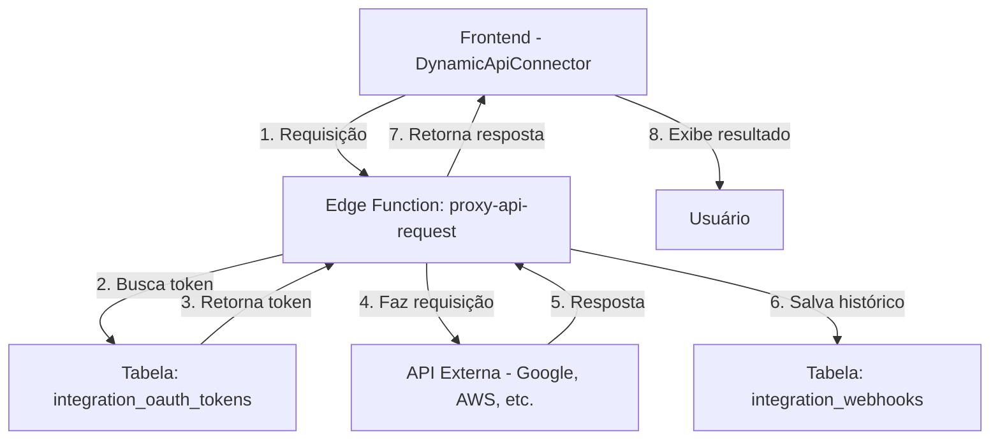
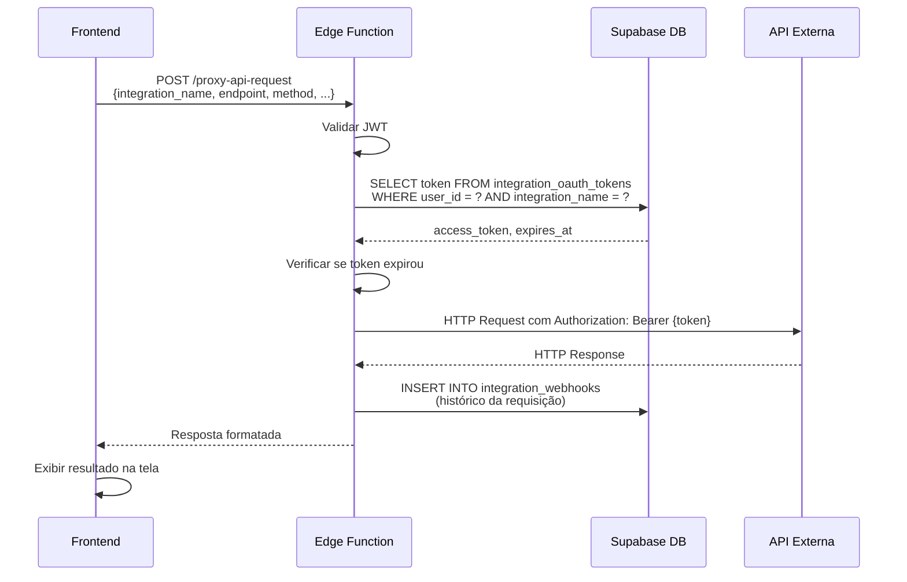

# Dynamic API Connector - Documentação Completa

## Visão Geral

O **Dynamic API Connector** é um sistema completo que permite aos usuários fazer requisições customizadas para APIs externas usando tokens OAuth armazenados de forma segura no Supabase.

### Arquitetura



---

## Componentes do Sistema

### 1. Edge Function: `proxy-api-request`

**Localização:** `supabase/functions/proxy-api-request/index.ts`

**Responsabilidades:**
- Autenticar usuário via JWT
- Buscar token OAuth do usuário na tabela `integration_oauth_tokens`
- Validar expiração e renovar token se necessário (futuro)
- Fazer requisição para API externa de forma segura
- Salvar histórico na tabela `integration_webhooks`
- Retornar resposta formatada para o frontend

**Segurança:**
- Tokens **nunca** são expostos ao frontend
- Cada usuário só acessa seus próprios tokens (isolamento por `user_id`)
- Validação completa de JWT obrigatória (`verify_jwt = true`)
- Logs detalhados para auditoria

**Payload esperado:**
```typescript
{
  "integration_name": "google_workspace",
  "endpoint": "https://www.googleapis.com/admin/directory/v1/users",
  "method": "GET" | "POST" | "PUT" | "PATCH" | "DELETE",
  "headers": {
    "Custom-Header": "value"
  },
  "query_params": {
    "maxResults": "10",
    "orderBy": "email"
  },
  "body": {
    // JSON body para POST/PUT/PATCH
  }
}
```

**Resposta:**
```typescript
{
  "success": true,
  "status_code": 200,
  "status_text": "OK",
  "duration_ms": 342,
  "content_type": "application/json",
  "data": {
    // Resposta da API
  },
  "headers": {
    // Headers da resposta
  }
}
```

---

### 2. Componente Frontend: `DynamicApiConnector`

**Localização:** `src/components/integrations/DynamicApiConnector.tsx`

**Funcionalidades:**
- ✅ Dropdown para selecionar integração conectada
- ✅ Configurar endpoint (URL completa)
- ✅ Selecionar método HTTP (GET, POST, PUT, PATCH, DELETE)
- ✅ Adicionar query parameters dinamicamente
- ✅ Adicionar headers customizados
- ✅ Editor de body JSON (para POST/PUT/PATCH)
- ✅ Exibir resposta formatada com tabs (Body / Headers)
- ✅ Indicadores visuais de sucesso/erro
- ✅ Copiar resposta para clipboard

**Como usar:**

1. **Conecte uma integração OAuth** (ex: Google Workspace)
   - Vá para a aba "Connected" e conecte sua conta

2. **Configure a requisição:**
   - Selecione a integração no dropdown
   - Insira o endpoint completo (ex: `https://www.googleapis.com/admin/directory/v1/users`)
   - Escolha o método HTTP
   - (Opcional) Adicione query parameters
   - (Opcional) Adicione headers customizados
   - (Opcional) Insira body JSON (para POST/PUT/PATCH)

3. **Envie a requisição:**
   - Clique em "Enviar Requisição"
   - Aguarde a resposta

4. **Visualize o resultado:**
   - Status code e tempo de resposta
   - Body formatado (JSON ou texto)
   - Headers da resposta
   - Copie o resultado com um clique

---

### 3. Componente Frontend: `ApiRequestHistory`

**Localização:** `src/components/integrations/ApiRequestHistory.tsx`

**Funcionalidades:**
- ✅ Lista todas as requisições do usuário autenticado
- ✅ Ordenação cronológica (mais recentes primeiro)
- ✅ Filtros por integração e status (sucesso/falha)
- ✅ Indicadores visuais de status (✓ sucesso / ✗ erro)
- ✅ Exibir método HTTP com cores (GET = azul, POST = verde, etc.)
- ✅ Timestamp relativo (ex: "há 5 minutos")
- ✅ Duração da requisição em milissegundos
- ✅ Expandir para ver detalhes completos (request + response)
- ✅ Atualização manual via botão "Atualizar"

**Detalhes de cada requisição:**
- Endpoint completo
- Método HTTP
- Headers enviados
- Query parameters
- Body enviado (se houver)
- Status code da resposta
- Headers da resposta
- Body da resposta (JSON formatado)
- Mensagem de erro (se houver)

---

## Tabelas do Banco de Dados

### `integration_oauth_tokens`

Armazena tokens OAuth de forma segura, isolados por usuário.

**Colunas principais:**
- `id`: UUID único
- `user_id`: UUID do usuário (FK para auth.users)
- `integration_name`: Nome da integração (ex: "google_workspace", "aws", "azure")
- `access_token`: Token de acesso (criptografado)
- `refresh_token`: Token de renovação (criptografado, nullable)
- `expires_at`: Timestamp de expiração do access_token
- `scope`: Escopos autorizados
- `metadata`: JSON com informações adicionais (email, nome, etc.)

**Políticas RLS:**
- Usuários só podem ver seus próprios tokens
- Apenas edge functions com service role podem ler tokens

---

### `integration_webhooks`

Histórico de todas as requisições feitas através do conector.

**Colunas principais:**
- `id`: UUID único
- `integration_name`: Nome da integração
- `event_type`: Tipo de evento (sempre "api_request" para o conector)
- `status`: Status da requisição ("success" ou "failed")
- `error_message`: Mensagem de erro (se houver)
- `payload`: JSON com detalhes completos da requisição e resposta
- `created_at`: Timestamp de criação
- `processed_at`: Timestamp de processamento

**Estrutura do payload:**
```json
{
  "endpoint": "https://api.example.com/users",
  "method": "GET",
  "user_id": "uuid-do-usuario",
  "status_code": 200,
  "duration_ms": 342,
  "request": {
    "headers": {},
    "query_params": {},
    "body": {}
  },
  "response": {
    // Dados da resposta
  }
}
```

---

## Fluxo Completo - Passo a Passo

### 1. Conectar Integração OAuth

Antes de usar o Dynamic API Connector, o usuário precisa conectar uma integração:

1. Vá para **Integrações → Connected**
2. Clique em "Connect Google Workspace" (ou outra integração)
3. Autorize o acesso no provedor OAuth
4. Token é salvo automaticamente na tabela `integration_oauth_tokens`

---

### 2. Fazer uma Requisição

1. Vá para **Integrações → API Connector**
2. Selecione a integração no dropdown (ex: "google_workspace")
3. Configure a requisição:
   - **Endpoint:** `https://www.googleapis.com/admin/directory/v1/users`
   - **Método:** `GET`
   - **Query Params:** `maxResults = 10`, `orderBy = email`
   - **Headers:** (opcional, ex: `Accept = application/json`)
4. Clique em **"Enviar Requisição"**

---

### 3. O que acontece no backend



---

### 4. Visualizar Resposta

A resposta é exibida no painel direito com:
- ✅ Badge de status (200 OK, 404 Not Found, etc.)
- ⏱️ Tempo de resposta em milissegundos
- 📄 Tipo de conteúdo (application/json, text/plain, etc.)
- 📋 Corpo da resposta formatado (com syntax highlighting)
- 📤 Headers da resposta
- 📋 Botão para copiar resposta

---

### 5. Consultar Histórico

1. Role para baixo até **"Histórico de Requisições"**
2. Veja todas as requisições anteriores
3. Filtre por integração ou status
4. Clique em uma requisição para ver detalhes completos:
   - Request enviado (headers, query params, body)
   - Response recebido (body, headers, status)

---

## Exemplos Práticos

### Exemplo 1: Listar Usuários do Google Workspace

**Configuração:**
```json
{
  "integration_name": "google_workspace",
  "endpoint": "https://www.googleapis.com/admin/directory/v1/users",
  "method": "GET",
  "query_params": {
    "maxResults": "10",
    "orderBy": "email"
  }
}
```

**Resposta esperada:**
```json
{
  "success": true,
  "status_code": 200,
  "duration_ms": 234,
  "data": {
    "users": [
      {
        "id": "123456789",
        "primaryEmail": "user@example.com",
        "name": {
          "fullName": "John Doe"
        }
      }
    ]
  }
}
```

---

### Exemplo 2: Criar um Usuário (POST)

**Configuração:**
```json
{
  "integration_name": "google_workspace",
  "endpoint": "https://www.googleapis.com/admin/directory/v1/users",
  "method": "POST",
  "body": {
    "primaryEmail": "newuser@example.com",
    "name": {
      "givenName": "New",
      "familyName": "User"
    },
    "password": "TempPassword123!"
  }
}
```

---

### Exemplo 3: Testar Token com /userinfo

**Configuração:**
```json
{
  "integration_name": "google_workspace",
  "endpoint": "https://www.googleapis.com/oauth2/v1/userinfo",
  "method": "GET"
}
```

**Resposta esperada:**
```json
{
  "success": true,
  "status_code": 200,
  "data": {
    "id": "123456789",
    "email": "user@example.com",
    "verified_email": true,
    "name": "John Doe",
    "picture": "https://..."
  }
}
```

---

## Segurança e Boas Práticas

### ✅ O que o sistema faz

1. **Isolamento por usuário:**
   - Cada usuário só acessa seus próprios tokens
   - RLS policies garantem isolamento no banco

2. **Tokens nunca expostos:**
   - Frontend **nunca** recebe o access_token
   - Todas as requisições passam pelo edge function

3. **Validação de entrada:**
   - Body JSON validado antes de envio
   - Campos obrigatórios verificados
   - URLs e parâmetros sanitizados

4. **Auditoria completa:**
   - Todas as requisições são logadas
   - Histórico acessível apenas pelo próprio usuário
   - Logs incluem request e response completos

---

### ⚠️ Limitações atuais

1. **Renovação automática de tokens:**
   - Ainda não implementada
   - Se o token expirar, o usuário precisa reconectar manualmente

2. **Rate limiting:**
   - Não há controle de taxa de requisições
   - Usuário pode fazer muitas requisições em curto período

3. **Timeout:**
   - Requisições podem travar se a API externa demorar muito
   - Recomendado configurar timeout na edge function

---

## Troubleshooting

### ❌ Erro: "Integration not connected"

**Causa:** Token não encontrado na tabela `integration_oauth_tokens`

**Solução:**
1. Vá para **Integrações → Connected**
2. Conecte sua conta OAuth novamente

---

### ❌ Erro: "Token expired"

**Causa:** Access token expirou e não há refresh token

**Solução:**
1. Reconecte sua conta OAuth
2. No futuro, renovação automática será implementada

---

### ❌ Erro: 403 "access_denied"

**Causa:** Token válido, mas sem permissão para acessar o recurso

**Possíveis razões:**
- Conta errada (ex: Gmail pessoal tentando acessar Admin SDK)
- APIs não ativadas no Google Cloud (Admin SDK, Directory API)
- Scopes insuficientes no token

**Solução:**
1. Verifique se está usando conta correta (Workspace, não Gmail)
2. Ative as APIs necessárias no Google Cloud Console
3. Reconecte com os scopes corretos

---

### ❌ Erro: "Body inválido"

**Causa:** Body JSON mal formatado

**Solução:**
- Valide o JSON usando um validador online
- Certifique-se de usar aspas duplas (`"`) em chaves e strings
- Não inclua comentários no JSON

---

## Roadmap Futuro

### 🚀 Melhorias planejadas

1. **Renovação automática de tokens:**
   - Detectar expiração
   - Chamar edge function de refresh
   - Atualizar token na tabela
   - Retentar requisição automaticamente

2. **Templates de requisições:**
   - Salvar configurações frequentes
   - Compartilhar templates entre usuários
   - Templates pré-configurados para APIs populares

3. **Rate limiting:**
   - Limitar requisições por minuto/hora
   - Fila de requisições
   - Retry automático com backoff

4. **Validação de schemas:**
   - Validar body com JSON Schema
   - Sugestões de campos obrigatórios
   - Documentação inline da API

5. **Suporte a mais tipos de autenticação:**
   - API Key
   - Basic Auth
   - Bearer Token customizado
   - Múltiplos tokens por integração

6. **Exportação de histórico:**
   - Download em CSV/JSON
   - Filtros avançados
   - Estatísticas de uso

---

## Configuração Inicial

### Para desenvolvedores

1. **Deploy da edge function:**
   ```bash
   # A função já será deployada automaticamente pelo Lovable
   # Não é necessário fazer nada manualmente
   ```

2. **Configurar RLS policies:**
   ```sql
   -- Já configuradas nas migrations existentes
   -- integration_oauth_tokens e integration_webhooks têm RLS habilitada
   ```

3. **Testar localmente:**
   ```bash
   # Use o componente na página /integrations
   # Conecte uma integração OAuth primeiro
   # Faça uma requisição de teste
   ```

---

## Suporte

Para dúvidas ou problemas:

1. Verifique os logs da edge function no Supabase Dashboard
2. Consulte a tabela `integration_webhooks` para ver erros detalhados
3. Revise esta documentação
4. Contate o administrador do sistema

---

**Última atualização:** 2025-11-18
