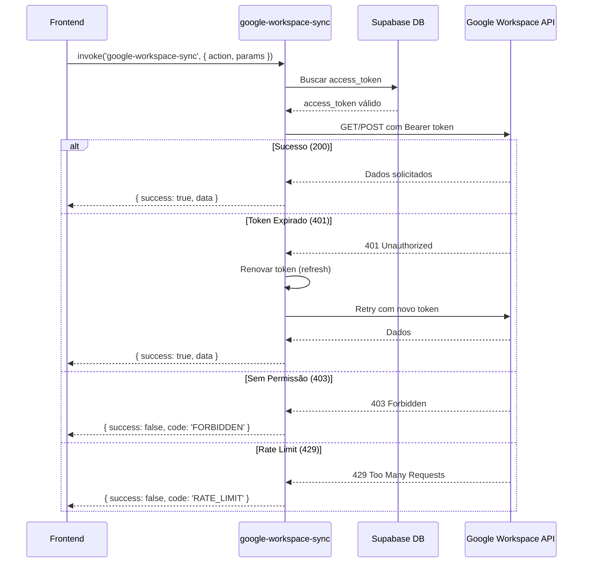

# Guia de Uso das APIs do Google Workspace

Este documento detalha como consumir endpoints do Google Workspace usando os tokens OAuth 2.0 obtidos.

## 📋 Índice

1. [Arquitetura](#arquitetura)
2. [Endpoints Disponíveis](#endpoints-disponíveis)
3. [Tratamento de Erros](#tratamento-de-erros)
4. [Exemplos de Uso](#exemplos-de-uso)
5. [Edge Cases Comuns](#edge-cases-comuns)

---

## 🏗️ Arquitetura



---

## 🔌 Endpoints Disponíveis

### 1. Get User Profile

**Descrição:** Obter perfil do usuário autenticado (você)

**Endpoint Google:** `https://www.googleapis.com/oauth2/v2/userinfo`

**Scopes necessários:**
- `openid`
- `profile`
- `email`

**Código:**
```typescript
const { getUserProfile } = useGoogleWorkspaceApi();
const profile = await getUserProfile();

// Resultado:
{
  id: "123456789",
  email: "user@empresa.com",
  verified_email: true,
  name: "João Silva",
  given_name: "João",
  family_name: "Silva",
  picture: "https://lh3.googleusercontent.com/...",
  locale: "pt-BR",
  hd: "empresa.com" // undefined para @gmail.com
}
```

**Edge Cases:**
- `hd` (hosted domain) será `undefined` para contas pessoais (@gmail.com)
- `picture` retorna URL padrão se o usuário não configurou foto
- `locale` pode variar (pt-BR, en-US, etc)

---

### 2. List Users

**Descrição:** Listar usuários do domínio Google Workspace

**Endpoint Google:** `https://admin.googleapis.com/admin/directory/v1/users`

**Scopes necessários:**
- `https://www.googleapis.com/auth/admin.directory.user.readonly`

**Requer:** Permissões de administrador do Workspace

**Código:**
```typescript
const { listUsers } = useGoogleWorkspaceApi();

// Listar primeiros 50 usuários
const result = await listUsers({ 
  maxResults: 50 
});

// Filtrar por domínio
const result = await listUsers({ 
  maxResults: 100,
  domain: 'empresa.com'
});

// Resultado:
{
  users: [{
    id: "123456",
    primaryEmail: "user@empresa.com",
    name: {
      fullName: "João Silva",
      givenName: "João",
      familyName: "Silva"
    },
    isAdmin: false,
    suspended: false,
    orgUnitPath: "/Vendas/Regional Sul",
    lastLoginTime: "2025-11-17T10:30:00.000Z",
    creationTime: "2024-01-15T08:00:00.000Z"
  }],
  metadata: {
    totalCount: 50,
    syncedAt: "2025-11-17T19:00:00Z",
    nextPageToken: "AEIUasdf..." // ou null
  }
}
```

**Paginação:**
```typescript
// Primeira página
const page1 = await listUsers({ maxResults: 100 });

// Próxima página
if (page1.metadata.nextPageToken) {
  const page2 = await listUsers({ 
    maxResults: 100,
    pageToken: page1.metadata.nextPageToken 
  });
}
```

**Edge Cases:**
- `lastLoginTime` pode ser `undefined` para usuários que nunca fizeram login
- `orgUnitPath` sempre começa com `/`
- Usuários suspensos aparecem na lista com `suspended: true`
- Domínios grandes podem ter milhares de usuários, sempre usar paginação

---

### 3. List Groups

**Descrição:** Listar grupos do Google Workspace

**Endpoint Google:** `https://admin.googleapis.com/admin/directory/v1/groups`

**Scopes necessários:**
- `https://www.googleapis.com/auth/admin.directory.group.readonly`

**Código:**
```typescript
const { listGroups } = useGoogleWorkspaceApi();

const result = await listGroups({ maxResults: 30 });

// Resultado:
{
  groups: [{
    id: "abc123",
    email: "vendas@empresa.com",
    name: "Equipe de Vendas",
    description: "Grupo da equipe comercial",
    directMembersCount: 15
  }],
  metadata: {
    totalCount: 30,
    syncedAt: "2025-11-17T19:00:00Z",
    nextPageToken: null
  }
}
```

**Edge Cases:**
- `description` pode ser `undefined`
- `directMembersCount` não inclui membros de subgrupos aninhados
- Grupos podem ter membros externos ao domínio

---

### 4. Get Audit Logs

**Descrição:** Buscar eventos de auditoria

**Endpoint Google:** `https://admin.googleapis.com/admin/reports/v1/activity/users/{userKey}/applications/{applicationName}`

**Scopes necessários:**
- `https://www.googleapis.com/auth/admin.reports.audit.readonly`

**Aplicações disponíveis:**
- `admin` - Alterações administrativas
- `login` - Eventos de autenticação
- `drive` - Atividades no Google Drive
- `token` - Uso de tokens OAuth
- `calendar` - Eventos do Calendar
- `meet` - Atividades do Google Meet

**Código:**
```typescript
const { getAuditLogs } = useGoogleWorkspaceApi();

// Logs de login dos últimos 7 dias
const result = await getAuditLogs({
  applicationName: 'login',
  startTime: new Date(Date.now() - 7 * 24 * 60 * 60 * 1000).toISOString(),
  maxResults: 100
});

// Logs de um usuário específico
const result = await getAuditLogs({
  applicationName: 'admin',
  userKey: 'user@empresa.com',
  startTime: '2025-11-01T00:00:00Z',
  endTime: '2025-11-17T23:59:59Z'
});

// Resultado:
{
  auditLogs: [{
    id: { 
      time: "2025-11-17T10:30:00Z", 
      uniqueQualifier: "xyz123" 
    },
    actor: { 
      email: "user@empresa.com", 
      profileId: "123456" 
    },
    events: [{
      type: "USER_SETTINGS",
      name: "2sv_change",
      parameters: [
        { name: "2sv_enabled", value: "true" }
      ]
    }]
  }],
  metadata: {
    totalCount: 1,
    syncedAt: "2025-11-17T19:00:00Z",
    applicationName: "admin",
    startTime: "2025-11-01T00:00:00Z",
    endTime: "2025-11-17T23:59:59Z"
  }
}
```

**Edge Cases:**
- Logs podem ter **delay de até 24 horas** para aparecer
- `items` pode ser vazio se não houver logs no período
- `events` é array, um item pode ter múltiplos eventos
- `parameters` pode ser `undefined` para alguns tipos

---

## ⚠️ Tratamento de Erros HTTP

A edge function implementa tratamento específico para cada código HTTP:

### 401 Unauthorized
**Causa:** Token OAuth expirado ou inválido  
**Mensagem:** "🔒 Token expirado ou inválido. Renovando automaticamente..."  
**Ação:** Renovar token ou reconectar integração  
**Código retornado:** `TOKEN_EXPIRED`

```typescript
{
  success: false,
  error: "Token expirado ou inválido",
  code: "TOKEN_EXPIRED",
  requiresReconnection: true
}
```

### 403 Forbidden
**Causa:** Usuário sem permissões necessárias (falta scope ou não é admin)  
**Mensagem:** "⛔ Sem permissão. Verifique se o usuário tem os scopes necessários..."  
**Ação:** Verificar scopes no OAuth ou permissões de admin  
**Código retornado:** `FORBIDDEN`

```typescript
{
  success: false,
  error: "Sem permissão para acessar este recurso",
  code: "FORBIDDEN",
  status: 403
}
```

### 404 Not Found
**Causa:** Recurso não existe (ID inválido ou endpoint errado)  
**Mensagem:** "❓ Recurso não encontrado. Verifique o ID ou endpoint."  
**Código retornado:** `NOT_FOUND`

### 429 Rate Limit
**Causa:** Muitas requisições em curto período  
**Mensagem:** "⏳ Limite de requisições atingido. Aguarde alguns minutos..."  
**Ação:** Implementar backoff exponencial ou aguardar  
**Código retornado:** `RATE_LIMIT`

### 500+ Server Error
**Causa:** Erro interno do Google  
**Mensagem:** "🔧 Erro no servidor do Google. Tente novamente..."  
**Ação:** Retry com backoff exponencial  
**Código retornado:** `SERVER_ERROR`

---

## 💡 Exemplos de Uso Completos

### Exemplo 1: Obter e exibir perfil do usuário

```typescript
import { useGoogleWorkspaceApi } from '@/hooks/useGoogleWorkspaceApi';

function MyComponent() {
  const { getUserProfile, loading } = useGoogleWorkspaceApi();
  const [profile, setProfile] = useState(null);

  const loadProfile = async () => {
    const data = await getUserProfile();
    if (data) {
      setProfile(data);
      console.log('Nome:', data.name);
      console.log('Email:', data.email);
      console.log('Empresa:', data.hd || 'Conta pessoal');
    }
  };

  return (
    <button onClick={loadProfile} disabled={loading}>
      {loading ? 'Carregando...' : 'Ver Meu Perfil'}
    </button>
  );
}
```

### Exemplo 2: Listar usuários com paginação

```typescript
const { listUsers, loading } = useGoogleWorkspaceApi();
const [allUsers, setAllUsers] = useState([]);

const loadAllUsers = async () => {
  let users = [];
  let nextPageToken = null;

  do {
    const result = await listUsers({
      maxResults: 500, // Máximo por página
      pageToken: nextPageToken
    });

    if (result) {
      users = [...users, ...result.users];
      nextPageToken = result.metadata.nextPageToken;
    } else {
      break;
    }
  } while (nextPageToken);

  setAllUsers(users);
  console.log(`Total de usuários carregados: ${users.length}`);
};
```

### Exemplo 3: Buscar logs de login com tratamento de erros

```typescript
const { getAuditLogs, error } = useGoogleWorkspaceApi();

const checkLoginActivity = async () => {
  try {
    const result = await getAuditLogs({
      applicationName: 'login',
      startTime: new Date(Date.now() - 24 * 60 * 60 * 1000).toISOString(),
      maxResults: 100
    });

    if (!result) {
      console.error('Falha ao buscar logs:', error);
      return;
    }

    // Processar logs
    const failedLogins = result.auditLogs.filter(log =>
      log.events.some(event => event.name === 'login_failure')
    );

    console.log(`Tentativas de login falhadas: ${failedLogins.length}`);
  } catch (err) {
    console.error('Erro crítico:', err);
  }
};
```

---

## 🐛 Edge Cases Comuns

### 1. Token Expirado Durante Requisição

**Problema:** O token pode expirar entre a verificação e o uso

**Solução:** A edge function automaticamente tenta renovar

```typescript
// Fluxo automático implementado:
// 1. Buscar token do banco
// 2. Fazer requisição à API
// 3. Se receber 401, renovar token
// 4. Fazer retry com novo token
// 5. Se falhar novamente, pedir reconexão
```

### 2. Usuários Sem lastLoginTime

**Problema:** Usuários criados mas que nunca fizeram login

**Solução:** Sempre verificar se o campo existe

```typescript
const users = await listUsers();
users?.users.forEach(user => {
  const lastLogin = user.lastLoginTime 
    ? new Date(user.lastLoginTime).toLocaleDateString() 
    : 'Nunca fez login';
  console.log(`${user.primaryEmail}: ${lastLogin}`);
});
```

### 3. Paginação Incompleta

**Problema:** Domínios grandes podem ter milhares de registros

**Solução:** Sempre verificar `nextPageToken`

```typescript
let hasMore = true;
let pageToken = null;

while (hasMore) {
  const result = await listUsers({ 
    maxResults: 500, 
    pageToken 
  });
  
  if (!result) break;
  
  // Processar users aqui
  processUsers(result.users);
  
  // Verificar próxima página
  if (result.metadata.nextPageToken) {
    pageToken = result.metadata.nextPageToken;
  } else {
    hasMore = false;
  }
}
```

### 4. Delay de Audit Logs

**Problema:** Logs podem demorar até 24h para aparecer

**Solução:** Informar usuário sobre o delay

```typescript
// Buscar logs de ontem, não de hoje
const yesterday = new Date();
yesterday.setDate(yesterday.getDate() - 1);

const result = await getAuditLogs({
  applicationName: 'login',
  startTime: yesterday.toISOString()
});

// Avisar usuário
if (result?.auditLogs.length === 0) {
  toast({
    title: 'ℹ️ Nenhum log encontrado',
    description: 'Logs podem levar até 24h para aparecer. Tente novamente amanhã.'
  });
}
```

### 5. Contas Suspensas

**Problema:** Usuários suspensos aparecem na lista

**Solução:** Filtrar por `suspended: false`

```typescript
const result = await listUsers();
const activeUsers = result?.users.filter(user => !user.suspended) || [];
const suspendedUsers = result?.users.filter(user => user.suspended) || [];

console.log(`Ativos: ${activeUsers.length}`);
console.log(`Suspensos: ${suspendedUsers.length}`);
```

---

## 🚨 Erros Comuns e Soluções

### Erro: "Token não encontrado ou expirado"

**Causa:** Integração OAuth não conectada ou token expirou

**Solução:**
1. Vá para a aba "OAuth 2.0"
2. Clique em "Conectar Google Workspace"
3. Autorize o acesso

---

### Erro: "Sem permissão. Verifique scopes"

**Causa:** Faltam permissões OAuth ou usuário não é admin

**Solução para Admin APIs:**
1. Verifique se a conta é admin do Google Workspace
2. Reconecte a integração para renovar scopes
3. Verifique se os scopes estão configurados em `google-oauth-start`

**Scopes atuais configurados:**
```typescript
const scopes = [
  'https://www.googleapis.com/auth/admin.directory.user.readonly',
  'https://www.googleapis.com/auth/admin.directory.group.readonly',
  'https://www.googleapis.com/auth/admin.reports.audit.readonly',
  'https://www.googleapis.com/auth/drive.metadata.readonly',
  'openid',
  'profile',
  'email'
].join(' ');
```

---

### Erro: "Limite de requisições atingido"

**Causa:** Muitas chamadas em curto período (rate limit do Google)

**Solução:**
1. Aguardar 1-2 minutos antes de tentar novamente
2. Implementar cache para evitar requisições duplicadas
3. Reduzir frequência de sincronização

**Limites do Google:**
- API Directory: 1.500 requisições/minuto
- API Reports: 600 requisições/minuto

---

## 🔐 Segurança

### ✅ Boas Práticas Implementadas

1. **Tokens nunca expostos no frontend**
   - Armazenados apenas no banco de dados
   - Transmitidos apenas via edge functions

2. **Renovação automática**
   - Tokens expirados são renovados automaticamente
   - Fallback para reconexão se refresh falhar

3. **Logs detalhados**
   - Todas as operações são logadas
   - Erros são registrados para auditoria

4. **Validação de entrada**
   - Parâmetros são validados antes de chamar a API
   - Mensagens claras sobre campos obrigatórios

---

## 📊 Monitoramento

### Logs Disponíveis

**Edge Function Logs:**
```
[Token] Buscando access_token para user abc-123...
[Token] Access token válido encontrado
[API Call] GET https://www.googleapis.com/oauth2/v2/userinfo
[API Call] Success
[Profile] User profile fetched: user@empresa.com
```

**Consultar logs:**
```bash
# Via Supabase Dashboard
https://supabase.com/dashboard/project/ofbyxnpprwwuieabwhdo/functions/google-workspace-sync/logs
```

### Métricas Importantes

- **Taxa de sucesso:** Requisições bem-sucedidas / Total
- **Tempo de resposta:** Latência média das chamadas
- **Renovações de token:** Quantas vezes o token foi renovado
- **Erros 401/403:** Indicam problemas de autenticação/autorização

---

## 🧪 Testando as APIs

Use o componente `GoogleApiTester` na aba "🔌 API Test" do Hub de Integrações:

1. Conecte o Google Workspace na aba "OAuth 2.0"
2. Vá para a aba "🔌 API Test"
3. Selecione o endpoint que deseja testar
4. Configure os parâmetros
5. Clique em "Obter/Listar"
6. Visualize o resultado formatado em JSON

---

## 📚 Referências

- [Google Workspace Admin SDK](https://developers.google.com/admin-sdk)
- [Google OAuth 2.0](https://developers.google.com/identity/protocols/oauth2)
- [Directory API](https://developers.google.com/admin-sdk/directory)
- [Reports API](https://developers.google.com/admin-sdk/reports)
- [Error Codes Reference](https://developers.google.com/admin-sdk/directory/v1/limits)
