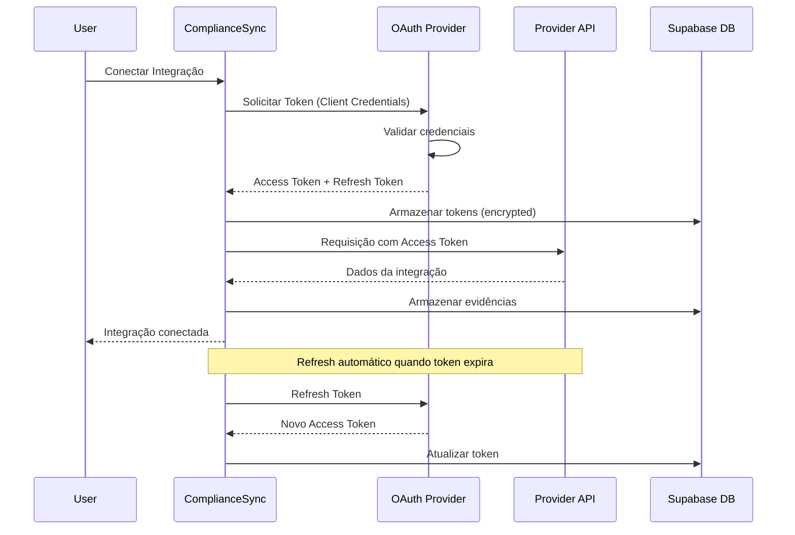
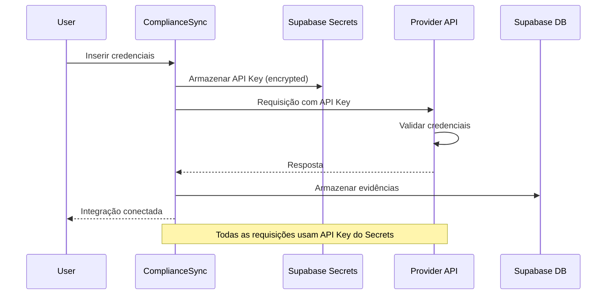
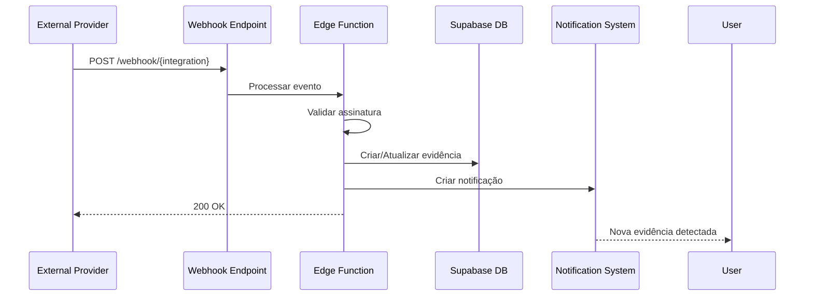
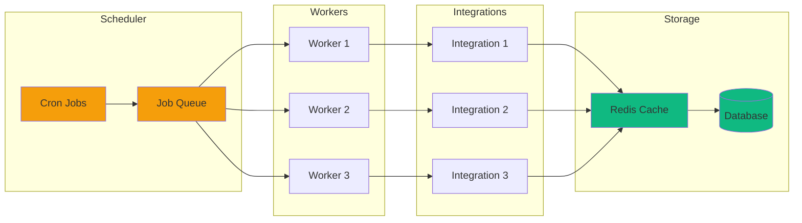

# Arquitetura de Integrações - ComplianceSync

## Visão Geral

Este documento mapeia todas as integrações externas previstas no projeto ComplianceSync, incluindo endpoints, credenciais, funcionalidades e dependências técnicas.

---

## Diagrama de Arquitetura de Integrações

```mermaid
graph TB
    subgraph "ComplianceSync Platform"
        APP[Frontend Application]
        API[Edge Functions]
        DB[(Supabase Database)]
        STORAGE[Storage Buckets]
        AUTH[Authentication Layer]
    end

    subgraph "Integration Layer"
        OAUTH[OAuth Manager]
        TOKEN[Token Manager]
        WEBHOOK[Webhook Handler]
        SYNC[Sync Scheduler]
        CACHE[Integration Cache]
    end

    subgraph "Cloud & Infrastructure"
        AWS[AWS]
        AZURE[Azure]
        GCP[Google Cloud]
        K8S[Kubernetes]
        DOCKER[Docker]
        TERRAFORM[Terraform]
    end

    subgraph "Identity & Access"
        ENTRA[Azure AD/Entra]
        OKTA[Okta]
        AUTH0[Auth0]
        ONELOGIN[OneLogin]
        PING[PingIdentity]
    end

    subgraph "Productivity"
        M365[Microsoft 365]
        GWORKSPACE[Google Workspace]
        SLACK[Slack]
        JIRA[Jira]
        CONFLUENCE[Confluence]
    end

    subgraph "Security & Monitoring"
        SPLUNK[Splunk]
        CROWDSTRIKE[CrowdStrike]
        DEFENDER[MS Defender]
        QUALYS[Qualys]
        SENTINELONE[SentinelOne]
    end

    APP --> API
    API --> OAUTH
    API --> TOKEN
    API --> WEBHOOK
    API --> SYNC
    
    OAUTH --> DB
    TOKEN --> DB
    WEBHOOK --> DB
    SYNC --> CACHE
    CACHE --> DB
    
    OAUTH --> AWS
    OAUTH --> AZURE
    OAUTH --> GCP
    OAUTH --> ENTRA
    OAUTH --> OKTA
    OAUTH --> M365
    OAUTH --> GWORKSPACE
    
    TOKEN --> K8S
    TOKEN --> DOCKER
    TOKEN --> TERRAFORM
    TOKEN --> SPLUNK
    TOKEN --> CROWDSTRIKE
    
    SYNC --> STORAGE
    
    style APP fill:#4f46e5
    style API fill:#3b82f6
    style DB fill:#10b981
    style OAUTH fill:#f59e0b
    style TOKEN fill:#f59e0b
    style WEBHOOK fill:#f59e0b
```



---

## Categorias de Integrações

### 1. Cloud & Infraestrutura

#### 1.1 Amazon Web Services (AWS)

**Endpoints Principais:**
- `https://iam.amazonaws.com` - Identity and Access Management
- `https://s3.amazonaws.com` - Storage
- `https://cloudtrail.amazonaws.com` - Audit Logs
- `https://config.amazonaws.com` - Configuration Management
- `https://ec2.amazonaws.com` - Compute
- `https://vpc.amazonaws.com` - Networking

**Credenciais Necessárias:**
- Access Key ID
- Secret Access Key
- Region
- Account ID

**Funcionalidades Habilitadas:**
- Coleta automática de configurações IAM
- Monitoramento de buckets S3 e políticas de criptografia
- Auditoria de atividades via CloudTrail
- Validação de configurações de segurança
- Monitoramento de VPC e Security Groups

**Dependências Técnicas:**
- AWS SDK v3
- API Keys armazenadas em Supabase Secrets
- Webhooks para eventos em tempo real (EventBridge)
- Variáveis de ambiente: `AWS_ACCESS_KEY_ID`, `AWS_SECRET_ACCESS_KEY`, `AWS_REGION`

**Controles Mapeados:**
- IAM Policies and Roles
- S3 Bucket Encryption
- VPC Security
- CloudTrail Logging
- AWS Config Rules

---

#### 1.2 Microsoft Azure

**Endpoints Principais:**
- `https://management.azure.com` - Resource Management
- `https://login.microsoftonline.com` - Authentication
- `https://graph.microsoft.com` - Microsoft Graph API
- `https://vault.azure.net` - Key Vault

**Credenciais Necessárias:**
- Tenant ID
- Client ID (Application ID)
- Client Secret
- Subscription ID

**Funcionalidades Habilitadas:**
- Monitoramento de recursos e configurações
- Gestão de identidades via Azure AD
- Auditoria de atividades
- Validação de políticas de segurança
- Monitoramento de Key Vault

**Dependências Técnicas:**
- OAuth 2.0 (Client Credentials Flow)
- Azure SDK for JavaScript
- Microsoft Graph API
- Variáveis de ambiente: `AZURE_TENANT_ID`, `AZURE_CLIENT_ID`, `AZURE_CLIENT_SECRET`, `AZURE_SUBSCRIPTION_ID`

**Controles Mapeados:**
- Resource Encryption
- IAM Configuration
- Network Security Groups
- Key Vault Access Policies

---

#### 1.3 Google Cloud Platform (GCP)

**Endpoints Principais:**
- `https://cloudresourcemanager.googleapis.com` - Resource Management
- `https://iam.googleapis.com` - IAM
- `https://compute.googleapis.com` - Compute Engine
- `https://storage.googleapis.com` - Cloud Storage
- `https://cloudkms.googleapis.com` - Key Management

**Credenciais Necessárias:**
- Service Account JSON Key
- Project ID
- Client Email

**Funcionalidades Habilitadas:**
- Coleta de configurações de IAM
- Monitoramento de VPC e firewalls
- Auditoria de Cloud KMS
- Validação de políticas de Storage
- Monitoramento do Security Command Center

**Dependências Técnicas:**
- Service Account Authentication
- Google Cloud SDK
- OAuth 2.0 JWT Bearer
- Variáveis de ambiente: `GCP_SERVICE_ACCOUNT_KEY`, `GCP_PROJECT_ID`

**Controles Mapeados:**
- Cloud IAM Permissions
- VPC Configuration
- Cloud KMS Encryption
- Security Center Findings

---

#### 1.4 Kubernetes

**Endpoints Principais:**
- `https://<cluster-endpoint>/api/v1` - Core API
- `https://<cluster-endpoint>/apis/rbac.authorization.k8s.io` - RBAC
- `https://<cluster-endpoint>/apis/networking.k8s.io` - Network Policies

**Credenciais Necessárias:**
- Cluster Endpoint URL
- Certificate Authority Data
- Service Account Token ou Kubeconfig

**Funcionalidades Habilitadas:**
- Monitoramento de RBAC
- Validação de Network Policies
- Auditoria de Pod Security
- Gestão de Secrets
- Validação de Security Contexts

**Dependências Técnicas:**
- Kubernetes API Client
- Bearer Token Authentication
- TLS/SSL Certificates
- Variáveis de ambiente: `K8S_ENDPOINT`, `K8S_TOKEN`, `K8S_CA_CERT`

**Controles Mapeados:**
- RBAC Configuration
- Network Policies
- Pod Security Standards
- Secrets Management

---

#### 1.5 Docker Registry

**Endpoints Principais:**
- `https://registry.hub.docker.com/v2` - Docker Hub
- `https://<private-registry>/v2` - Private Registry

**Credenciais Necessárias:**
- Registry URL
- Username
- Password ou Access Token

**Funcionalidades Habilitadas:**
- Scan de vulnerabilidades em imagens
- Validação de políticas de acesso
- Auditoria de pull/push de imagens
- Monitoramento de tags e versões

**Dependências Técnicas:**
- Docker Registry HTTP API V2
- Basic Authentication ou Token-based
- Variáveis de ambiente: `DOCKER_REGISTRY_URL`, `DOCKER_USERNAME`, `DOCKER_PASSWORD`

**Controles Mapeados:**
- Image Scanning
- Registry Access Control
- Image Signing Verification

---

#### 1.6 Terraform

**Endpoints Principais:**
- `https://app.terraform.io/api/v2` - Terraform Cloud API
- File System - Local state files

**Credenciais Necessárias:**
- Terraform Cloud Token
- Organization Name
- Workspace Name

**Funcionalidades Habilitadas:**
- Validação de configurações IaC
- Auditoria de mudanças de estado
- Validação de políticas como código
- Drift detection

**Dependências Técnicas:**
- Terraform Cloud API
- Bearer Token Authentication
- State file parsing
- Variáveis de ambiente: `TF_CLOUD_TOKEN`, `TF_ORGANIZATION`, `TF_WORKSPACE`

**Controles Mapeados:**
- IaC Security Validation
- State Management
- Policy as Code Enforcement

---

### 2. Identidade & Acesso

#### 2.1 Azure AD / Entra ID

**Endpoints Principais:**
- `https://graph.microsoft.com/v1.0/users` - User Management
- `https://graph.microsoft.com/v1.0/groups` - Group Management
- `https://graph.microsoft.com/v1.0/identity` - Identity Protection
- `https://graph.microsoft.com/v1.0/auditLogs` - Audit Logs

**Credenciais Necessárias:**
- Tenant ID
- Client ID
- Client Secret
- Scopes: `User.Read.All`, `Group.Read.All`, `Directory.Read.All`, `AuditLog.Read.All`

**Funcionalidades Habilitadas:**
- Sincronização de usuários e grupos
- Monitoramento de SSO e MFA
- Auditoria de acessos
- Validação de Conditional Access
- Gestão de Privileged Identity Management (PIM)

**Dependências Técnicas:**
- OAuth 2.0 (Client Credentials Flow)
- Microsoft Graph API
- Webhook via Microsoft Graph Change Notifications
- Variáveis de ambiente: `ENTRA_TENANT_ID`, `ENTRA_CLIENT_ID`, `ENTRA_CLIENT_SECRET`

**Controles Mapeados:**
- Single Sign-On Configuration
- Multi-Factor Authentication
- Conditional Access Policies
- Privileged Identity Management

---

#### 2.2 Okta

**Endpoints Principais:**
- `https://<domain>.okta.com/api/v1/users` - User Management
- `https://<domain>.okta.com/api/v1/groups` - Group Management
- `https://<domain>.okta.com/api/v1/logs` - System Logs
- `https://<domain>.okta.com/api/v1/apps` - Application Management

**Credenciais Necessárias:**
- Okta Domain
- API Token

**Funcionalidades Habilitadas:**
- Sincronização de diretórios
- Monitoramento de SSO
- Auditoria de eventos de autenticação
- Gestão de ciclo de vida de usuários
- Validação de políticas de MFA

**Dependências Técnicas:**
- Okta API
- Bearer Token Authentication
- Webhook via Okta Event Hooks
- Variáveis de ambiente: `OKTA_DOMAIN`, `OKTA_API_TOKEN`

**Controles Mapeados:**
- Universal Directory Sync
- SSO Integration
- MFA Enforcement
- Lifecycle Management

---

#### 2.3 Auth0

**Endpoints Principais:**
- `https://<domain>.auth0.com/api/v2/users` - User Management
- `https://<domain>.auth0.com/api/v2/logs` - Logs
- `https://<domain>.auth0.com/api/v2/connections` - Connections

**Credenciais Necessárias:**
- Domain
- Client ID
- Client Secret
- Management API Token

**Funcionalidades Habilitadas:**
- Gestão de autenticação
- Monitoramento de logins
- Auditoria de eventos
- Validação de conexões

**Dependências Técnicas:**
- OAuth 2.0 (Client Credentials Flow)
- Auth0 Management API
- Variáveis de ambiente: `AUTH0_DOMAIN`, `AUTH0_CLIENT_ID`, `AUTH0_CLIENT_SECRET`

**Controles Mapeados:**
- Authentication Rules
- MFA Configuration
- Social Connections

---

### 3. Produtividade

#### 3.1 Microsoft 365

**Endpoints Principais:**
- `https://graph.microsoft.com/v1.0/users` - User Data
- `https://graph.microsoft.com/v1.0/security/alerts` - Security Alerts
- `https://graph.microsoft.com/v1.0/compliance` - Compliance
- `https://graph.microsoft.com/v1.0/auditLogs/directoryAudits` - Audit Logs

**Credenciais Necessárias:**
- Tenant ID
- Client ID
- Client Secret
- Scopes: `User.Read.All`, `Files.Read.All`, `Mail.Read`, `SecurityEvents.Read.All`

**Funcionalidades Habilitadas:**
- Monitoramento de compartilhamento de arquivos
- Auditoria de atividades
- Validação de políticas DLP
- Monitoramento de alertas de segurança
- Gestão de conformidade

**Dependências Técnicas:**
- OAuth 2.0 (Client Credentials Flow)
- Microsoft Graph API
- Webhook via Microsoft Graph Subscriptions
- Variáveis de ambiente: `M365_TENANT_ID`, `M365_CLIENT_ID`, `M365_CLIENT_SECRET`

**Controles Mapeados:**
- Data Loss Prevention
- Sharing Policies
- Retention Policies
- Security Alerts

---

#### 3.2 Google Workspace

**Endpoints Principais:**
- `https://admin.googleapis.com/admin/directory/v1` - Directory API
- `https://www.googleapis.com/admin/reports/v1` - Reports API
- `https://www.googleapis.com/drive/v3` - Drive API

**Credenciais Necessárias:**
- Service Account JSON Key
- Domain-wide Delegation
- Admin Email

**Funcionalidades Habilitadas:**
- Sincronização de usuários e grupos
- Auditoria de atividades
- Monitoramento de compartilhamento
- Validação de configurações de segurança

**Dependências Técnicas:**
- Service Account Authentication
- OAuth 2.0 JWT Bearer
- Domain-wide Delegation
- Variáveis de ambiente: `GWORKSPACE_SERVICE_ACCOUNT_KEY`, `GWORKSPACE_ADMIN_EMAIL`

**Controles Mapeados:**
- 2-Step Verification
- Password Policies
- Sharing Settings
- Mobile Device Management

---

#### 3.3 Slack

**Endpoints Principais:**
- `https://slack.com/api/users.list` - User Management
- `https://slack.com/api/conversations.list` - Channels
- `https://slack.com/api/audit.v1.logs` - Audit Logs

**Credenciais Necessárias:**
- Workspace ID
- OAuth Token
- Scopes: `users:read`, `channels:read`, `auditlogs:read`

**Funcionalidades Habilitadas:**
- Auditoria de atividades
- Monitoramento de permissões
- Validação de configurações de segurança
- Gestão de integrações

**Dependências Técnicas:**
- OAuth 2.0
- Slack Web API
- Webhook via Slack Events API
- Variáveis de ambiente: `SLACK_TOKEN`, `SLACK_WORKSPACE_ID`

**Controles Mapeados:**
- Workspace Access
- Channel Permissions
- App Integrations
- File Sharing Policies

---

#### 3.4 Jira

**Endpoints Principais:**
- `https://<domain>.atlassian.net/rest/api/3/user` - User Management
- `https://<domain>.atlassian.net/rest/api/3/project` - Projects
- `https://<domain>.atlassian.net/rest/api/3/issue` - Issues

**Credenciais Necessárias:**
- Atlassian Domain
- Email
- API Token

**Funcionalidades Habilitadas:**
- Sincronização de projetos
- Auditoria de mudanças
- Gestão de permissões
- Rastreamento de conformidade

**Dependências Técnicas:**
- Basic Authentication (Email + API Token)
- Jira REST API v3
- Webhook via Jira Webhooks
- Variáveis de ambiente: `JIRA_DOMAIN`, `JIRA_EMAIL`, `JIRA_API_TOKEN`

**Controles Mapeados:**
- Project Permissions
- Issue Security
- Audit Logs

---

### 4. Segurança & Monitoramento

#### 4.1 Splunk

**Endpoints Principais:**
- `https://<host>:8089/services/search/jobs` - Search API
- `https://<host>:8089/services/data/indexes` - Index Management
- `https://<host>:8089/servicesNS/<owner>/<app>/saved/searches` - Saved Searches

**Credenciais Necessárias:**
- Splunk Host
- Port (default 8089)
- Username
- Password ou Authentication Token

**Funcionalidades Habilitadas:**
- Coleta de logs de segurança
- Execução de queries de auditoria
- Correlação de eventos
- Alertas de segurança

**Dependências Técnicas:**
- Splunk REST API
- Basic Authentication ou Token-based
- Variáveis de ambiente: `SPLUNK_HOST`, `SPLUNK_PORT`, `SPLUNK_TOKEN`

**Controles Mapeados:**
- Security Event Monitoring
- Incident Detection
- Log Analysis
- Alert Management

---

#### 4.2 CrowdStrike

**Endpoints Principais:**
- `https://api.crowdstrike.com/oauth2/token` - Authentication
- `https://api.crowdstrike.com/devices/queries/devices/v1` - Device Management
- `https://api.crowdstrike.com/detects/queries/detects/v1` - Detections
- `https://api.crowdstrike.com/incidents/queries/incidents/v1` - Incidents

**Credenciais Necessárias:**
- Client ID
- Client Secret
- Base URL (region-specific)

**Funcionalidades Habilitadas:**
- Monitoramento de endpoints
- Detecção de ameaças
- Gestão de incidentes
- Validação de compliance
- Status de proteção

**Dependências Técnicas:**
- OAuth 2.0 (Client Credentials Flow)
- CrowdStrike API
- Webhook via CrowdStrike Event Streams
- Variáveis de ambiente: `CROWDSTRIKE_CLIENT_ID`, `CROWDSTRIKE_CLIENT_SECRET`, `CROWDSTRIKE_BASE_URL`

**Controles Mapeados:**
- Endpoint Protection Status
- Threat Detection
- Incident Response
- Vulnerability Management

---

#### 4.3 Microsoft Defender

**Endpoints Principais:**
- `https://api.securitycenter.microsoft.com/api/machines` - Machines
- `https://api.securitycenter.microsoft.com/api/alerts` - Alerts
- `https://api.securitycenter.microsoft.com/api/vulnerabilities` - Vulnerabilities

**Credenciais Necessárias:**
- Tenant ID
- Client ID
- Client Secret
- Scopes: `SecurityEvents.Read.All`

**Funcionalidades Habilitadas:**
- Monitoramento de alertas
- Gestão de vulnerabilidades
- Auditoria de eventos de segurança
- Status de proteção de dispositivos

**Dependências Técnicas:**
- OAuth 2.0 (Client Credentials Flow)
- Microsoft Defender API
- Variáveis de ambiente: `DEFENDER_TENANT_ID`, `DEFENDER_CLIENT_ID`, `DEFENDER_CLIENT_SECRET`

**Controles Mapeados:**
- Threat Detection
- Vulnerability Assessment
- Device Compliance
- Security Alerts

---

#### 4.4 Qualys

**Endpoints Principais:**
- `https://qualysapi.qualys.com/api/2.0/fo/asset/host` - Host Assets
- `https://qualysapi.qualys.com/api/2.0/fo/scan` - Vulnerability Scans
- `https://qualysapi.qualys.com/api/2.0/fo/compliance` - Compliance

**Credenciais Necessárias:**
- API Server URL
- Username
- Password

**Funcionalidades Habilitadas:**
- Scan de vulnerabilidades
- Gestão de conformidade
- Inventário de ativos
- Relatórios de segurança

**Dependências Técnicas:**
- Basic Authentication
- Qualys API
- Variáveis de ambiente: `QUALYS_API_URL`, `QUALYS_USERNAME`, `QUALYS_PASSWORD`

**Controles Mapeados:**
- Vulnerability Scanning
- Compliance Posture
- Asset Inventory
- Patch Management

---

#### 4.5 SentinelOne

**Endpoints Principais:**
- `https://<console-url>/web/api/v2.1/agents` - Agents
- `https://<console-url>/web/api/v2.1/threats` - Threats
- `https://<console-url>/web/api/v2.1/activities` - Activities

**Credenciais Necessárias:**
- Console URL
- API Token

**Funcionalidades Habilitadas:**
- Monitoramento de agentes
- Detecção de ameaças
- Resposta a incidentes
- Auditoria de atividades

**Dependências Técnicas:**
- Bearer Token Authentication
- SentinelOne Management API
- Variáveis de ambiente: `SENTINELONE_URL`, `SENTINELONE_API_TOKEN`

**Controles Mapeados:**
- Endpoint Detection and Response
- Threat Intelligence
- Incident Investigation
- Rollback Capabilities

---

### 5. Desenvolvimento & DevOps

#### 5.1 GitHub

**Endpoints Principais:**
- `https://api.github.com/user` - User Management
- `https://api.github.com/repos/<owner>/<repo>` - Repositories
- `https://api.github.com/orgs/<org>` - Organizations

**Credenciais Necessárias:**
- Personal Access Token ou GitHub App
- Organization Name

**Funcionalidades Habilitadas:**
- Auditoria de commits
- Validação de branch protection
- Monitoramento de secrets scanning
- Gestão de permissões

**Dependências Técnicas:**
- OAuth 2.0 ou Personal Access Token
- GitHub REST API v3
- Webhook via GitHub Webhooks
- Variáveis de ambiente: `GITHUB_TOKEN`, `GITHUB_ORG`

**Controles Mapeados:**
- Code Review Requirements
- Branch Protection Rules
- Secrets Scanning
- Dependency Scanning

---

#### 5.2 GitLab

**Endpoints Principais:**
- `https://gitlab.com/api/v4/users` - User Management
- `https://gitlab.com/api/v4/projects` - Projects
- `https://gitlab.com/api/v4/groups` - Groups

**Credenciais Necessárias:**
- GitLab URL (self-hosted ou gitlab.com)
- Personal Access Token

**Funcionalidades Habilitadas:**
- Auditoria de repositórios
- Validação de pipelines
- Monitoramento de segurança
- Gestão de permissões

**Dependências Técnicas:**
- Personal Access Token
- GitLab REST API v4
- Webhook via GitLab Webhooks
- Variáveis de ambiente: `GITLAB_URL`, `GITLAB_TOKEN`

**Controles Mapeados:**
- CI/CD Security
- Code Quality Gates
- Container Scanning
- SAST/DAST Integration

---

## Fluxo de Autenticação e Sincronização

### OAuth 2.0 Flow (Azure, Google, M365, etc.)



### API Key Flow (AWS, Kubernetes, Docker, etc.)



### Webhook Flow (Real-time Events)



---

## Sincronização Agendada

### Arquitetura de Sincronização



**Intervalos de Sincronização:**
- **Cloud Providers (AWS, Azure, GCP):** A cada 1 hora
- **Identity Providers (Okta, Azure AD):** A cada 30 minutos
- **Security Tools (CrowdStrike, Defender):** A cada 15 minutos
- **Productivity (M365, Google Workspace):** A cada 2 horas
- **DevOps (GitHub, GitLab):** A cada 6 horas

---

## Variáveis de Ambiente Necessárias

### Cloud & Infrastructure
```bash
# AWS
AWS_ACCESS_KEY_ID=
AWS_SECRET_ACCESS_KEY=
AWS_REGION=
AWS_ACCOUNT_ID=

# Azure
AZURE_TENANT_ID=
AZURE_CLIENT_ID=
AZURE_CLIENT_SECRET=
AZURE_SUBSCRIPTION_ID=

# Google Cloud
GCP_SERVICE_ACCOUNT_KEY=
GCP_PROJECT_ID=

# Kubernetes
K8S_ENDPOINT=
K8S_TOKEN=
K8S_CA_CERT=

# Docker
DOCKER_REGISTRY_URL=
DOCKER_USERNAME=
DOCKER_PASSWORD=

# Terraform
TF_CLOUD_TOKEN=
TF_ORGANIZATION=
TF_WORKSPACE=
```

### Identity & Access
```bash
# Azure AD / Entra ID
ENTRA_TENANT_ID=
ENTRA_CLIENT_ID=
ENTRA_CLIENT_SECRET=

# Okta
OKTA_DOMAIN=
OKTA_API_TOKEN=

# Auth0
AUTH0_DOMAIN=
AUTH0_CLIENT_ID=
AUTH0_CLIENT_SECRET=

# OneLogin
ONELOGIN_SUBDOMAIN=
ONELOGIN_CLIENT_ID=
ONELOGIN_CLIENT_SECRET=

# PingIdentity
PING_ENVIRONMENT_ID=
PING_CLIENT_ID=
PING_CLIENT_SECRET=
```

### Productivity
```bash
# Microsoft 365
M365_TENANT_ID=
M365_CLIENT_ID=
M365_CLIENT_SECRET=

# Google Workspace
GWORKSPACE_SERVICE_ACCOUNT_KEY=
GWORKSPACE_ADMIN_EMAIL=

# Slack
SLACK_TOKEN=
SLACK_WORKSPACE_ID=

# Jira
JIRA_DOMAIN=
JIRA_EMAIL=
JIRA_API_TOKEN=

# Confluence
CONFLUENCE_URL=
CONFLUENCE_EMAIL=
CONFLUENCE_API_TOKEN=
```

### Security & Monitoring
```bash
# Splunk
SPLUNK_HOST=
SPLUNK_PORT=
SPLUNK_TOKEN=

# CrowdStrike
CROWDSTRIKE_CLIENT_ID=
CROWDSTRIKE_CLIENT_SECRET=
CROWDSTRIKE_BASE_URL=

# Microsoft Defender
DEFENDER_TENANT_ID=
DEFENDER_CLIENT_ID=
DEFENDER_CLIENT_SECRET=

# Qualys
QUALYS_API_URL=
QUALYS_USERNAME=
QUALYS_PASSWORD=

# SentinelOne
SENTINELONE_URL=
SENTINELONE_API_TOKEN=
```

### Development & DevOps
```bash
# GitHub
GITHUB_TOKEN=
GITHUB_ORG=

# GitLab
GITLAB_URL=
GITLAB_TOKEN=

# Jenkins
JENKINS_URL=
JENKINS_USERNAME=
JENKINS_API_TOKEN=

# CircleCI
CIRCLECI_TOKEN=
CIRCLECI_ORG=
```

---

## Implementação de Edge Functions

### Exemplo: AWS Integration Edge Function

```typescript
// supabase/functions/aws-sync/index.ts
import { serve } from 'https://deno.land/std@0.168.0/http/server.ts';
import { 
  S3Client, 
  ListBucketsCommand,
  GetBucketEncryptionCommand 
} from 'npm:@aws-sdk/client-s3';
import { 
  IAMClient, 
  ListUsersCommand 
} from 'npm:@aws-sdk/client-iam';

const corsHeaders = {
  'Access-Control-Allow-Origin': '*',
  'Access-Control-Allow-Headers': 'authorization, x-client-info, apikey, content-type',
};

serve(async (req) => {
  if (req.method === 'OPTIONS') {
    return new Response(null, { headers: corsHeaders });
  }

  try {
    const awsConfig = {
      region: Deno.env.get('AWS_REGION'),
      credentials: {
        accessKeyId: Deno.env.get('AWS_ACCESS_KEY_ID')!,
        secretAccessKey: Deno.env.get('AWS_SECRET_ACCESS_KEY')!,
      },
    };

    // Collect S3 Evidence
    const s3Client = new S3Client(awsConfig);
    const bucketsResponse = await s3Client.send(new ListBucketsCommand({}));
    
    const bucketEvidences = await Promise.all(
      bucketsResponse.Buckets?.map(async (bucket) => {
        try {
          const encryption = await s3Client.send(
            new GetBucketEncryptionCommand({ Bucket: bucket.Name })
          );
          return {
            bucket: bucket.Name,
            encrypted: true,
            algorithm: encryption.ServerSideEncryptionConfiguration?.Rules[0]?.ApplyServerSideEncryptionByDefault?.SSEAlgorithm,
          };
        } catch {
          return {
            bucket: bucket.Name,
            encrypted: false,
          };
        }
      }) || []
    );

    // Collect IAM Evidence
    const iamClient = new IAMClient(awsConfig);
    const usersResponse = await iamClient.send(new ListUsersCommand({}));

    const evidence = {
      timestamp: new Date().toISOString(),
      s3: {
        totalBuckets: bucketsResponse.Buckets?.length || 0,
        buckets: bucketEvidences,
      },
      iam: {
        totalUsers: usersResponse.Users?.length || 0,
      },
    };

    return new Response(JSON.stringify(evidence), {
      headers: { ...corsHeaders, 'Content-Type': 'application/json' },
    });
  } catch (error) {
    console.error('AWS Sync Error:', error);
    return new Response(
      JSON.stringify({ error: error.message }),
      { status: 500, headers: { ...corsHeaders, 'Content-Type': 'application/json' } }
    );
  }
});
```

### Exemplo: Webhook Handler

```typescript
// supabase/functions/integration-webhook/index.ts
import { serve } from 'https://deno.land/std@0.168.0/http/server.ts';
import { createClient } from 'https://esm.sh/@supabase/supabase-js@2';

const supabaseUrl = Deno.env.get('SUPABASE_URL')!;
const supabaseKey = Deno.env.get('SUPABASE_SERVICE_ROLE_KEY')!;

serve(async (req) => {
  try {
    const { integration, event, data } = await req.json();
    const supabase = createClient(supabaseUrl, supabaseKey);

    // Validate webhook signature
    const signature = req.headers.get('x-webhook-signature');
    if (!validateSignature(signature, data, integration)) {
      return new Response('Invalid signature', { status: 401 });
    }

    // Store evidence
    await supabase.from('integration_evidence_mapping').insert({
      integration_name: integration,
      evidence_type: event.type,
      config: data,
      last_collected: new Date().toISOString(),
    });

    // Create notification
    await supabase.rpc('create_notification', {
      p_user_id: data.user_id,
      p_title: `Nova evidência: ${integration}`,
      p_message: `Evento ${event.type} detectado`,
      p_type: 'info',
    });

    return new Response('OK', { status: 200 });
  } catch (error) {
    console.error('Webhook Error:', error);
    return new Response('Error', { status: 500 });
  }
});

function validateSignature(signature: string | null, data: any, integration: string): boolean {
  // Implement signature validation logic per integration
  return true;
}
```

---

## Tabela de Mapeamento de Evidências

| Integração | Evidências Coletadas | Controles Relacionados | Frequência |
|------------|---------------------|------------------------|------------|
| AWS | IAM Policies, S3 Encryption, CloudTrail Logs, VPC Config | AC-2, AC-6, AU-2, SC-8 | 1h |
| Azure | Resource Config, IAM Roles, Key Vault Access | AC-2, AC-6, SC-28 | 1h |
| GCP | IAM Bindings, KMS Keys, VPC Rules | AC-2, AC-6, SC-8 | 1h |
| Kubernetes | RBAC Roles, Network Policies, Secrets | AC-3, AC-6, SC-7 | 30min |
| Docker | Image Scans, Registry Access | SA-11, CM-7 | 2h |
| Azure AD | User Accounts, MFA Status, Conditional Access | IA-2, IA-5, AC-2 | 30min |
| Okta | SSO Config, MFA Policies, Lifecycle Rules | IA-2, IA-4, AC-2 | 30min |
| M365 | DLP Policies, Sharing Settings, Alerts | MP-4, SC-7, IR-5 | 2h |
| Google Workspace | 2FA Status, Sharing Rules, Mobile Devices | IA-2, AC-20, SC-7 | 2h |
| CrowdStrike | Endpoint Status, Detections, Incidents | SI-3, SI-4, IR-4 | 15min |
| Defender | Alerts, Vulnerabilities, Device Compliance | SI-2, SI-3, RA-5 | 15min |
| Splunk | Security Events, Audit Logs | AU-2, AU-6, SI-4 | 15min |
| GitHub | Branch Protection, Secrets Scan, Commits | CM-3, SA-11, SC-28 | 6h |
| GitLab | Pipeline Security, Code Quality, SAST | SA-11, SA-15, RA-5 | 6h |

---

## Segurança das Credenciais

### Armazenamento de Secrets

Todas as credenciais são armazenadas como **Supabase Secrets** e nunca expostas no código ou frontend.

```typescript
// Exemplo de uso de secrets em Edge Functions
const apiKey = Deno.env.get('AWS_ACCESS_KEY_ID');
const apiSecret = Deno.env.get('AWS_SECRET_ACCESS_KEY');
```

### Criptografia

- Todas as credenciais são criptografadas em repouso
- Comunicação via HTTPS/TLS
- Tokens OAuth armazenados com criptografia AES-256

### Rotação de Credenciais

- Implementar rotação automática de tokens OAuth
- Alertas quando credenciais expiram
- Suporte a múltiplas versões de credenciais para zero-downtime rotation

---

## Monitoramento e Logs

### Métricas de Integração

- Taxa de sucesso de sincronização
- Latência de requisições
- Número de evidências coletadas
- Erros por integração
- Status de saúde (healthy/degraded/paused)

### Alertas

- Falha de autenticação
- Taxa de erro elevada
- Timeout de sincronização
- Credenciais expirando

---

## Próximos Passos

1. **Implementar Edge Functions** para cada integração prioritária
2. **Configurar Webhooks** para eventos em tempo real
3. **Criar testes automatizados** de integração
4. **Documentar processos de troubleshooting**
5. **Implementar retry logic e circuit breakers**
6. **Adicionar cache para reduzir chamadas API**
7. **Criar dashboard de health das integrações**

---

## Referências

- [AWS SDK for JavaScript v3](https://docs.aws.amazon.com/AWSJavaScriptSDK/v3/latest/)
- [Azure SDK for JavaScript](https://learn.microsoft.com/en-us/javascript/api/overview/azure/)
- [Google Cloud Client Libraries](https://cloud.google.com/nodejs/docs/reference)
- [Microsoft Graph API](https://learn.microsoft.com/en-us/graph/api/overview)
- [Okta API](https://developer.okta.com/docs/reference/)
- [CrowdStrike API](https://falcon.crowdstrike.com/documentation/page/a2a7fc0e/crowdstrike-oauth2-based-apis)
- [Supabase Edge Functions](https://supabase.com/docs/guides/functions)

---

**Última Atualização:** 2025-11-17  
**Versão:** 1.0  
**Autor:** ComplianceSync Team
