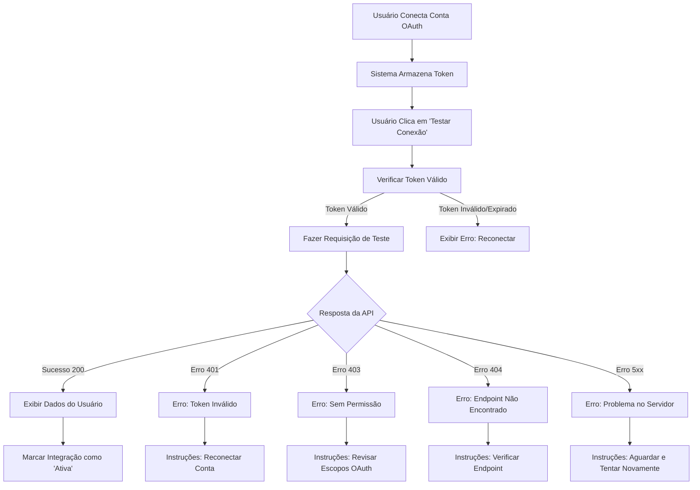

# Guia de Validação de Integrações OAuth

## Visão Geral

O sistema de validação de integrações OAuth permite testar automaticamente se suas conexões com APIs externas estão funcionando corretamente. Este documento explica como usar o validador, interpretar resultados e resolver problemas comuns.

---

## 🎯 Objetivos da Validação

1. **Verificar Conectividade**: Confirmar que o token OAuth está válido
2. **Testar Permissões**: Validar que os escopos necessários foram autorizados
3. **Identificar Problemas**: Detectar e diagnosticar erros de configuração
4. **Fornecer Feedback**: Exibir instruções claras para correção de erros
5. **Registrar Logs**: Manter histórico detalhado para auditoria e debug

---

## 🔧 Como Funciona

### Fluxo de Validação



### Endpoint de Teste Padrão

Para validar a integração Google Workspace, o sistema usa:

```
GET https://www.googleapis.com/oauth2/v1/userinfo
```

Este endpoint é público e requer apenas os escopos básicos de perfil do usuário.

---

## 📋 Usando o Validador

### 1. Conectar Conta OAuth

Antes de validar, você precisa conectar sua conta:

1. Vá para **Hub de Integrações** > **OAuth 2.0**
2. Clique em **"Conectar Google Workspace"**
3. Autorize as permissões solicitadas
4. Aguarde o retorno para a aplicação

### 2. Executar Validação

Após conectar:

1. Vá para **Hub de Integrações** > **✅ Validar**
2. Clique em **"Testar Conexão"**
3. Aguarde a validação (geralmente 1-3 segundos)
4. Visualize o resultado

### 3. Interpretando Resultados

#### ✅ Sucesso (Status 200)

```json
{
  "success": true,
  "statusCode": 200,
  "duration": 1234,
  "data": {
    "id": "123456789",
    "email": "usuario@empresa.com.br",
    "name": "João Silva",
    "picture": "https://..."
  }
}
```

**Significado**: A integração está funcionando perfeitamente!

**Status Visual**: Badge verde "Ativa"

**Dados Exibidos**:
- Nome do usuário
- Email
- ID único
- Tempo de resposta

---

#### ❌ Erro 401 - Token Inválido

```json
{
  "success": false,
  "statusCode": 401,
  "error": "Invalid Credentials"
}
```

**Causa**: Token expirado ou inválido

**Solução**:
1. Clique em "Desconectar" na aba OAuth 2.0
2. Clique em "Conectar Google Workspace" novamente
3. Autorize as permissões
4. Execute nova validação

---

#### ❌ Erro 403 - Acesso Negado

```json
{
  "success": false,
  "statusCode": 403,
  "error": "Access Denied"
}
```

**Causas Comuns**:
- Escopos OAuth insuficientes
- Conta sem permissões necessárias
- API não habilitada no Google Cloud Console
- Redirect URI incorreto
- Tela de consentimento não publicada

**Soluções**:

1. **Verificar Escopos OAuth**
   - Acesse [Google Cloud Console](https://console.cloud.google.com)
   - Navegue até **APIs & Services** > **OAuth consent screen**
   - Confirme que os seguintes escopos estão adicionados:
     ```
     openid
     https://www.googleapis.com/auth/userinfo.profile
     https://www.googleapis.com/auth/userinfo.email
     ```

2. **Verificar APIs Habilitadas**
   - Vá para **APIs & Services** > **Library**
   - Certifique-se de que as seguintes APIs estão HABILITADAS:
     - Google+ API (para userinfo)
     - Admin SDK API
     - Google Drive API (se necessário)

3. **Verificar Redirect URI**
   - Vá para **APIs & Services** > **Credentials**
   - Clique no seu OAuth 2.0 Client ID
   - Confirme que está listado:
     ```
     https://ofbyxnpprwwuieabwhdo.supabase.co/functions/v1/google-oauth-callback
     ```

4. **Publicar Tela de Consentimento**
   - Vá para **OAuth consent screen**
   - Se estiver em "Testing", adicione seu email aos "Test users"
   - Ou publique a aplicação clicando em "PUBLISH APP"

---

#### ❌ Erro 404 - Não Encontrado

```json
{
  "success": false,
  "statusCode": 404,
  "error": "Not Found"
}
```

**Causa**: Endpoint da API incorreto ou não disponível

**Solução**:
- Verifique se o endpoint está correto
- Consulte a documentação da API para endpoints válidos
- Certifique-se de que a API está disponível para sua conta

---

#### ❌ Erro 429 - Limite Excedido

```json
{
  "success": false,
  "statusCode": 429,
  "error": "Rate Limit Exceeded"
}
```

**Causa**: Muitas requisições em pouco tempo

**Solução**:
- Aguarde alguns minutos antes de tentar novamente
- Revise as quotas da API no Google Cloud Console
- Considere implementar rate limiting na sua aplicação

---

#### ❌ Erro 500/502/503 - Erro no Servidor

```json
{
  "success": false,
  "statusCode": 500,
  "error": "Internal Server Error"
}
```

**Causa**: Problema temporário no servidor da API

**Solução**:
- Aguarde alguns minutos
- Tente novamente
- Verifique o status da API no painel do Google Cloud
- Se persistir, entre em contato com o suporte

---

## 📊 Logs Detalhados

O validador mantém logs completos de cada etapa:

```javascript
[
  {
    "timestamp": "2025-11-18T16:30:45.123Z",
    "step": "Token Check",
    "status": "success",
    "message": "Token válido encontrado",
    "details": {
      "tokenId": "uuid-123",
      "expiresAt": "2025-11-18T20:30:00Z"
    }
  },
  {
    "timestamp": "2025-11-18T16:30:45.789Z",
    "step": "Requisição",
    "status": "info",
    "message": "Enviando requisição de teste...",
    "details": {
      "endpoint": "https://www.googleapis.com/oauth2/v1/userinfo"
    }
  },
  {
    "timestamp": "2025-11-18T16:30:46.234Z",
    "step": "Sucesso",
    "status": "success",
    "message": "Conexão validada com sucesso!",
    "details": {
      "statusCode": 200,
      "duration": "1234ms",
      "responseData": { ... }
    }
  }
]
```

### Expandir Logs

1. Clique em **"Logs Detalhados (N)"** após a validação
2. Visualize todos os passos executados
3. Copie logs para reportar problemas
4. Use para debugging avançado

---

## 🔒 Segurança

### Proteção de Tokens

- ✅ Tokens **NUNCA** são exibidos nos logs
- ✅ Apenas o `token_id` é registrado
- ✅ Requisições são feitas via proxy seguro (Edge Function)
- ✅ Tokens são criptografados no banco de dados
- ✅ Acesso isolado por usuário (RLS policies)

### Dados Exibidos

Os seguintes dados **SÃO** exibidos após validação bem-sucedida:
- Nome do usuário
- Email
- ID único
- Foto de perfil (URL)

Esses dados são **públicos** e retornados pela API OAuth.

---

## 🧪 Teste Automático vs Manual

### Teste Automático

Ativado com `autoTest={true}` no componente:

```tsx
<IntegrationValidator 
  integrationName="google_workspace"
  autoTest={true}
/>
```

**Quando usar**:
- Após conectar a conta OAuth
- Em dashboards de status
- Em health checks periódicos

### Teste Manual

Usuário clica no botão "Testar Conexão":

```tsx
<IntegrationValidator 
  integrationName="google_workspace"
  autoTest={false}
/>
```

**Quando usar**:
- Para verificação sob demanda
- Ao resolver problemas
- Para validar após mudanças de configuração

---

## 📈 Métricas e Monitoramento

### Dados Coletados

Cada validação registra:
- ✅ Timestamp da validação
- ✅ Usuário que executou
- ✅ Integração testada
- ✅ Status HTTP retornado
- ✅ Tempo de resposta (ms)
- ✅ Sucesso ou falha
- ✅ Mensagem de erro (se houver)

### Histórico

Todas as validações ficam registradas em `integration_webhooks`:

```sql
SELECT 
  created_at,
  event_type,
  integration_name,
  status,
  payload->>'status_code' as status_code,
  payload->>'duration_ms' as duration_ms
FROM integration_webhooks
WHERE event_type = 'validation_test'
ORDER BY created_at DESC
LIMIT 10;
```

---

## 🔄 Reconexão Fácil

### Fluxo de Reconexão

1. **Detectar Problema**: Validação falha com erro 401 ou 403
2. **Desconectar**: Clique em "Desconectar" na aba OAuth 2.0
3. **Reconectar**: Clique em "Conectar Google Workspace"
4. **Reautorizar**: Aceite as permissões novamente
5. **Validar**: Execute nova validação
6. **Confirmar**: Verifique status "Ativa"

### Limpeza Automática

Ao desconectar:
- ✅ Token é removido do banco de dados
- ✅ Token é revogado no Google (se possível)
- ✅ Sessão é invalidada
- ✅ Logs são mantidos para auditoria

---

## 💡 Dicas e Melhores Práticas

### Para Usuários

1. **Valide após conectar**: Sempre execute validação após conectar uma nova conta
2. **Monitore expiração**: Fique atento ao tempo até expiração do token
3. **Revise permissões**: Certifique-se de autorizar todos os escopos necessários
4. **Salve logs**: Copie logs detalhados ao reportar problemas

### Para Administradores

1. **Configure alertas**: Monitore falhas de validação
2. **Revise quotas**: Acompanhe uso das APIs no Google Cloud Console
3. **Documente escopos**: Mantenha lista clara dos escopos necessários
4. **Teste regularmente**: Execute validações periódicas em produção

### Para Desenvolvedores

1. **Use callbacks**: Implemente `onValidationComplete` para automação
2. **Personalize endpoints**: Adapte o `testEndpoint` para sua API
3. **Trate erros**: Implemente lógica de retry e fallback
4. **Monitore performance**: Acompanhe tempo de resposta das validações

---

## 🚀 Exemplos de Uso

### Validação Básica

```tsx
import { IntegrationValidator } from '@/components/integrations/IntegrationValidator';

function MyPage() {
  return (
    <IntegrationValidator 
      integrationName="google_workspace"
      testEndpoint="https://www.googleapis.com/oauth2/v1/userinfo"
    />
  );
}
```

### Validação com Callback

```tsx
function MyPage() {
  const handleValidation = (result) => {
    if (result.success) {
      console.log('✅ Integração ativa!');
      console.log('Usuário:', result.data.email);
    } else {
      console.error('❌ Erro:', result.error);
      // Enviar para serviço de monitoramento
      trackError('integration_validation_failed', result);
    }
  };

  return (
    <IntegrationValidator 
      integrationName="google_workspace"
      onValidationComplete={handleValidation}
    />
  );
}
```

### Validação Automática Após OAuth

```tsx
function OAuthCallback() {
  const [justConnected, setJustConnected] = useState(false);

  useEffect(() => {
    const params = new URLSearchParams(window.location.search);
    if (params.get('success') === 'true') {
      setJustConnected(true);
    }
  }, []);

  return (
    <IntegrationValidator 
      integrationName="google_workspace"
      autoTest={justConnected}
      onValidationComplete={(result) => {
        if (result.success) {
          toast.success('Integração configurada com sucesso!');
        }
      }}
    />
  );
}
```

---

## 📚 Referências

- [Google OAuth 2.0 Documentation](https://developers.google.com/identity/protocols/oauth2)
- [Google Cloud Console](https://console.cloud.google.com)
- [OAuth Testing Best Practices](https://oauth.net/2/testing/)
- [Documentação OAuth Complice](./OAUTH_COMPLETE_GUIDE.md)

---

## ❓ Perguntas Frequentes

### P: Quanto tempo leva uma validação?
**R**: Geralmente entre 1-3 segundos, dependendo da latência da API.

### P: Preciso validar toda vez que usar a API?
**R**: Não. Valide apenas ao conectar, ao resolver problemas ou periodicamente.

### P: Os logs ficam salvos para sempre?
**R**: Sim, em `integration_webhooks` para auditoria e compliance.

### P: Posso testar outras APIs além do Google?
**R**: Sim! Basta configurar o `integrationName` e `testEndpoint` correspondentes.

### P: O que fazer se a validação falhar repetidamente?
**R**: 1) Revise todas as configurações OAuth, 2) Verifique logs detalhados, 3) Entre em contato com o suporte com os logs copiados.

---

**Documento atualizado**: 18 de novembro de 2025  
**Versão**: 1.0.0
