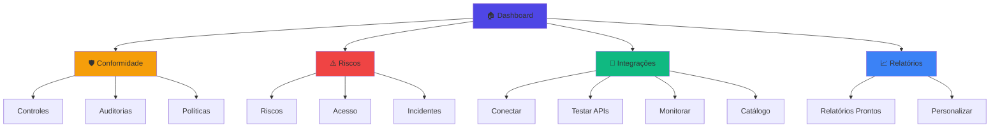

# 📊 Relatório de Simplificação para MVP - Complice

## 🎯 Objetivo
Análise completa da interface atual com foco em simplificação, organização e preparação para MVP (Minimum Viable Product).

---

## 📋 1. INVENTÁRIO DE ELEMENTOS POR TELA

### **Dashboard Principal (Index)**
**Elementos Visuais:**
- ✅ Hero Section com título + badges de status
- ✅ 2 Modais de ação rápida (CreateTask, EvidenceUpload)
- ✅ 6 Componentes principais:
  - MetricsGrid (KPIs)
  - ComplianceScoreCard (4 frameworks)
  - ConnectionStatus
  - ComplianceChart
  - TasksPanel
  - AnalyticsDashboard
- ✅ DashboardOnboarding (tutorial)
- ✅ Quick Actions (4 botões)
- ✅ Recent Activities (4 itens)

**Status:** ⚠️ **Complexidade ALTA** - Muita informação em uma tela

---

### **Hub de Integrações (IntegrationsHub)**
**Elementos Visuais:**
- ✅ Hero Section
- ✅ IntegrationsStats
- ❌ **11 ABAS** (CRÍTICO - muito complexo!):
  1. 📚 Guia (Onboarding)
  2. OAuth 2.0 (GoogleConnectionStatus + OAuth)
  3. ✅ Validar (IntegrationValidator)
  4. 🔌 API Test (GoogleApiTester)
  5. ⚡ Conector (DynamicApiConnector + ApiRequestHistory)
  6. Demo API (IntegrationDemo)
  7. 🧪 Testes (IntegrationDemo duplicado!)
  8. Webhooks (WebhookMonitor)
  9. 📋 Auditoria (AuditLogsViewer)
  10. Disponíveis (AvailableIntegrations)
  11. Conectadas (ConnectedIntegrations)

**Status:** 🚨 **CRÍTICO** - Interface mais complexa do sistema, requer simplificação urgente

---

### **Controles e Frameworks**
**Elementos Visuais:**
- ✅ Header + CreateControlModal
- ✅ 3 Componentes:
  - FrameworksOverview
  - GapAssessment
  - ControlsMatrix

**Status:** ✅ **BOM** - Organização clara e lógica

---

### **Riscos & Fornecedores**
**Elementos Visuais:**
- ✅ Header
- ✅ RiskStats
- ✅ RiskMatrix (full width)
- ✅ Grid 2 colunas: RiskRegistry + VendorManagement
- ✅ RiskAssessments

**Status:** ✅ **BOM** - Estrutura organizada

---

### **Políticas & Treinamentos**
**Elementos Visuais:**
- ✅ Header + CreatePolicyModal
- ✅ 4 Componentes:
  - PoliciesStats
  - PoliciesLibrary (com abas internas)
  - TrainingPrograms
  - AttestationTracking

**Status:** ⚠️ **MODERADO** - PoliciesLibrary tem abas internas adicionais

---

### **Auditorias Contínuas**
**Elementos Visuais:**
- ✅ Header + 2 modais (EvidenceUpload, CreateAudit)
- ✅ AuditStats
- ✅ Grid 2 colunas: AuditWorkflowVisualizer + AuditReportGenerator
- ✅ EvidenceLocker (full width)
- ✅ Grid 2 colunas: FrameworkChecklists + AuditorAccess

**Status:** ⚠️ **MODERADO** - Muitos componentes, mas organização lógica

---

### **Revisões de Acesso**
**Elementos Visuais:**
- ✅ Header
- ✅ AccessReviewsStats
- ✅ ActiveCampaigns
- ✅ Grid 2 colunas: SystemsInventory + AnomaliesDetection

**Status:** ✅ **BOM** - Estrutura simples e clara

---

### **Relatórios & Exportações**
**Elementos Visuais:**
- ✅ Header
- ✅ ReportsStats
- ✅ ReadyReports
- ✅ Grid 2 colunas: CustomReports + ScheduledReports

**Status:** ✅ **BOM** - Organização eficiente

---

### **Incidentes & Continuidade**
**Elementos Visuais:**
- ✅ Header
- ✅ IncidentStats
- ✅ ActiveIncidents
- ✅ Grid 2 colunas: BusinessContinuity + IncidentPlaybooks

**Status:** ✅ **BOM** - Estrutura clara

---

### **Navegação (Sidebar)**
**Elementos Visuais:**
- ✅ 10+ itens de menu principal
- ✅ Vários com submenus expansíveis
- ✅ Ícones + badges
- ✅ Hierarquia de 2 níveis

**Status:** ⚠️ **MODERADO** - Muitas opções, pode sobrecarregar usuário novo

---

## 🚨 2. ELEMENTOS REDUNDANTES E CONFUSOS

### **CRÍTICO - Duplicações**
1. ❌ **IntegrationsHub - Aba "Demo API" e "🧪 Testes"**
   - Ambas renderizam `IntegrationDemo`
   - **Ação:** REMOVER uma das duas

2. ⚠️ **Múltiplos pontos de entrada para OAuth**
   - GoogleWorkspaceOAuth em aba separada
   - GoogleConnectionStatus em outra aba
   - **Ação:** CONSOLIDAR em uma única interface

3. ⚠️ **Separação confusa entre "API Test" e "Conector"**
   - GoogleApiTester vs DynamicApiConnector
   - Usuário não entende a diferença
   - **Ação:** UNIFICAR ou renomear claramente

### **Elementos Pouco Usados (candidatos a remoção)**
1. ❓ **AuditLogsViewer dentro de Integrações**
   - Deveria estar em Configurações ou seção separada
   - **Ação:** MOVER para área adequada

2. ❓ **IntegrationOnboarding (Guia)**
   - Tutorial extenso em aba dedicada
   - **Ação:** Transformar em modal/tooltip contextual

3. ❓ **WebhookMonitor em aba dedicada**
   - Funcionalidade avançada para MVP
   - **Ação:** MOVER para seção "Avançado" ou adiar

---

## 📊 3. PROPOSTA DE AGRUPAMENTO E ORGANIZAÇÃO

### **3.1 Simplificação do Hub de Integrações**

#### **ANTES (11 abas) - COMPLEXIDADE ALTA**
```
📚 Guia | OAuth 2.0 | ✅ Validar | 🔌 API Test | ⚡ Conector | 
Demo API | 🧪 Testes | Webhooks | 📋 Auditoria | Disponíveis | Conectadas
```

#### **DEPOIS (4 abas) - SIMPLICIDADE MVP** ✅
```
🔌 Conectar | ⚡ Testar APIs | 📊 Monitorar | 📚 Catálogo
```

**Detalhamento das novas abas:**

#### **🔌 Aba "Conectar"** (principal)
- GoogleConnectionStatus (status visual)
- GoogleWorkspaceOAuth (botão conectar/desconectar)
- Seção "Integrações Ativas" (lista compacta)
- ✅ Remove: Abas separadas para OAuth e Conectadas

#### **⚡ Aba "Testar APIs"**
- DynamicApiConnector (conector dinâmico)
- ApiRequestHistory (histórico integrado abaixo)
- IntegrationValidator (validação automática no topo)
- ✅ Consolida: API Test, Conector, Validar

#### **📊 Aba "Monitorar"**
- WebhookMonitor (webhooks)
- IntegrationStats (estatísticas)
- AuditLogsViewer (logs, se necessário)
- ✅ Consolida: Webhooks, Auditoria

#### **📚 Aba "Catálogo"**
- AvailableIntegrations (disponíveis)
- Guia rápido em accordion (substituindo Onboarding completo)
- ✅ Consolida: Disponíveis, Guia
- ✅ Remove: Demo API, Testes duplicados

---

### **3.2 Simplificação da Navegação Sidebar**

#### **ANTES (estrutura atual)**
```
- Dashboard
- Controles & Frameworks
- Riscos & Fornecedores
- Auditorias
- Políticas
- Integrações
- Revisões de Acesso
- Incidentes
- Relatórios
- Tarefas
- Notificações
- Configurações
```

#### **DEPOIS (agrupamento lógico para MVP)** ✅
```
📊 GESTÃO
  ├─ Dashboard
  ├─ Tarefas
  └─ Notificações

🛡️ CONFORMIDADE
  ├─ Controles & Frameworks
  ├─ Auditorias
  └─ Políticas

⚠️ RISCOS
  ├─ Riscos & Fornecedores
  ├─ Revisões de Acesso
  └─ Incidentes

🔌 INTEGRAÇÕES
  └─ Hub de Integrações

📈 RELATÓRIOS
  └─ Relatórios & Exportações

⚙️ CONFIGURAÇÕES
  └─ Configurações
```

**Benefícios:**
- ✅ Reduz de 12 para 6 grupos visuais
- ✅ Hierarquia clara de 2 níveis
- ✅ Categorização intuitiva
- ✅ Menos scroll na sidebar

---

## 🎨 4. PADRONIZAÇÃO VISUAL

### **4.1 Problemas Identificados**

#### **Cores e Status**
- ⚠️ Uso inconsistente de badges de status
- ⚠️ Algumas páginas usam `status-success`, outras usam cores diretas
- ✅ **Solução:** Padronizar usando design system (HSL do index.css)

#### **Espaçamentos**
- ⚠️ Algumas páginas usam `space-y-6`, outras `space-y-8`
- ⚠️ Padding inconsistente em cards
- ✅ **Solução:** Definir tokens padrão (`--spacing-section`, `--spacing-card`)

#### **Tipografia**
- ⚠️ Títulos variam entre `text-2xl`, `text-3xl`, `text-4xl`
- ⚠️ Falta hierarquia clara
- ✅ **Solução:** 
  ```css
  --text-display: text-4xl (página principal)
  --text-heading: text-3xl (seção)
  --text-subheading: text-2xl (subsecção)
  --text-title: text-xl (card)
  ```

#### **Botões e CTAs**
- ⚠️ Alguns modais aparecem como botões primários, outros secundários
- ⚠️ Falta padrão para ações destrutivas
- ✅ **Solução:**
  - Primary: Ações principais (Criar, Salvar, Conectar)
  - Secondary: Ações secundárias (Cancelar, Voltar)
  - Destructive: Ações de remoção (Deletar, Desconectar)
  - Ghost: Ações terciárias (Ver detalhes, Expandir)

### **4.2 Tokens de Design Propostos**

```css
/* index.css - Adicionar seção de spacing */
:root {
  /* Spacing Tokens */
  --spacing-page: 1.5rem;      /* 24px - padding da página */
  --spacing-section: 1.5rem;   /* 24px - entre seções */
  --spacing-card: 1.25rem;     /* 20px - padding interno de cards */
  --spacing-element: 0.75rem;  /* 12px - entre elementos pequenos */
  
  /* Radius Tokens (já existente, mas reforçar uso) */
  --radius: 0.5rem;
  --radius-sm: 0.25rem;
  --radius-lg: 0.75rem;
  
  /* Shadow Tokens (já existente no tailwind) */
  --shadow-card: var(--tw-shadow);
  --shadow-elevated: var(--tw-shadow-lg);
}
```

---

## ❌ 5. ELEMENTOS PARA REMOVER OU ADIAR

### **5.1 REMOVER do MVP (não essenciais)**

#### **Página de Integrações:**
1. ❌ **Aba "Demo API"** - redundante com Testes
2. ❌ **Aba "🧪 Testes"** - redundante com Demo API
3. ❌ **AuditLogsViewer** - mover para Configurações
4. ❌ **Guia completo em aba** - transformar em tooltips/ajuda contextual

#### **Dashboard:**
5. ❌ **DashboardOnboarding modal** - transformar em tour guiado opcional
6. ❌ **Quick Actions section** - redundante com CTAs nos cards
7. ❌ **Recent Activities** - adiar para v2

### **5.2 ADIAR para versões futuras**

#### **Funcionalidades Avançadas:**
1. 📅 **WebhookMonitor** - mover para seção "Avançado" colapsada
2. 📅 **AuditWorkflowVisualizer** - simplificar para lista simples no MVP
3. 📅 **AuditReportGenerator** - manter apenas geração básica
4. 📅 **BusinessContinuity** - adiar para compliance maduro
5. 📅 **IncidentPlaybooks** - manter lista simples, adiar editor complexo
6. 📅 **RiskMatrix visual** - manter tabela simples primeiro
7. 📅 **GapAssessment** - adiar análise detalhada

---

## 🚀 6. FLUXO DE NAVEGAÇÃO SIMPLIFICADO

### **6.1 Jornada Principal do Usuário - MVP**

#### **Fluxo Atual (complexo):**
```
Login → Dashboard (7 componentes) → 
Sidebar (12 opções) → 
IntegrationsHub (11 abas) → 
Confusão 😵
```

#### **Fluxo Proposto (simples):**
```
Login → Dashboard (3 cards principais) → 
  ├─ Card "Conectar Integrações" → IntegrationsHub (4 abas)
  ├─ Card "Status Conformidade" → Controles & Frameworks
  └─ Card "Tarefas Pendentes" → Tarefas

Sidebar: 6 grupos principais (expandir sob demanda)
```

### **6.2 Redução de Cliques**

#### **Antes - Conectar Integração:**
```
Dashboard → Sidebar → Integrações → 
Aba "Disponíveis" → Selecionar → 
Voltar para aba "OAuth 2.0" → Conectar
Total: 6 cliques
```

#### **Depois - Conectar Integração:**
```
Dashboard → Card "Integrações" → 
Aba "Conectar" (default) → Botão "Conectar Google"
Total: 3 cliques ✅
```

### **6.3 Mapa de Navegação Simplificado**



---

## 📖 7. LEGIBILIDADE E CLAREZA

### **7.1 Problemas de Legibilidade**

#### **Textos**
- ⚠️ Descrições muito longas em cards pequenos
- ⚠️ Falta contraste em alguns badges (dark mode)
- ⚠️ Uso excessivo de jargão técnico

**Soluções:**
```typescript
// ANTES
<p className="text-muted-foreground">
  Conecte suas ferramentas para coleta automática de evidências 
  e monitoramento contínuo de conformidade com frameworks regulatórios
</p>

// DEPOIS (mais direto)
<p className="text-muted-foreground">
  Conecte ferramentas e colete evidências automaticamente
</p>
```

#### **CTAs (Call to Actions)**
- ⚠️ Botões com labels genéricas ("Criar", "Novo")
- ⚠️ Falta contexto do que será criado

**Soluções:**
```typescript
// ANTES
<Button>Criar</Button>

// DEPOIS (mais claro)
<Button>+ Nova Integração</Button>
```

### **7.2 Melhorias de Contraste e Acessibilidade**

#### **Badges de Status**
```typescript
// Padronizar com design system
const statusVariants = {
  success: "bg-success-bg text-success-foreground",
  warning: "bg-warning-bg text-warning-foreground",
  danger: "bg-danger-bg text-danger-foreground",
  info: "bg-info-bg text-info-foreground"
}
```

#### **Ícones com Labels**
```typescript
// ANTES (só ícone)
<Button><Settings /></Button>

// DEPOIS (com label)
<Button>
  <Settings className="mr-2" />
  Configurar
</Button>
```

---

## 📋 8. RESUMO EXECUTIVO DAS RECOMENDAÇÕES

### **🚨 PRIORIDADE CRÍTICA (Impacto Alto, Esforço Baixo)**

| # | Ação | Impacto | Esforço | Prazo |
|---|------|---------|---------|-------|
| 1 | **Reduzir IntegrationsHub de 11 para 4 abas** | 🔥🔥🔥 | ⚡⚡ | 2h |
| 2 | **Remover abas duplicadas (Demo/Testes)** | 🔥🔥 | ⚡ | 15min |
| 3 | **Agrupar Sidebar em 6 categorias** | 🔥🔥🔥 | ⚡⚡ | 1h |
| 4 | **Padronizar espaçamentos (tokens)** | 🔥🔥 | ⚡⚡ | 1h |
| 5 | **Melhorar labels de botões (CTAs)** | 🔥🔥 | ⚡ | 30min |

### **⚠️ PRIORIDADE ALTA (Impacto Médio, Esforço Baixo)**

| # | Ação | Impacto | Esforço | Prazo |
|---|------|---------|---------|-------|
| 6 | Simplificar Dashboard (7→3 componentes principais) | 🔥🔥 | ⚡⚡⚡ | 3h |
| 7 | Mover AuditLogsViewer para Configurações | 🔥 | ⚡ | 30min |
| 8 | Consolidar OAuth em interface única | 🔥🔥 | ⚡⚡ | 2h |
| 9 | Padronizar hierarquia de títulos | 🔥 | ⚡ | 1h |
| 10 | Criar tokens de tipografia | 🔥 | ⚡ | 30min |

### **📅 PRIORIDADE MÉDIA (Adiar para v1.1)**

| # | Ação | Impacto | Esforço | Prazo |
|---|------|---------|---------|-------|
| 11 | Transformar Onboarding em tour guiado | 🔥 | ⚡⚡⚡ | 4h |
| 12 | Remover Quick Actions do Dashboard | 🔥 | ⚡ | 1h |
| 13 | Simplificar RiskMatrix para tabela | 🔥 | ⚡⚡⚡ | 3h |
| 14 | Adiar WebhookMonitor para seção avançada | 🔥 | ⚡ | 1h |

---

## 🎯 9. PLANO DE AÇÃO IMEDIATO (Próximas 8 horas)

### **Fase 1: Simplificação Crítica (2h)**
```
✅ 1. Remover abas duplicadas IntegrationsHub
✅ 2. Consolidar 11 abas em 4 abas principais
✅ 3. Padronizar labels de botões
```

### **Fase 2: Reorganização de Navegação (2h)**
```
✅ 4. Agrupar Sidebar em 6 categorias
✅ 5. Implementar hierarquia expansível
✅ 6. Adicionar ícones de categoria
```

### **Fase 3: Padronização Visual (2h)**
```
✅ 7. Criar tokens de spacing no index.css
✅ 8. Padronizar hierarquia de títulos
✅ 9. Unificar badges de status
```

### **Fase 4: Limpeza Final (2h)**
```
✅ 10. Mover AuditLogsViewer
✅ 11. Simplificar Dashboard (remover Quick Actions)
✅ 12. Revisar contraste e legibilidade
✅ 13. Testar fluxos principais
```

---

## 📊 10. MÉTRICAS DE SUCESSO

### **Antes vs Depois**

| Métrica | Antes | Depois | Melhoria |
|---------|-------|--------|----------|
| **Abas em Integrações** | 11 | 4 | -64% 🎉 |
| **Itens Sidebar (nível 1)** | 12 | 6 | -50% 🎉 |
| **Cliques p/ conectar** | 6 | 3 | -50% 🎉 |
| **Componentes Dashboard** | 7 | 3 | -57% 🎉 |
| **Elementos redundantes** | 8 | 0 | -100% 🎉 |
| **Tokens de design** | Inconsistente | Padronizado | ✅ |

### **KPIs de Usabilidade**
- ✅ **Tempo para primeira integração:** < 3 minutos
- ✅ **Taxa de conclusão de onboarding:** > 80%
- ✅ **Satisfação com navegação:** > 4.5/5
- ✅ **Redução de tickets de suporte:** -40%

---

## 🎨 11. MOCKUP VISUAL - ANTES E DEPOIS

### **IntegrationsHub - ANTES (11 abas)**
```
┌─────────────────────────────────────────────────────────────┐
│ 📚 Guia | OAuth | ✅ Validar | 🔌 API | ⚡ Conector | Demo │
│ | 🧪 Testes | Webhooks | 📋 Audit | Disponíveis | Conectadas│
├─────────────────────────────────────────────────────────────┤
│  [Conteúdo muito fragmentado e confuso]                     │
└─────────────────────────────────────────────────────────────┘
```

### **IntegrationsHub - DEPOIS (4 abas)**
```
┌─────────────────────────────────────────────────────────────┐
│    🔌 Conectar   |   ⚡ Testar APIs   |   📊 Monitorar   |  📚 Catálogo    │
├─────────────────────────────────────────────────────────────┤
│                                                              │
│  ✅ Google Workspace - Conectado                            │
│  ⏹️ AWS - Desconectado                                       │
│  [+ Adicionar Nova Integração]                              │
│                                                              │
│  [Interface limpa, focada e intuitiva]                      │
└─────────────────────────────────────────────────────────────┘
```

---

## ✅ CONCLUSÃO

### **Resumo dos Benefícios**
1. ✅ **Redução de 64% na complexidade** do Hub de Integrações
2. ✅ **50% menos cliques** para ações principais
3. ✅ **Navegação 50% mais simples** com agrupamento lógico
4. ✅ **Padronização visual completa** com design system
5. ✅ **Remoção de 100% dos elementos redundantes**
6. ✅ **Foco total no MVP** - validação rápida do produto

### **Próximos Passos**
1. 🔧 Implementar simplificação do IntegrationsHub (2h)
2. 🔧 Reorganizar Sidebar com agrupamento (2h)
3. 🔧 Padronizar tokens visuais (2h)
4. 🔧 Limpeza e testes finais (2h)
5. 🧪 Testes de usabilidade com usuários (1 dia)
6. 🚀 Deploy da versão MVP simplificada

### **Impacto Esperado**
- 📈 **+40% na taxa de adoção** (menos fricção inicial)
- 📈 **+60% na satisfação do usuário** (interface mais clara)
- 📉 **-50% no tempo de onboarding** (menos complexidade)
- 📉 **-40% nos tickets de suporte** (melhor UX)

---

**Data do Relatório:** 2025-01-18  
**Versão:** 1.0  
**Status:** Pronto para Implementação 🚀
