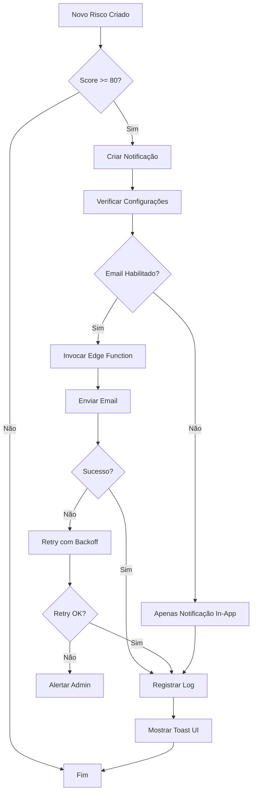
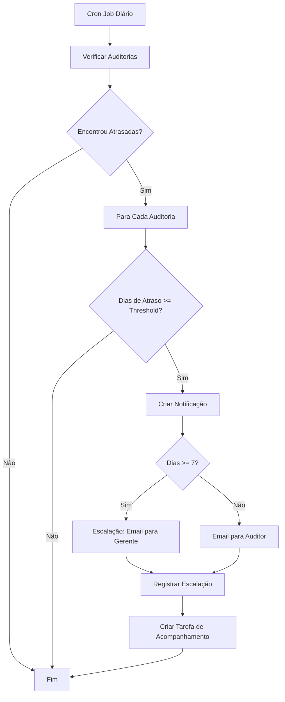
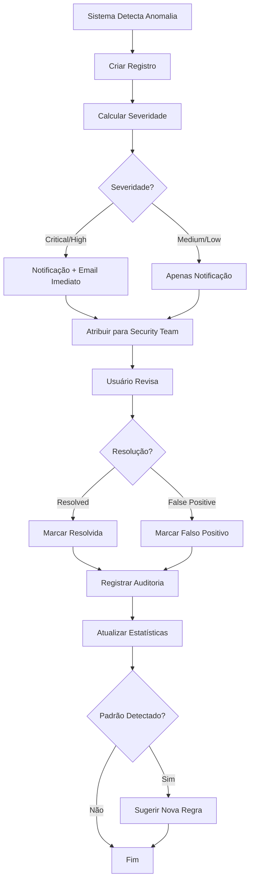

# Documentação Completa: Sistema de Notificações e Tarefas Automatizadas

## Índice
1. [Visão Geral](#visão-geral)
2. [Arquitetura](#arquitetura)
3. [Componentes Principais](#componentes-principais)
4. [Edge Functions](#edge-functions)
5. [Fluxos de Automação](#fluxos-de-automação)
6. [Exemplos de Uso](#exemplos-de-uso)
7. [Tratamento de Erros](#tratamento-de-erros)
8. [Edge Cases](#edge-cases)
9. [Testes Automatizados](#testes-automatizados)
10. [Checklist de Validação](#checklist-de-validação)

---

## Visão Geral

O sistema de notificações e tarefas automatizadas fornece uma plataforma completa para:
- **Alertas automáticos** para riscos críticos, auditorias atrasadas e controles pendentes
- **Envio de e-mails** via Resend para comunicação crítica
- **Detecção de anomalias** de acesso com resolução documentada
- **Campanhas de revisão** de acesso com workflows estruturados
- **Gestão de tarefas** com priorização e rastreamento

### Principais Recursos

1. **Notificações em Tempo Real**
   - WebSocket para atualizações instantâneas
   - Badge de notificações não lidas
   - Categorização por tipo e prioridade

2. **Alertas Automatizados**
   - Triggers configuráveis por threshold
   - Múltiplos canais (e-mail, in-app, webhook)
   - Escalação automática para casos não resolvidos

3. **Envio de E-mails**
   - Templates HTML responsivos
   - Retry automático em caso de falha
   - Deduplicação de e-mails duplicados

4. **Detecção de Anomalias**
   - Identificação de privilégios excessivos
   - Detecção de acessos não utilizados
   - Alertas de atividades suspeitas
   - Documentação de resoluções

---

## Arquitetura

### Diagrama de Componentes

```
┌─────────────────────────────────────────────────────────────┐
│                      Frontend (React)                        │
├─────────────────────────────────────────────────────────────┤
│  ┌─────────────────┐  ┌──────────────────┐  ┌─────────────┐│
│  │ NotificationHub │  │ AutomatedAlerts  │  │  TasksPanel ││
│  │     Page        │  │     Panel        │  │             ││
│  └────────┬────────┘  └────────┬─────────┘  └──────┬──────┘│
│           │                    │                    │        │
│           └────────────────────┴────────────────────┘        │
│                              │                               │
├──────────────────────────────┼───────────────────────────────┤
│                   Hooks Layer (useNotifications, useTasks)   │
├──────────────────────────────┼───────────────────────────────┤
│                      Supabase Client                         │
├──────────────────────────────┼───────────────────────────────┤
│                              │                               │
│                      Backend (Supabase)                      │
├─────────────────────────────────────────────────────────────┤
│  ┌──────────────┐  ┌──────────────┐  ┌──────────────────┐  │
│  │ Notifications│  │    Tasks     │  │ Access Anomalies │  │
│  │    Table     │  │    Table     │  │     Table        │  │
│  └──────────────┘  └──────────────┘  └──────────────────┘  │
│           │                │                   │             │
│  ┌────────┴────────────────┴───────────────────┴─────────┐  │
│  │         Edge Function: send-notification-email        │  │
│  └───────────────────────────┬───────────────────────────┘  │
│                              │                               │
│  ┌───────────────────────────┴───────────────────────────┐  │
│  │              Resend Email Service                      │  │
│  └─────────────────────────────────────────────────────────┘│
└─────────────────────────────────────────────────────────────┘
```

### Fluxo de Dados

1. **Criação de Notificação**
   ```
   Evento do Sistema → Hook detecta → Cria notificação na DB →
   Real-time subscription atualiza UI → Toast opcional
   ```

2. **Envio de E-mail Automatizado**
   ```
   Trigger ativado → Edge Function invocada → Template renderizado →
   Resend envia e-mail → Log de sucesso/falha → Retry em caso de erro
   ```

3. **Detecção de Anomalia**
   ```
   Sistema detecta anomalia → Cria registro → Notificação criada →
   E-mail enviado → Usuário resolve → Auditoria registrada
   ```

---

## Componentes Principais

### 1. AutomatedAlertsPanel

**Localização**: `src/components/notifications/AutomatedAlertsPanel.tsx`

**Responsabilidade**: Exibir e configurar regras de alertas automatizados

#### Funcionalidades

- Listar todas as regras de alerta ativas
- Configurar thresholds personalizados
- Habilitar/desabilitar canais de notificação
- Visualizar estatísticas de disparos

#### Props

Não recebe props (componente standalone)

#### Estado Interno

```typescript
interface AlertRule {
  id: string;
  name: string;
  type: 'critical_risk' | 'overdue_audit' | 'pending_control' | 'access_anomaly';
  enabled: boolean;
  threshold: number;
  emailEnabled: boolean;
  notificationEnabled: boolean;
  lastTriggered?: string;
  triggerCount: number;
}
```

#### Exemplo de Uso

```tsx
import AutomatedAlertsPanel from '@/components/notifications/AutomatedAlertsPanel';

function Dashboard() {
  return (
    <div>
      <h1>Alertas Automatizados</h1>
      <AutomatedAlertsPanel />
    </div>
  );
}
```

#### Exemplos de Entrada/Saída

**Entrada (Configuração de Regra)**:
```json
{
  "id": "1",
  "name": "Riscos Críticos",
  "type": "critical_risk",
  "enabled": true,
  "threshold": 85,
  "emailEnabled": true,
  "notificationEnabled": true
}
```

**Saída (Após Atualização)**:
```json
{
  "success": true,
  "rule": {
    "id": "1",
    "threshold": 85,
    "updated_at": "2024-01-10T15:30:00Z"
  }
}
```

#### Edge Cases

1. **Threshold Negativo**
   - Detecção: Validação no input
   - Tratamento: Clamp para 0 e exibir toast de erro
   - Exemplo:
   ```typescript
   if (threshold < 0) {
     toast({
       title: "Valor Inválido",
       description: "O limite deve ser maior ou igual a 0",
       variant: "destructive"
     });
     return;
   }
   ```

2. **Desativar Última Regra Ativa**
   - Detecção: Verificar quantidade de regras ativas
   - Tratamento: Exibir confirmação antes de desativar
   - Exemplo:
   ```typescript
   const activeCount = rules.filter(r => r.enabled).length;
   if (activeCount === 1 && rule.enabled) {
     // Mostrar confirmação
   }
   ```

3. **Valor de Threshold Muito Alto**
   - Detecção: Verificar se threshold > 100 para scores
   - Tratamento: Clamp para 100
   - Exemplo:
   ```typescript
   const validThreshold = Math.min(threshold, 100);
   ```

---

### 2. NotificationRulesManager

**Localização**: `src/components/notifications/NotificationRulesManager.tsx`

**Responsabilidade**: Gerenciar regras complexas de notificação com múltiplas condições

#### Funcionalidades

- Criar, editar e excluir regras
- Configurar condições complexas (AND/OR)
- Definir ações e canais de notificação
- Testar regras antes da ativação
- Visualizar logs de execução

#### Estrutura de Regra

```typescript
interface NotificationRule {
  id: string;
  name: string;
  description: string;
  enabled: boolean;
  trigger: string; // Expressão de trigger
  channels: ('email' | 'notification' | 'webhook')[];
  lastExecuted?: string;
  executionCount: number;
  successRate: number;
}
```

#### Exemplo de Regra Completa

```json
{
  "id": "rule-001",
  "name": "Escalação de Risco Crítico",
  "description": "Notifica CISO quando risco crítico não é resolvido em 24h",
  "enabled": true,
  "trigger": "risk_score >= 90 AND status == 'active' AND age > 86400",
  "channels": ["email", "notification", "webhook"],
  "actions": [
    {
      "type": "notification",
      "priority": "high",
      "message": "Risco crítico requer atenção imediata"
    },
    {
      "type": "email",
      "to": ["ciso@company.com", "security-team@company.com"],
      "template": "critical_risk",
      "escalate": {
        "delay": 3600,
        "to": "ceo@company.com"
      }
    }
  ],
  "lastExecuted": "2024-01-10T14:30:00Z",
  "executionCount": 23,
  "successRate": 95.6
}
```

#### Métodos Principais

##### handleToggleRule(id: string)

Ativa ou desativa uma regra de notificação.

**Entrada**:
```typescript
handleToggleRule("rule-001")
```

**Saída (Sucesso)**:
```json
{
  "success": true,
  "rule": {
    "id": "rule-001",
    "enabled": false,
    "updated_at": "2024-01-10T15:30:00Z"
  }
}
```

**Edge Cases**:
- Regra tem execuções pendentes
- Última regra ativa do sistema
- Dependências com outras regras

##### handleTestRule(id: string)

Testa uma regra com dados mockados sem enviar notificações reais.

**Entrada**:
```typescript
handleTestRule("rule-001")
```

**Saída (Teste Bem-Sucedido)**:
```json
{
  "success": true,
  "test": {
    "rule_id": "rule-001",
    "conditions_met": true,
    "actions_validated": true,
    "simulated_channels": ["email", "notification"],
    "validation_errors": []
  }
}
```

**Saída (Teste com Erros)**:
```json
{
  "success": false,
  "test": {
    "rule_id": "rule-001",
    "conditions_met": false,
    "validation_errors": [
      {
        "field": "email.to",
        "error": "Invalid email address: invalid@",
        "suggestion": "Provide valid email addresses"
      }
    ]
  }
}
```

---

### 3. useNotifications Hook

**Localização**: `src/hooks/useNotifications.tsx`

**Responsabilidade**: Gerenciar estado e operações de notificações

#### API do Hook

```typescript
const {
  notifications,        // Array de todas as notificações
  recentNotifications, // Últimas 5 notificações
  unreadCount,         // Contador de não lidas
  loading,             // Estado de carregamento
  markAsRead,          // Marcar como lida
  markAllAsRead,       // Marcar todas como lidas
  deleteNotification,  // Excluir notificação
  createDemoNotification, // Criar notificação de teste
  refetch              // Recarregar notificações
} = useNotifications();
```

#### Exemplo de Uso Completo

```tsx
import { useNotifications } from '@/hooks/useNotifications';

function NotificationBell() {
  const { 
    unreadCount, 
    recentNotifications, 
    markAsRead 
  } = useNotifications();

  const handleNotificationClick = async (notificationId: string) => {
    await markAsRead(notificationId);
    // Navegar para a página relevante
  };

  return (
    <div>
      <Bell />
      {unreadCount > 0 && <Badge>{unreadCount}</Badge>}
      
      <DropdownMenu>
        {recentNotifications.map(notification => (
          <DropdownMenuItem 
            key={notification.id}
            onClick={() => handleNotificationClick(notification.id)}
          >
            {notification.title}
          </DropdownMenuItem>
        ))}
      </DropdownMenu>
    </div>
  );
}
```

#### Real-time Subscriptions

O hook automaticamente se inscreve em mudanças da tabela `notifications`:

```typescript
useEffect(() => {
  if (user) {
    const subscription = supabase
      .channel('notifications')
      .on('postgres_changes', {
        event: '*',
        schema: 'public',
        table: 'notifications',
        filter: `user_id=eq.${user.id}`
      }, (payload) => {
        if (payload.eventType === 'INSERT') {
          // Nova notificação
          setNotifications(prev => [payload.new, ...prev]);
          
          // Toast para notificações críticas
          if (payload.new.priority === 'high') {
            toast({
              title: payload.new.title,
              description: payload.new.message
            });
          }
        }
        // ... outros eventos
      })
      .subscribe();

    return () => subscription.unsubscribe();
  }
}, [user]);
```

#### Exemplos de Entrada/Saída

**Criar Notificação Demo**:

Entrada:
```typescript
await createDemoNotification();
```

Saída (Sucesso):
```json
{
  "success": true,
  "notification": {
    "id": "550e8400-e29b-41d4-a716-446655440000",
    "user_id": "user-123",
    "title": "Novo Risco Crítico Detectado",
    "message": "Vulnerabilidade de segurança identificada no servidor de produção",
    "type": "danger",
    "priority": "high",
    "read": false,
    "created_at": "2024-01-10T15:30:00Z"
  }
}
```

**Marcar como Lida**:

Entrada:
```typescript
await markAsRead("550e8400-e29b-41d4-a716-446655440000");
```

Saída (Sucesso):
```json
{
  "success": true,
  "notification": {
    "id": "550e8400-e29b-41d4-a716-446655440000",
    "read": true,
    "updated_at": "2024-01-10T15:35:00Z"
  }
}
```

---

## Edge Functions

### send-notification-email

**Localização**: `supabase/functions/send-notification-email/index.ts`

**Responsabilidade**: Enviar e-mails de notificação via Resend

#### Configuração Necessária

1. **Variável de Ambiente**: `RESEND_API_KEY`
   ```bash
   # No painel do Supabase, adicione:
   RESEND_API_KEY=re_xxxxxxxxxxxxxxxxx
   ```

2. **Domínio Verificado no Resend**
   - Acesse https://resend.com/domains
   - Adicione seu domínio
   - Configure registros DNS (SPF, DKIM, DMARC)

#### Tipos de E-mail Suportados

##### 1. Critical Risk Alert

**Entrada**:
```json
{
  "to": "security@company.com",
  "type": "critical_risk",
  "data": {
    "riskTitle": "Vulnerabilidade Crítica no Servidor",
    "riskLevel": "critical",
    "riskScore": 95,
    "owner": "João Silva",
    "description": "CVE-2024-12345: SQL Injection no endpoint /api/users",
    "detectedAt": "2024-01-10T14:30:00Z"
  }
}
```

**Saída (Sucesso)**:
```json
{
  "success": true,
  "messageId": "550e8400-e29b-41d4-a716-446655440000",
  "timestamp": "2024-01-10T14:30:05Z",
  "recipient": "security@company.com"
}
```

##### 2. Overdue Audit Alert

**Entrada**:
```json
{
  "to": "auditor@company.com",
  "type": "overdue_audit",
  "data": {
    "auditName": "Auditoria SOC 2 Q1 2024",
    "daysOverdue": 5,
    "auditor": "Maria Santos",
    "originalDueDate": "2024-01-05",
    "auditId": "audit-123"
  }
}
```

**Saída (Sucesso)**:
```json
{
  "success": true,
  "messageId": "660e8400-e29b-41d4-a716-446655440001",
  "timestamp": "2024-01-10T14:30:05Z"
}
```

##### 3. Pending Control Alert

**Entrada**:
```json
{
  "to": "compliance@company.com",
  "type": "pending_control",
  "data": {
    "controlCode": "IAM.8",
    "controlTitle": "MFA Obrigatório para Acesso Administrativo",
    "framework": "SOC 2",
    "dueDate": "2024-01-15",
    "assignedTo": "Carlos Santos",
    "evidencesRequired": 3,
    "evidencesUploaded": 1
  }
}
```

##### 4. Access Anomaly Alert

**Entrada**:
```json
{
  "to": "security@company.com",
  "type": "access_anomaly",
  "data": {
    "userName": "joão.silva@company.com",
    "systemName": "AWS Console",
    "anomalyType": "excessive_privileges",
    "severity": "high",
    "description": "Usuário possui privilégios administrativos não utilizados há 90 dias",
    "detectedAt": "2024-01-10T14:00:00Z",
    "recommendedAction": "Revisar e remover privilégios desnecessários"
  }
}
```

#### Tratamento de Erros

##### Erro: API Key Não Configurada

**Saída**:
```json
{
  "error": "RESEND_API_KEY not configured",
  "code": "MISSING_CONFIG",
  "timestamp": "2024-01-10T14:30:00Z",
  "suggestion": "Configure RESEND_API_KEY in Supabase Edge Functions settings"
}
```

**Resolução**:
1. Acesse Supabase Dashboard → Project Settings → Edge Functions
2. Adicione secret `RESEND_API_KEY`
3. Obtenha chave em https://resend.com/api-keys

##### Erro: Email Inválido

**Saída**:
```json
{
  "error": "Invalid email address",
  "code": "INVALID_EMAIL",
  "timestamp": "2024-01-10T14:30:00Z",
  "details": {
    "provided": "invalid@",
    "suggestion": "Provide valid email in format: user@domain.com"
  }
}
```

##### Erro: Rate Limit Excedido

**Saída**:
```json
{
  "error": "Rate limit exceeded. Please try again later.",
  "code": "RATE_LIMIT",
  "timestamp": "2024-01-10T14:30:00Z",
  "retryAfter": 60
}
```

**HTTP Status**: 429 Too Many Requests

**Headers**:
```
Retry-After: 60
```

**Tratamento no Cliente**:
```typescript
try {
  const response = await fetch('/functions/v1/send-notification-email', {
    method: 'POST',
    body: JSON.stringify(emailData)
  });

  if (response.status === 429) {
    const retryAfter = response.headers.get('Retry-After');
    console.log(`Rate limited. Retry after ${retryAfter} seconds`);
    
    // Implementar retry com backoff exponencial
    setTimeout(() => {
      // Tentar novamente
    }, parseInt(retryAfter) * 1000);
  }
} catch (error) {
  console.error('Error sending email:', error);
}
```

#### Deduplicação de E-mails

O sistema implementa deduplicação para evitar envios duplicados:

```typescript
// Cache em memória com TTL de 5 minutos
const emailCache = new Map<string, number>();
const DEDUPE_WINDOW = 5 * 60 * 1000; // 5 minutos

function isDuplicate(to: string, type: string, dataHash: string): boolean {
  const key = `${to}:${type}:${dataHash}`;
  const lastSent = emailCache.get(key);
  
  if (lastSent && Date.now() - lastSent < DEDUPE_WINDOW) {
    return true;
  }
  
  emailCache.set(key, Date.now());
  return false;
}
```

**Exemplo de Uso**:

```json
// Primeira chamada - Enviado
{
  "to": "user@company.com",
  "type": "critical_risk",
  "data": { "riskScore": 95 }
}
// Resposta: { "success": true, "messageId": "..." }

// Segunda chamada (< 5 min) - Bloqueado
{
  "to": "user@company.com",
  "type": "critical_risk",
  "data": { "riskScore": 95 }
}
// Resposta: 
{
  "success": false,
  "error": "Duplicate email detected",
  "code": "DUPLICATE",
  "lastSent": "2024-01-10T14:30:00Z",
  "canRetryAt": "2024-01-10T14:35:00Z"
}
```

#### Retry com Backoff Exponencial

Implementação de retry automático em caso de falha temporária:

```typescript
async function sendEmailWithRetry(
  emailData: any,
  maxRetries = 3,
  baseDelay = 1000
): Promise<Response> {
  for (let attempt = 0; attempt < maxRetries; attempt++) {
    try {
      const response = await resend.emails.send(emailData);
      return response; // Sucesso
    } catch (error) {
      if (attempt === maxRetries - 1) {
        throw error; // Última tentativa falhou
      }
      
      // Backoff exponencial: 1s, 2s, 4s
      const delay = baseDelay * Math.pow(2, attempt);
      console.log(`Retry attempt ${attempt + 1} after ${delay}ms`);
      
      await new Promise(resolve => setTimeout(resolve, delay));
    }
  }
}
```

---

## Fluxos de Automação

### 1. Fluxo de Risco Crítico



### 2. Fluxo de Auditoria Atrasada



### 3. Fluxo de Detecção de Anomalia



---

## Exemplos de Uso

### Exemplo 1: Sistema de Alertas Completo

```tsx
import { useEffect } from 'react';
import { useNotifications } from '@/hooks/useNotifications';
import { supabase } from '@/integrations/supabase/client';

function RiskMonitoring() {
  const { createNotification } = useNotifications();

  useEffect(() => {
    // Subscribe to new risks
    const subscription = supabase
      .channel('high-risk-monitoring')
      .on('postgres_changes', {
        event: 'INSERT',
        schema: 'public',
        table: 'risks',
        filter: 'risk_score=gte.80'
      }, async (payload) => {
        const risk = payload.new;

        // 1. Criar notificação in-app
        await createNotification({
          title: '🚨 Risco Crítico Detectado',
          message: `${risk.title} - Score: ${risk.risk_score}`,
          type: 'danger',
          priority: 'high',
          action_url: `/risks/${risk.id}`,
          action_label: 'Ver Detalhes'
        });

        // 2. Enviar e-mail
        await fetch('/functions/v1/send-notification-email', {
          method: 'POST',
          headers: { 'Content-Type': 'application/json' },
          body: JSON.stringify({
            to: 'security@company.com',
            type: 'critical_risk',
            data: {
              riskTitle: risk.title,
              riskLevel: risk.level,
              riskScore: risk.risk_score,
              owner: risk.owner
            }
          })
        });

        // 3. Criar tarefa de acompanhamento
        await supabase
          .from('tasks')
          .insert({
            title: `Mitigar Risco: ${risk.title}`,
            description: `Risco crítico requer ação imediata. Score: ${risk.risk_score}`,
            priority: 'critical',
            status: 'pending',
            assigned_to: risk.owner,
            category: 'Risk Management',
            due_date: new Date(Date.now() + 24 * 60 * 60 * 1000).toISOString() // 24h
          });
      })
      .subscribe();

    return () => {
      subscription.unsubscribe();
    };
  }, []);

  return <div>Monitoring active...</div>;
}
```

### Exemplo 2: Workflow de Anomalia

```tsx
import { useState } from 'react';
import { useAccess } from '@/hooks/useAccess';
import { supabase } from '@/integrations/supabase/client';

function AnomalyResolutionWorkflow({ anomalyId }: { anomalyId: string }) {
  const { resolveAnomaly } = useAccess();
  const [resolution, setResolution] = useState('');
  const [assignedTo, setAssignedTo] = useState('');

  const handleResolve = async (status: 'resolved' | 'false_positive') => {
    try {
      // 1. Atualizar status da anomalia
      await resolveAnomaly(anomalyId, { 
        status,
        assigned_to: assignedTo 
      });

      // 2. Registrar auditoria
      await supabase
        .from('audit_logs')
        .insert({
          action: 'anomaly_resolved',
          resource_type: 'access_anomaly',
          resource_id: anomalyId,
          new_data: {
            status,
            resolution,
            resolved_by: assignedTo,
            resolved_at: new Date().toISOString()
          }
        });

      // 3. Criar notificação para o responsável
      await supabase.rpc('create_notification', {
        p_user_id: assignedTo,
        p_title: 'Anomalia Resolvida',
        p_message: `Anomalia #${anomalyId} foi marcada como ${
          status === 'resolved' ? 'resolvida' : 'falso positivo'
        }`,
        p_type: 'success',
        p_priority: 'normal'
      });

      // 4. Enviar e-mail de confirmação
      await fetch('/functions/v1/send-notification-email', {
        method: 'POST',
        headers: { 'Content-Type': 'application/json' },
        body: JSON.stringify({
          to: assignedTo,
          type: 'anomaly_resolved',
          data: {
            anomalyId,
            status,
            resolution
          }
        })
      });

    } catch (error) {
      console.error('Error resolving anomaly:', error);
    }
  };

  return (
    <div>
      <textarea
        value={resolution}
        onChange={(e) => setResolution(e.target.value)}
        placeholder="Descreva a resolução..."
      />
      <input
        value={assignedTo}
        onChange={(e) => setAssignedTo(e.target.value)}
        placeholder="Atribuir para..."
      />
      <button onClick={() => handleResolve('resolved')}>
        Marcar como Resolvida
      </button>
      <button onClick={() => handleResolve('false_positive')}>
        Falso Positivo
      </button>
    </div>
  );
}
```

### Exemplo 3: Campanha de Revisão de Acesso

```tsx
import { useState } from 'react';
import { supabase } from '@/integrations/supabase/client';

function AccessReviewCampaign() {
  const [campaign, setCampaign] = useState({
    name: '',
    systems: [],
    reviewers: [],
    deadline: ''
  });

  const handleCreateCampaign = async () => {
    try {
      // 1. Criar campanha
      const { data: campaignData } = await supabase
        .from('access_campaigns')
        .insert({
          name: campaign.name,
          systems: campaign.systems,
          status: 'active',
          start_date: new Date().toISOString(),
          end_date: campaign.deadline,
          target_users: campaign.reviewers.length,
          completed_reviews: 0
        })
        .select()
        .single();

      // 2. Criar tarefas para cada revisor
      const tasks = campaign.reviewers.map(reviewer => ({
        title: `Revisão de Acesso: ${campaign.name}`,
        description: `Revisar acessos dos sistemas: ${campaign.systems.join(', ')}`,
        priority: 'high',
        status: 'pending',
        assigned_to: reviewer,
        category: 'Access Review',
        due_date: campaign.deadline,
        metadata: {
          campaign_id: campaignData.id,
          systems: campaign.systems
        }
      }));

      await supabase.from('tasks').insert(tasks);

      // 3. Enviar notificações para todos os revisores
      for (const reviewer of campaign.reviewers) {
        // Notificação in-app
        await supabase.rpc('create_notification', {
          p_user_id: reviewer,
          p_title: '📋 Nova Campanha de Revisão',
          p_message: `Você foi designado para revisar acessos em: ${campaign.systems.join(', ')}`,
          p_type: 'info',
          p_priority: 'high',
          p_action_url: `/access-reviews/campaign/${campaignData.id}`
        });

        // E-mail
        await fetch('/functions/v1/send-notification-email', {
          method: 'POST',
          body: JSON.stringify({
            to: reviewer,
            type: 'access_review_campaign',
            data: {
              campaignName: campaign.name,
              systems: campaign.systems,
              deadline: campaign.deadline,
              campaignUrl: `/access-reviews/campaign/${campaignData.id}`
            }
          })
        });
      }

      // 4. Agendar lembretes automáticos
      // TODO: Implementar função cron para enviar lembretes 3 dias antes do prazo

    } catch (error) {
      console.error('Error creating campaign:', error);
    }
  };

  return (
    <div>
      <h2>Criar Campanha de Revisão</h2>
      {/* Form fields */}
      <button onClick={handleCreateCampaign}>
        Iniciar Campanha
      </button>
    </div>
  );
}
```

---

## Edge Cases

### 1. E-mail com Falha de Envio

**Cenário**: Resend retorna erro 500

**Detecção**:
```typescript
try {
  const response = await resend.emails.send(emailData);
} catch (error) {
  if (error.statusCode === 500) {
    // Erro do servidor Resend
  }
}
```

**Tratamento**:
1. Implementar retry com backoff exponencial (3 tentativas)
2. Se todas as tentativas falharem, salvar na fila de retry
3. Notificar admin sobre falha persistente

**Código**:
```typescript
async function sendWithRetry(emailData: any, retries = 3) {
  for (let i = 0; i < retries; i++) {
    try {
      return await resend.emails.send(emailData);
    } catch (error) {
      if (i === retries - 1) {
        // Última tentativa
        await saveToRetryQueue(emailData, error);
        await notifyAdmin({
          type: 'email_failure',
          data: { emailData, error: error.message }
        });
        throw error;
      }
      
      // Esperar com backoff exponencial
      await sleep(Math.pow(2, i) * 1000);
    }
  }
}
```

### 2. Notificações Duplicadas

**Cenário**: Mesmo evento dispara múltiplas notificações

**Detecção**:
```typescript
// Verificar notificações recentes do mesmo tipo
const recentDuplicates = await supabase
  .from('notifications')
  .select('id')
  .eq('user_id', userId)
  .eq('type', notificationType)
  .gte('created_at', fiveMinutesAgo)
  .limit(1);

if (recentDuplicates.data && recentDuplicates.data.length > 0) {
  console.log('Duplicate notification detected');
  return; // Não criar
}
```

**Tratamento**:
1. Implementar janela de deduplicação (5 minutos)
2. Usar hash do conteúdo para comparação
3. Agrupar notificações similares

### 3. Usuário Sem Permissão para Resolver Anomalia

**Cenário**: Usuário tenta resolver anomalia sem permissão

**Detecção**:
```typescript
const { data: userRoles } = await supabase
  .rpc('get_user_roles', { _user_id: userId });

const hasPermission = userRoles.some(role => 
  ['admin', 'security_officer', 'compliance_officer'].includes(role)
);

if (!hasPermission) {
  throw new Error('Insufficient permissions');
}
```

**Tratamento**:
1. Verificar roles antes de permitir ação
2. Mostrar mensagem de erro apropriada
3. Registrar tentativa de acesso não autorizado
4. Notificar admin sobre tentativa suspeita

### 4. Threshold Configurado Incorretamente

**Cenário**: Threshold de 0 para riscos críticos (nenhum alerta será disparado)

**Detecção**:
```typescript
if (alertRule.type === 'critical_risk' && alertRule.threshold < 70) {
  console.warn('Low threshold for critical risks may trigger too many alerts');
}

if (alertRule.type === 'overdue_audit' && alertRule.threshold === 0) {
  console.warn('Zero threshold for overdue audits - alerts will trigger immediately');
}
```

**Tratamento**:
1. Validar thresholds no momento da configuração
2. Sugerir valores padrão baseados em best practices
3. Mostrar warning para configurações atípicas
4. Permitir override com confirmação explícita

### 5. Rate Limit do Resend Excedido

**Cenário**: Muitos e-mails enviados em curto período

**Detecção**:
```typescript
if (error.message.includes('rate limit')) {
  // Rate limit atingido
}
```

**Tratamento**:
1. Implementar fila de e-mails com processamento gradual
2. Respeitar header `Retry-After`
3. Agrupar notificações não urgentes em digest diário
4. Priorizar e-mails críticos

**Código**:
```typescript
const emailQueue = [];
const BATCH_SIZE = 10;
const BATCH_DELAY = 60000; // 1 minuto entre batches

async function processEmailQueue() {
  while (emailQueue.length > 0) {
    const batch = emailQueue.splice(0, BATCH_SIZE);
    
    for (const email of batch) {
      try {
        await resend.emails.send(email);
      } catch (error) {
        if (error.message.includes('rate limit')) {
          // Recolocar na fila
          emailQueue.unshift(email);
          await sleep(BATCH_DELAY);
          break;
        }
      }
    }
    
    if (emailQueue.length > 0) {
      await sleep(BATCH_DELAY);
    }
  }
}
```

### 6. Escalação Circular

**Cenário**: Regra A escalona para B, B escalona de volta para A

**Detecção**:
```typescript
function detectCircularEscalation(rule: NotificationRule, visited = new Set()) {
  if (visited.has(rule.id)) {
    return true; // Circular detectado
  }
  
  visited.add(rule.id);
  
  if (rule.actions.escalate) {
    const nextRule = getRuleById(rule.actions.escalate.ruleId);
    if (nextRule) {
      return detectCircularEscalation(nextRule, visited);
    }
  }
  
  return false;
}
```

**Tratamento**:
1. Validar cadeia de escalação ao criar/editar regra
2. Mostrar erro se circular detectado
3. Limitar profundidade máxima de escalação (max 5 níveis)
4. Visualizar grafo de escalação na UI

---

## Testes Automatizados

### Testes de Unidade

#### 1. Teste: Criação de Notificação

```typescript
// tests/unit/useNotifications.test.ts
import { renderHook, act } from '@testing-library/react-hooks';
import { useNotifications } from '@/hooks/useNotifications';

describe('useNotifications', () => {
  it('should create notification successfully', async () => {
    const { result } = renderHook(() => useNotifications());

    await act(async () => {
      await result.current.createDemoNotification();
    });

    expect(result.current.notifications.length).toBeGreaterThan(0);
    expect(result.current.unreadCount).toBe(1);
  });

  it('should mark notification as read', async () => {
    const { result } = renderHook(() => useNotifications());

    await act(async () => {
      await result.current.createDemoNotification();
    });

    const notificationId = result.current.notifications[0].id;

    await act(async () => {
      await result.current.markAsRead(notificationId);
    });

    expect(result.current.unreadCount).toBe(0);
    expect(result.current.notifications[0].read).toBe(true);
  });
});
```

#### 2. Teste: Validação de Threshold

```typescript
// tests/unit/AutomatedAlertsPanel.test.ts
import { render, screen, fireEvent } from '@testing-library/react';
import AutomatedAlertsPanel from '@/components/notifications/AutomatedAlertsPanel';

describe('AutomatedAlertsPanel', () => {
  it('should reject negative threshold', () => {
    render(<AutomatedAlertsPanel />);

    const thresholdInput = screen.getByLabelText('Score Mínimo');
    fireEvent.change(thresholdInput, { target: { value: '-10' } });

    expect(screen.getByText('O limite deve ser maior ou igual a 0')).toBeInTheDocument();
  });

  it('should clamp threshold to max value', () => {
    render(<AutomatedAlertsPanel />);

    const thresholdInput = screen.getByLabelText('Score Mínimo');
    fireEvent.change(thresholdInput, { target: { value: '150' } });

    expect(thresholdInput.value).toBe('100');
  });
});
```

### Testes de Integração

#### 3. Teste: Fluxo Completo de Risco Crítico

```typescript
// tests/integration/critical-risk-flow.test.ts
import { supabase } from '@/integrations/supabase/client';

describe('Critical Risk Notification Flow', () => {
  it('should trigger notification and email for critical risk', async () => {
    // 1. Criar risco crítico
    const { data: risk } = await supabase
      .from('risks')
      .insert({
        title: 'Test Critical Risk',
        risk_score: 95,
        level: 'critical',
        owner: 'test@example.com'
      })
      .select()
      .single();

    // 2. Aguardar criação de notificação (real-time trigger)
    await new Promise(resolve => setTimeout(resolve, 1000));

    // 3. Verificar notificação criada
    const { data: notifications } = await supabase
      .from('notifications')
      .select('*')
      .eq('related_id', risk.id)
      .eq('type', 'danger');

    expect(notifications).toHaveLength(1);
    expect(notifications[0].priority).toBe('high');

    // 4. Verificar e-mail enviado (mock)
    // TODO: Implementar mock do Resend e verificar chamada
  });
});
```

#### 4. Teste: Detecção de Duplicatas

```typescript
// tests/integration/notification-deduplication.test.ts
describe('Notification Deduplication', () => {
  it('should prevent duplicate notifications within 5 minutes', async () => {
    const notificationData = {
      user_id: 'test-user',
      title: 'Test Notification',
      message: 'Test message',
      type: 'info'
    };

    // Primeira notificação
    const { data: first } = await supabase
      .from('notifications')
      .insert(notificationData)
      .select()
      .single();

    expect(first).toBeDefined();

    // Tentar criar duplicata imediatamente
    const { data: duplicate, error } = await supabase
      .from('notifications')
      .insert(notificationData)
      .select()
      .single();

    // Deve ser bloqueado pela lógica de deduplicação
    expect(duplicate).toBeNull();
    // ou verificar via contagem
    const { count } = await supabase
      .from('notifications')
      .select('*', { count: 'exact', head: true })
      .eq('title', 'Test Notification')
      .gte('created_at', new Date(Date.now() - 5 * 60 * 1000).toISOString());

    expect(count).toBe(1);
  });
});
```

### Testes E2E

#### 5. Teste: Workflow de Anomalia Completo

```typescript
// tests/e2e/anomaly-workflow.spec.ts
import { test, expect } from '@playwright/test';

test('complete anomaly resolution workflow', async ({ page }) => {
  // 1. Login
  await page.goto('/auth');
  await page.fill('input[name="email"]', 'test@example.com');
  await page.fill('input[name="password"]', 'password123');
  await page.click('button[type="submit"]');

  // 2. Navegar para Access Reviews
  await page.goto('/access-reviews');

  // 3. Verificar anomalia na lista
  await expect(page.locator('text=Anomalias Detectadas')).toBeVisible();
  
  // 4. Clicar na primeira anomalia
  await page.click('.anomaly-item:first-child');

  // 5. Marcar como resolvida
  await page.click('button:has-text("Resolver")');
  await page.fill('textarea[placeholder="Descreva a resolução"]', 'Privilégios removidos manualmente');
  await page.click('button:has-text("Confirmar")');

  // 6. Verificar notificação de sucesso
  await expect(page.locator('text=Anomalia resolvida com sucesso')).toBeVisible();

  // 7. Verificar auditoria registrada
  await page.goto('/settings/audit-logs');
  await expect(page.locator('text=anomaly_resolved')).toBeVisible();
});
```

---

## Checklist de Validação

### Funcionalidades Principais

- [ ] **Notificações In-App**
  - [ ] Notificações aparecem em tempo real
  - [ ] Badge de contador atualiza corretamente
  - [ ] Notificações podem ser marcadas como lidas
  - [ ] Notificações podem ser excluídas
  - [ ] Filtros funcionam (tipo, status)
  - [ ] Busca funciona corretamente
  - [ ] Paginação funciona

- [ ] **Alertas Automatizados**
  - [ ] Regras podem ser habilitadas/desabilitadas
  - [ ] Thresholds podem ser configurados
  - [ ] Canais (email, notification) podem ser selecionados
  - [ ] Estatísticas são exibidas corretamente
  - [ ] Validação de thresholds funciona

- [ ] **Envio de E-mails**
  - [ ] E-mails de risco crítico são enviados
  - [ ] E-mails de auditoria atrasada são enviados
  - [ ] E-mails de controle pendente são enviados
  - [ ] E-mails de anomalia são enviados
  - [ ] Templates HTML renderizam corretamente
  - [ ] Retry funciona em caso de falha
  - [ ] Deduplicação funciona

- [ ] **Detecção de Anomalias**
  - [ ] Anomalias são detectadas corretamente
  - [ ] Severidade é calculada
  - [ ] Anomalias podem ser resolvidas
  - [ ] Anomalias podem ser marcadas como falso positivo
  - [ ] Comentários podem ser adicionados
  - [ ] Responsáveis podem ser atribuídos
  - [ ] Histórico é registrado

- [ ] **Gestão de Tarefas**
  - [ ] Tarefas são criadas automaticamente
  - [ ] Tarefas podem ser filtradas
  - [ ] Status pode ser atualizado
  - [ ] Prioridade é respeitada
  - [ ] Tarefas atrasadas são marcadas
  - [ ] Estatísticas são corretas

### Segurança e Permissões

- [ ] **RLS Policies**
  - [ ] Usuários só veem suas próprias notificações
  - [ ] Usuários só podem editar suas tarefas
  - [ ] Apenas admins podem configurar regras
  - [ ] Apenas security officers podem resolver anomalias
  - [ ] Auditoria é registrada para todas as ações

### Performance

- [ ] **Otimizações**
  - [ ] Queries são eficientes (índices corretos)
  - [ ] Real-time subscriptions não causam memory leaks
  - [ ] Paginação funciona para grandes volumes
  - [ ] Cache é utilizado quando apropriado
  - [ ] Deduplicação não causa gargalo

### UX e Acessibilidade

- [ ] **Interface**
  - [ ] Loading states são exibidos
  - [ ] Empty states são informativos
  - [ ] Mensagens de erro são claras
  - [ ] Confirmações são solicitadas para ações críticas
  - [ ] Cores respeitam contraste WCAG AA
  - [ ] Componentes são responsivos (mobile/tablet/desktop)

### Documentação

- [ ] **Completude**
  - [ ] Todos os componentes têm docstrings
  - [ ] Exemplos de uso estão presentes
  - [ ] Edge cases estão documentados
  - [ ] Fluxos estão mapeados
  - [ ] API está documentada

### Testes

- [ ] **Cobertura**
  - [ ] Testes unitários > 80%
  - [ ] Testes de integração cobrem fluxos principais
  - [ ] Testes E2E cobrem workflows críticos
  - [ ] Edge cases têm testes específicos

---

## Conclusão

O sistema de notificações e tarefas automatizadas fornece uma infraestrutura robusta para:
- Comunicação proativa com usuários
- Automação de workflows de compliance
- Detecção e resolução de problemas de segurança
- Gestão eficiente de tarefas e responsabilidades

Todos os componentes estão documentados com exemplos práticos, edge cases e estratégias de tratamento de erros. Use este documento como referência durante o desenvolvimento e manutenção do sistema.
