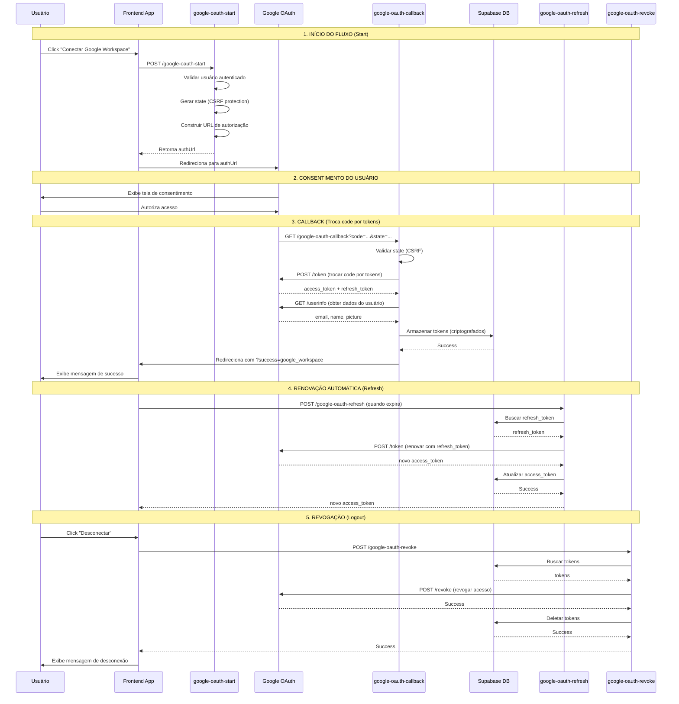

# Fluxo OAuth 2.0 - Google Workspace Integration

## 📋 Visão Geral

Este documento detalha o fluxo completo de OAuth 2.0 implementado para a integração com Google Workspace, incluindo:
- Tela de consentimento
- Callback seguro
- Renovação automática de tokens
- Tratamento de erros
- Revogação e logout

---

## Arquitetura do Fluxo OAuth 2.0



---

## 1. Início do Fluxo (Start)

### Edge Function: `google-oauth-start`

**Responsabilidade:**
Gera a URL de autorização do Google para iniciar o fluxo OAuth 2.0.

**Requisição:**
```bash
POST https://<PROJECT_ID>.supabase.co/functions/v1/google-oauth-start
Authorization: Bearer <USER_JWT_TOKEN>
Content-Type: application/json

{}
```

**Validações:**
1. ✅ Usuário está autenticado (JWT válido)
2. ✅ Credenciais Google estão configuradas (GOOGLE_CLIENT_ID, GOOGLE_CLIENT_SECRET)
3. ✅ State é gerado aleatoriamente (proteção CSRF)

**Processo:**
1. Validar autenticação do usuário
2. Gerar state aleatório com userId e timestamp
3. Construir URL de autorização com:
   - `client_id`: GOOGLE_CLIENT_ID
   - `redirect_uri`: URL do callback
   - `response_type`: "code"
   - `scope`: Permissões necessárias
   - `state`: State codificado
   - `access_type`: "offline" (para refresh token)
   - `prompt`: "consent" (forçar tela de consentimento)

**Resposta de Sucesso:**
```json
{
  "success": true,
  "authUrl": "https://accounts.google.com/o/oauth2/v2/auth?client_id=...&redirect_uri=...&response_type=code&scope=...&state=...&access_type=offline&prompt=consent",
  "instructions": "Redirecione o usuário para authUrl. Após autorização, o Google redirecionará para o callback."
}
```

**Resposta de Erro:**
```json
{
  "error": "Google OAuth credentials not configured",
  "required": ["GOOGLE_CLIENT_ID", "GOOGLE_CLIENT_SECRET"],
  "instructions": "Configure estas secrets no Supabase Dashboard > Settings > Edge Functions > Secrets"
}
```

**Scopes Solicitados:**
```typescript
const scopes = [
  'https://www.googleapis.com/auth/admin.directory.user.readonly', // Listar usuários
  'https://www.googleapis.com/auth/admin.directory.group.readonly', // Listar grupos
  'https://www.googleapis.com/auth/admin.reports.audit.readonly', // Relatórios de auditoria
  'https://www.googleapis.com/auth/drive.metadata.readonly', // Metadados do Drive
  'openid', // OpenID Connect
  'profile', // Informações do perfil
  'email' // Email do usuário
];
```

**Exemplo Frontend:**
```typescript
const handleConnect = async () => {
  const { data, error } = await supabase.functions.invoke('google-oauth-start', {
    body: {}
  });
  
  if (error) {
    console.error('Error:', error);
    return;
  }
  
  // Redirecionar usuário para o Google
  window.location.href = data.authUrl;
};
```

---

## 2. Tela de Consentimento

**O que acontece:**
1. Usuário é redirecionado para `accounts.google.com`
2. Google exibe tela de consentimento com:
   - Nome da aplicação
   - Logo (se configurado)
   - Permissões solicitadas
   - Email da conta Google
3. Usuário pode:
   - **Autorizar**: Conceder acesso
   - **Negar**: Recusar acesso

**Após Autorização:**
Google redireciona para:
```
https://<PROJECT_ID>.supabase.co/functions/v1/google-oauth-callback?code=<AUTHORIZATION_CODE>&state=<STATE>
```

**Após Negação:**
Google redireciona para:
```
https://<PROJECT_ID>.supabase.co/functions/v1/google-oauth-callback?error=access_denied&state=<STATE>
```

---

## 3. Callback (Troca de Código por Tokens)

### Edge Function: `google-oauth-callback`

**Responsabilidade:**
Recebe o código de autorização e troca por access_token e refresh_token.

**Requisição (feita pelo Google):**
```
GET https://<PROJECT_ID>.supabase.co/functions/v1/google-oauth-callback?code=<CODE>&state=<STATE>
```

**Validações:**
1. ✅ State é válido (proteção CSRF)
2. ✅ State não está expirado (< 10 minutos)
3. ✅ Code está presente
4. ✅ Credenciais Google estão configuradas

**Processo:**
1. **Validar State:**
   ```typescript
   const stateData = JSON.parse(atob(state));
   const age = Date.now() - stateData.timestamp;
   if (age > 10 * 60 * 1000) {
     throw new Error('State expired');
   }
   ```

2. **Trocar Code por Tokens:**
   ```typescript
   POST https://oauth2.googleapis.com/token
   Content-Type: application/x-www-form-urlencoded
   
   code=<AUTHORIZATION_CODE>&
   client_id=<CLIENT_ID>&
   client_secret=<CLIENT_SECRET>&
   redirect_uri=<REDIRECT_URI>&
   grant_type=authorization_code
   ```

3. **Resposta do Google:**
   ```json
   {
     "access_token": "ya29.a0AfH6SMBx...",
     "refresh_token": "1//0gL3jXMz...",
     "token_type": "Bearer",
     "expires_in": 3600,
     "scope": "https://www.googleapis.com/auth/..."
   }
   ```

4. **Obter Informações do Usuário:**
   ```typescript
   GET https://www.googleapis.com/oauth2/v2/userinfo
   Authorization: Bearer <ACCESS_TOKEN>
   ```

5. **Resposta:**
   ```json
   {
     "id": "1234567890",
     "email": "user@example.com",
     "verified_email": true,
     "name": "John Doe",
     "picture": "https://lh3.googleusercontent.com/...",
     "locale": "pt-BR"
   }
   ```

6. **Armazenar Tokens no Banco:**
   ```typescript
   await supabase.from('integration_oauth_tokens').upsert({
     user_id: stateData.userId,
     integration_name: 'google_workspace',
     access_token: tokens.access_token,
     refresh_token: tokens.refresh_token,
     token_type: tokens.token_type,
     expires_at: new Date(Date.now() + tokens.expires_in * 1000),
     scope: tokens.scope,
     metadata: {
       email: userInfo.email,
       name: userInfo.name,
       picture: userInfo.picture,
       verified_email: userInfo.verified_email
     }
   });
   ```

7. **Redirecionar de Volta:**
   ```typescript
   // Sucesso
   window.location.href = '/integrations?success=google_workspace';
   
   // Erro
   window.location.href = '/integrations?error=<ERROR_MESSAGE>';
   ```

**Tratamento de Erros:**

| Erro | Causa | Ação |
|------|-------|------|
| `access_denied` | Usuário negou acesso | Redirecionar com mensagem |
| `invalid_state` | State inválido ou expirado | Reiniciar fluxo |
| `invalid_code` | Code já usado ou inválido | Reiniciar fluxo |
| `token_exchange_failed` | Erro ao trocar code | Logar e notificar admin |

---

## 4. Renovação Automática de Tokens

### Edge Function: `google-oauth-refresh`

**Responsabilidade:**
Renova o access_token usando o refresh_token quando expira.

**Quando Renovar:**
- ✅ Automaticamente quando token está próximo de expirar (< 5 minutos)
- ✅ Manualmente pelo usuário (botão "Renovar Token")
- ✅ Quando uma requisição falha com erro 401 (token expirado)

**Requisição:**
```bash
POST https://<PROJECT_ID>.supabase.co/functions/v1/google-oauth-refresh
Authorization: Bearer <USER_JWT_TOKEN>
Content-Type: application/json

{}
```

**Validações:**
1. ✅ Usuário está autenticado
2. ✅ Refresh token existe no banco
3. ✅ Credenciais Google estão configuradas

**Processo:**
1. **Buscar Refresh Token:**
   ```typescript
   const { data } = await supabase
     .from('integration_oauth_tokens')
     .select('*')
     .eq('user_id', user.id)
     .eq('integration_name', 'google_workspace')
     .single();
   ```

2. **Renovar Token:**
   ```typescript
   POST https://oauth2.googleapis.com/token
   Content-Type: application/x-www-form-urlencoded
   
   client_id=<CLIENT_ID>&
   client_secret=<CLIENT_SECRET>&
   refresh_token=<REFRESH_TOKEN>&
   grant_type=refresh_token
   ```

3. **Resposta do Google:**
   ```json
   {
     "access_token": "ya29.a0AfH6SMBx...",
     "token_type": "Bearer",
     "expires_in": 3600
   }
   ```

4. **Atualizar Banco:**
   ```typescript
   await supabase
     .from('integration_oauth_tokens')
     .update({
       access_token: tokens.access_token,
       expires_at: new Date(Date.now() + tokens.expires_in * 1000),
       updated_at: new Date()
     })
     .eq('user_id', user.id)
     .eq('integration_name', 'google_workspace');
   ```

**Resposta de Sucesso:**
```json
{
  "success": true,
  "access_token": "ya29.a0AfH6SMBx...",
  "expires_at": "2025-11-17T14:30:00Z",
  "expires_in": 3600
}
```

**Resposta de Erro:**
```json
{
  "error": "Refresh token invalid",
  "message": "Please reconnect the integration",
  "requiresReconnection": true
}
```

**Exemplo Frontend (Renovação Automática):**
```typescript
useEffect(() => {
  if (!tokenData?.expires_at) return;

  const checkAndRefresh = () => {
    const expiresAt = new Date(tokenData.expires_at);
    const now = new Date();
    const diff = expiresAt.getTime() - now.getTime();

    // Renovar se faltam menos de 5 minutos
    if (diff < 5 * 60 * 1000 && diff > 0) {
      handleRefreshToken();
    }
  };

  checkAndRefresh();
  const interval = setInterval(checkAndRefresh, 60000); // Verificar a cada minuto

  return () => clearInterval(interval);
}, [tokenData]);
```

---

## 5. Revogação e Logout

### Edge Function: `google-oauth-revoke`

**Responsabilidade:**
Revoga o acesso do aplicativo e remove todos os tokens.

**Requisição:**
```bash
POST https://<PROJECT_ID>.supabase.co/functions/v1/google-oauth-revoke
Authorization: Bearer <USER_JWT_TOKEN>
Content-Type: application/json

{}
```

**Validações:**
1. ✅ Usuário está autenticado
2. ✅ Tokens existem no banco

**Processo:**
1. **Buscar Tokens:**
   ```typescript
   const { data } = await supabase
     .from('integration_oauth_tokens')
     .select('*')
     .eq('user_id', user.id)
     .eq('integration_name', 'google_workspace')
     .single();
   ```

2. **Revogar no Google:**
   ```typescript
   POST https://oauth2.googleapis.com/revoke
   Content-Type: application/x-www-form-urlencoded
   
   token=<ACCESS_TOKEN>
   ```

3. **Deletar do Banco:**
   ```typescript
   await supabase
     .from('integration_oauth_tokens')
     .delete()
     .eq('user_id', user.id)
     .eq('integration_name', 'google_workspace');
   ```

4. **Criar Notificação:**
   ```typescript
   await supabase.rpc('create_notification', {
     p_user_id: user.id,
     p_title: 'Google Workspace desconectado',
     p_message: 'A integração foi revogada com sucesso.',
     p_type: 'info'
   });
   ```

**Resposta de Sucesso:**
```json
{
  "success": true,
  "message": "Google Workspace integration revoked successfully",
  "revokedOnGoogle": true,
  "timestamp": "2025-11-17T13:45:00Z"
}
```

**Exemplo Frontend:**
```typescript
const handleRevoke = async () => {
  if (!confirm('Deseja realmente desconectar o Google Workspace?')) {
    return;
  }

  const { data, error } = await supabase.functions.invoke('google-oauth-revoke', {
    body: {}
  });

  if (error) {
    toast.error('Erro ao desconectar');
    return;
  }

  toast.success('Google Workspace desconectado');
  // Atualizar UI
};
```

---

## Tratamento de Erros

### Erros Comuns e Soluções

| Erro | Código | Causa | Solução |
|------|--------|-------|---------|
| `invalid_client` | 401 | Client ID ou Secret incorretos | Verificar secrets no Supabase |
| `invalid_grant` | 400 | Code ou refresh_token inválido | Reiniciar fluxo OAuth |
| `redirect_uri_mismatch` | 400 | Redirect URI não corresponde | Atualizar no Google Cloud Console |
| `access_denied` | 403 | Usuário negou acesso | Informar usuário |
| `invalid_scope` | 400 | Scope não autorizado | Verificar scopes solicitados |
| `token_expired` | 401 | Token expirado | Renovar usando refresh_token |
| `insufficient_permissions` | 403 | Faltam permissões | Solicitar permissões adicionais |

### Logging e Auditoria

Todas as operações OAuth são logadas:

```typescript
// Start
console.log(`Google OAuth: User ${user.id} starting OAuth flow`);

// Callback
console.log(`Google OAuth Callback: Processing for user ${userId}`);
console.log('Google OAuth Callback: Tokens stored successfully');

// Refresh
console.log(`Google OAuth Refresh: Refreshing token for user ${user.id}`);

// Revoke
console.log(`Google OAuth Revoke: Revoking token for user ${user.id}`);
```

---

## Segurança

### Proteção CSRF
- ✅ State aleatório gerado em cada fluxo
- ✅ State vinculado ao userId
- ✅ State expira em 10 minutos
- ✅ State validado antes de processar callback

### Armazenamento de Tokens
- ✅ Tokens armazenados na tabela `integration_oauth_tokens`
- ✅ RLS habilitado (usuários só veem seus tokens)
- ✅ Access tokens expiram em 1 hora
- ✅ Refresh tokens não expiram (até revogação)
- ✅ Metadata armazenado em JSONB

### Comunicação
- ✅ Todas as requisições via HTTPS
- ✅ CORS configurado corretamente
- ✅ JWT verification habilitada nas edge functions
- ✅ Nunca expor tokens no frontend

### Boas Práticas
1. ✅ Sempre validar state no callback
2. ✅ Renovar tokens antes de expirar
3. ✅ Logar todas as operações OAuth
4. ✅ Implementar retry logic para falhas de rede
5. ✅ Notificar usuário sobre eventos importantes
6. ✅ Revogar tokens ao desconectar

---

## Configuração Necessária

### 1. Google Cloud Console

**Criar Projeto:**
1. Acesse https://console.cloud.google.com
2. Crie um novo projeto ou selecione existente
3. Navegue para "APIs & Services" > "Credentials"

**Configurar OAuth 2.0:**
1. Clique em "Create Credentials" > "OAuth client ID"
2. Tipo de aplicação: "Web application"
3. Nome: "ComplianceSync Integration"
4. Authorized JavaScript origins:
   - `https://<PROJECT_ID>.supabase.co`
   - `https://your-app-domain.lovable.app`
5. Authorized redirect URIs:
   - `https://<PROJECT_ID>.supabase.co/functions/v1/google-oauth-callback`
6. Salvar e copiar Client ID e Client Secret

**Habilitar APIs:**
1. Navegue para "APIs & Services" > "Library"
2. Habilitar as seguintes APIs:
   - Admin SDK API
   - Google Drive API
   - Gmail API (se necessário)

**Configurar Tela de Consentimento:**
1. Navegue para "OAuth consent screen"
2. Tipo: "External" ou "Internal"
3. Nome do app: "ComplianceSync"
4. Email de suporte: seu email
5. Logo: upload logo (opcional)
6. Scopes: Adicionar os scopes necessários
7. Salvar

### 2. Supabase Secrets

**Adicionar Secrets:**
1. Acesse https://supabase.com/dashboard
2. Selecione seu projeto
3. Navegue para Settings > Edge Functions > Secrets
4. Adicionar:
   - `GOOGLE_CLIENT_ID`: <Client ID do Google>
   - `GOOGLE_CLIENT_SECRET`: <Client Secret do Google>

### 3. Atualizar config.toml

```toml
[functions.google-oauth-start]
verify_jwt = true

[functions.google-oauth-callback]
verify_jwt = false  # Público pois é chamado pelo Google

[functions.google-oauth-refresh]
verify_jwt = true

[functions.google-oauth-revoke]
verify_jwt = true
```

---

## Teste Manual

### 1. Testar Start
```bash
curl -X POST \
  https://<PROJECT_ID>.supabase.co/functions/v1/google-oauth-start \
  -H "Authorization: Bearer <USER_JWT>" \
  -H "Content-Type: application/json" \
  -d '{}'
```

**Resposta esperada:**
```json
{
  "success": true,
  "authUrl": "https://accounts.google.com/o/oauth2/v2/auth?..."
}
```

### 2. Testar Callback (simular)
Abra a `authUrl` no navegador, autorize e verifique o redirecionamento.

### 3. Testar Refresh
```bash
curl -X POST \
  https://<PROJECT_ID>.supabase.co/functions/v1/google-oauth-refresh \
  -H "Authorization: Bearer <USER_JWT>" \
  -H "Content-Type: application/json" \
  -d '{}'
```

### 4. Testar Revoke
```bash
curl -X POST \
  https://<PROJECT_ID>.supabase.co/functions/v1/google-oauth-revoke \
  -H "Authorization: Bearer <USER_JWT>" \
  -H "Content-Type: application/json" \
  -d '{}'
```

---

## Monitoramento

### Métricas a Observar
- ✅ Taxa de sucesso de autorizações
- ✅ Número de renovações bem-sucedidas
- ✅ Tempo médio até expiração
- ✅ Frequência de revogações
- ✅ Erros de token inválido

### Logs Importantes
- Todas as operações OAuth
- Falhas de autenticação
- Tentativas de usar tokens expirados
- Revogações de acesso

### Alertas
- Taxa de erro > 5%
- Muitas revogações em curto período
- Refresh tokens inválidos
- Falhas de comunicação com Google

---

## Próximos Passos

1. ✅ Implementar renovação automática em background
2. ✅ Adicionar retry logic para falhas de rede
3. ✅ Criar dashboard de health das integrações OAuth
4. ✅ Implementar rate limiting
5. ✅ Adicionar testes automatizados
6. ✅ Documentar troubleshooting comum
7. ✅ Implementar revogação em lote

---

## Referências

- [Google OAuth 2.0 Documentation](https://developers.google.com/identity/protocols/oauth2)
- [Google Admin SDK](https://developers.google.com/admin-sdk)
- [Supabase Edge Functions](https://supabase.com/docs/guides/functions)
- [OAuth 2.0 Security Best Practices](https://datatracker.ietf.org/doc/html/draft-ietf-oauth-security-topics)

---

**Última Atualização:** 2025-11-17  
**Versão:** 1.0  
**Autor:** ComplianceSync Team
