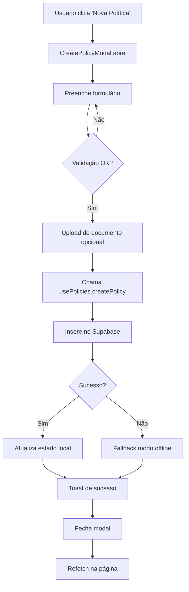
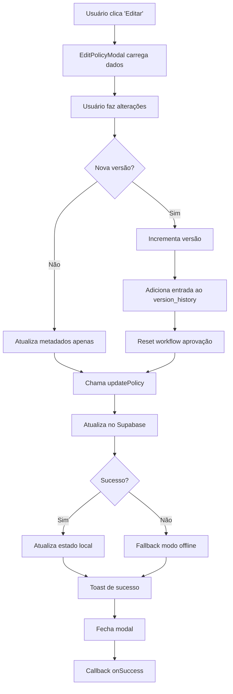
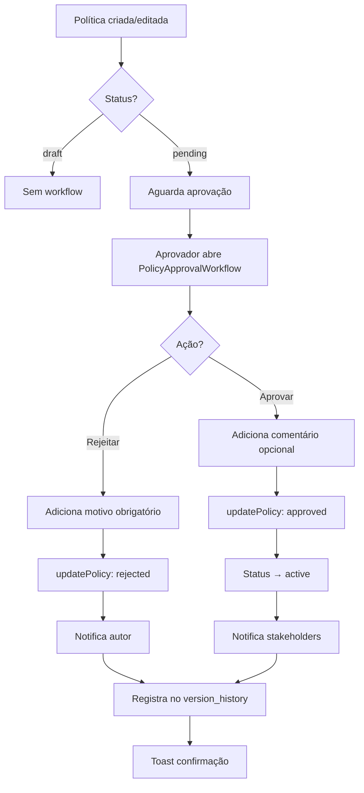
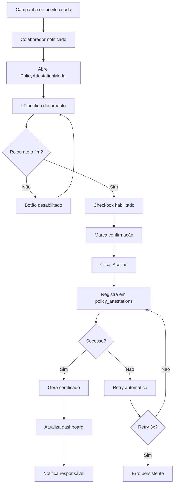

# Documentação do Módulo de Políticas & Treinamentos

## 📋 Visão Geral

O módulo de Políticas & Treinamentos é responsável pelo gerenciamento completo do ciclo de vida de políticas corporativas, incluindo criação, versionamento, workflow de aprovação, atestação por colaboradores e integração com programas de treinamento.

**Página Principal:** `src/pages/PoliciesTraining.tsx`

**Componentes Principais:**
- `PoliciesLibrary` - Biblioteca de políticas com busca e filtros
- `CreatePolicyModal` - Criação de novas políticas
- `EditPolicyModal` - Edição com versionamento
- `PolicyVersionHistory` - Histórico de versões
- `PolicyApprovalWorkflow` - Workflow de aprovação
- `PolicyAttestationModal` - Aceite de políticas
- `TrainingPrograms` - Programas de treinamento
- `AttestationTracking` - Rastreamento de aceites

---

## 🗂️ Estrutura de Dados

### Tabela: `policies`

```sql
CREATE TABLE policies (
  id UUID PRIMARY KEY DEFAULT gen_random_uuid(),
  user_id UUID NOT NULL REFERENCES auth.users(id),
  
  -- Metadados básicos
  name TEXT NOT NULL,
  description TEXT,
  category TEXT NOT NULL,
  version TEXT NOT NULL DEFAULT '1.0',
  status TEXT NOT NULL DEFAULT 'draft',
  
  -- Responsabilidades
  owner TEXT,
  approver TEXT,
  
  -- Datas
  effective_date DATE,
  review_date DATE,
  next_review DATE,
  
  -- Arquivos e tags
  tags TEXT[],
  file_url TEXT,
  
  -- Aprovação
  approval_status TEXT DEFAULT 'draft',
  approved_by UUID REFERENCES auth.users(id),
  approved_at TIMESTAMP WITH TIME ZONE,
  
  -- Versionamento
  version_history JSONB DEFAULT '[]'::jsonb,
  
  -- Auditoria
  created_at TIMESTAMP WITH TIME ZONE DEFAULT now(),
  updated_at TIMESTAMP WITH TIME ZONE DEFAULT now()
);

-- Índices para performance
CREATE INDEX idx_policies_user_id ON policies(user_id);
CREATE INDEX idx_policies_status ON policies(status);
CREATE INDEX idx_policies_approval_status ON policies(approval_status);
CREATE INDEX idx_policies_category ON policies(category);
```

### Tabela: `policy_attestations` (a ser criada)

```sql
CREATE TABLE policy_attestations (
  id UUID PRIMARY KEY DEFAULT gen_random_uuid(),
  
  -- Referências
  policy_id UUID NOT NULL REFERENCES policies(id) ON DELETE CASCADE,
  user_id UUID NOT NULL REFERENCES auth.users(id) ON DELETE CASCADE,
  
  -- Dados do atesto
  policy_version TEXT NOT NULL,
  attested_at TIMESTAMP WITH TIME ZONE DEFAULT now(),
  
  -- Auditoria
  ip_address TEXT,
  user_agent TEXT,
  campaign_id UUID,
  certificate_url TEXT,
  
  -- Constraint de unicidade
  UNIQUE(policy_id, user_id, policy_version)
);

-- Índices
CREATE INDEX idx_attestations_policy ON policy_attestations(policy_id);
CREATE INDEX idx_attestations_user ON policy_attestations(user_id);
CREATE INDEX idx_attestations_campaign ON policy_attestations(campaign_id);

-- RLS Policies
ALTER TABLE policy_attestations ENABLE ROW LEVEL SECURITY;

CREATE POLICY "Users can view their own attestations"
  ON policy_attestations FOR SELECT
  USING (auth.uid() = user_id);

CREATE POLICY "Users can create their own attestations"
  ON policy_attestations FOR INSERT
  WITH CHECK (auth.uid() = user_id);

CREATE POLICY "Admins can view all attestations"
  ON policy_attestations FOR SELECT
  USING (has_role(auth.uid(), 'admin'));
```

### Schema do `version_history` (JSONB)

```typescript
interface VersionHistoryEntry {
  version: string;           // Ex: "1.0", "2.1"
  date: string;             // ISO timestamp
  changes: string;          // Descrição das mudanças
  file_url?: string;        // URL do documento (opcional)
  author?: string;          // ID do autor
  action?: 'approve' | 'reject' | 'update';  // Tipo de ação
}

// Exemplo de version_history
[
  {
    "version": "1.0",
    "date": "2024-01-15T10:30:00Z",
    "changes": "Versão inicial da política",
    "file_url": "/documents/policy-v1.0.pdf",
    "author": "user-123"
  },
  {
    "version": "1.1",
    "date": "2024-03-20T14:45:00Z",
    "changes": "Adicionada seção sobre trabalho remoto",
    "file_url": "/documents/policy-v1.1.pdf",
    "author": "user-123",
    "action": "approve"
  }
]
```

---

## 🔄 Fluxos de Trabalho

### 1. Criação de Política



**Exemplo de Uso:**

```tsx
import CreatePolicyModal from '@/components/policies/CreatePolicyModal';

<CreatePolicyModal 
  onSuccess={() => {
    console.log('Política criada!');
    refetchPolicies();
  }}
/>
```

**Edge Cases:**
- ❌ Campos obrigatórios vazios → Validação no formulário
- ❌ Arquivo > 20MB → Erro do FileUploader
- ❌ Falha na conexão → Fallback com dados mocados
- ❌ Duplicidade de nome → Permitido (versões diferentes)

---

### 2. Edição com Versionamento



**Exemplo de Uso:**

```tsx
import EditPolicyModal from '@/components/policies/EditPolicyModal';

<EditPolicyModal 
  policy={policyData}
  onSuccess={() => {
    refetchPolicies();
    toast({ title: "Atualizado!" });
  }}
/>
```

**Versionamento Automático:**

```typescript
// Versão minor (1.0 → 1.1)
// - Mudanças menores, sem novo arquivo
const incrementVersion = (current: string) => {
  const [major, minor] = current.split('.').map(Number);
  return `${major}.${minor + 1}`;
};

// Versão major (1.5 → 2.0)
// - Novo arquivo carregado
// - Mudanças significativas
if (createNewVersion && newFileUrl !== oldFileUrl) {
  return `${major + 1}.0`;
}
```

**Edge Cases:**
- ❌ Política em aprovação → Aviso sobre reset
- ❌ Versão inválida → Valida formato X.Y
- ❌ Histórico corrompido → Fallback para array vazio
- ❌ Usuário sem permissão → Bloqueio RLS

---

### 3. Workflow de Aprovação



**Exemplo de Uso:**

```tsx
import PolicyApprovalWorkflow from '@/components/policies/PolicyApprovalWorkflow';

<PolicyApprovalWorkflow 
  policy={policyData}
  canApprove={userIsApprover}
  onApprovalChange={() => {
    refetchPolicies();
    sendNotifications();
  }}
/>
```

**Permissões:**

```typescript
// Verifica se usuário pode aprovar
const canApprove = (user: User, policy: Policy): boolean => {
  // 1. Não pode aprovar própria política
  if (user.id === policy.user_id) return false;
  
  // 2. Deve ser admin ou aprovador designado
  if (hasRole(user.id, 'admin')) return true;
  if (policy.approver === user.email) return true;
  
  return false;
};
```

**Edge Cases:**
- ❌ Aprovar própria política → Bloqueio no frontend e backend
- ❌ Rejeição sem comentário → Validação obrigatória
- ❌ Política já aprovada → Desabilita botões
- ❌ Múltiplas aprovações simultâneas → Optimistic locking

---

### 4. Atestação por Colaboradores



**Exemplo de Uso:**

```tsx
import PolicyAttestationModal from '@/components/policies/PolicyAttestationModal';

<PolicyAttestationModal 
  policy={policyData}
  campaignId="campaign-456"
  onAttestationComplete={() => {
    markAsCompleted();
    updateProgress();
  }}
/>
```

**Validações de Scroll:**

```typescript
// Detecta scroll até o final
const handleScroll = (event: React.UIEvent<HTMLDivElement>) => {
  const target = event.target as HTMLDivElement;
  const isAtBottom = 
    target.scrollHeight - target.scrollTop <= target.clientHeight + 50;
  
  if (isAtBottom) {
    setHasScrolledToEnd(true);
  }
};

// Edge case: documento muito curto
useEffect(() => {
  const contentHeight = scrollAreaRef.current?.scrollHeight || 0;
  const viewportHeight = scrollAreaRef.current?.clientHeight || 0;
  
  if (contentHeight <= viewportHeight) {
    // Documento cabe inteiro na tela
    setHasScrolledToEnd(true);
  }
}, []);
```

**Edge Cases:**
- ❌ Já atestou esta versão → Mostra data anterior
- ❌ Nova versão disponível → Solicita novo aceite
- ❌ Documento vazio → Validação na criação
- ❌ Duplicação de atesto → UNIQUE constraint
- ❌ Rede falha → Fila para retry

---

## 🔧 Hooks e Funções Principais

### Hook: `usePolicies`

**Localização:** `src/hooks/usePolicies.tsx`

```typescript
interface UsePoliciesReturn {
  policies: Policy[];
  stats: {
    total: number;
    active: number;
    draft: number;
    review: number;
    overdue: number;
    // ... outros
  };
  loading: boolean;
  createPolicy: (data: PolicyInsert) => Promise<Policy | null>;
  updatePolicy: (id: string, updates: PolicyUpdate) => Promise<void>;
  deletePolicy: (id: string) => Promise<void>;
  refetch: () => Promise<void>;
}
```

**Exemplo de Uso Completo:**

```tsx
import { usePolicies } from '@/hooks/usePolicies';

function PoliciesPage() {
  const { 
    policies, 
    stats, 
    loading, 
    createPolicy, 
    updatePolicy,
    refetch 
  } = usePolicies();

  // Criar política
  const handleCreate = async () => {
    const newPolicy = await createPolicy({
      name: "Nova Política",
      category: "seguranca",
      version: "1.0",
      status: "draft"
    });
    
    if (newPolicy) {
      console.log('Criada:', newPolicy.id);
    }
  };

  // Atualizar política
  const handleUpdate = async (id: string) => {
    await updatePolicy(id, {
      status: "active",
      approval_status: "approved"
    });
  };

  // Versionar política
  const handleNewVersion = async (policy: Policy) => {
    const versionHistory = [...(policy.version_history || [])];
    versionHistory.push({
      version: policy.version,
      date: new Date().toISOString(),
      changes: "Atualização de segurança",
      file_url: policy.file_url
    });

    await updatePolicy(policy.id, {
      version: "2.0",
      version_history: versionHistory,
      approval_status: "pending"
    });
  };

  if (loading) return <div>Carregando...</div>;

  return (
    <div>
      <h1>Políticas ({stats.total})</h1>
      <p>Ativas: {stats.active} | Rascunhos: {stats.draft}</p>
      
      {policies.map(policy => (
        <div key={policy.id}>
          <h3>{policy.name} v{policy.version}</h3>
          <button onClick={() => handleUpdate(policy.id)}>
            Aprovar
          </button>
          <button onClick={() => handleNewVersion(policy)}>
            Nova Versão
          </button>
        </div>
      ))}
    </div>
  );
}
```

**Estados de Política:**

| Status | Descrição | Ações Disponíveis |
|--------|-----------|-------------------|
| `draft` | Rascunho em elaboração | Editar, Deletar |
| `review` | Em revisão | Editar, Aprovar, Rejeitar |
| `active` | Ativa e publicada | Versionar, Arquivar |
| `archived` | Arquivada | Visualizar apenas |

**Estados de Aprovação:**

| approval_status | Descrição | Próxima Ação |
|-----------------|-----------|--------------|
| `draft` | Não enviado para aprovação | Enviar para revisão |
| `pending` | Aguardando aprovador | Aprovar ou Rejeitar |
| `approved` | Aprovada | Ativar política |
| `rejected` | Rejeitada | Revisar e reenviar |

---

## 📊 Estatísticas e Métricas

### Cálculo de Estatísticas

```typescript
// Hook usePolicies calcula automaticamente
const stats = {
  total: policies.length,
  
  // Por status
  active: policies.filter(p => p.status === 'active').length,
  draft: policies.filter(p => p.status === 'draft').length,
  review: policies.filter(p => p.status === 'review').length,
  archived: policies.filter(p => p.status === 'archived').length,
  
  // Por aprovação
  pendingApproval: policies.filter(p => 
    p.approval_status === 'pending'
  ).length,
  
  // Revisões vencidas
  overdue: policies.filter(p => {
    if (!p.next_review) return false;
    return new Date(p.next_review) < new Date();
  }).length,
  
  // Por categoria
  byCategory: policies.reduce((acc, p) => {
    acc[p.category] = (acc[p.category] || 0) + 1;
    return acc;
  }, {} as Record<string, number>)
};
```

### Dashboard de Aceites

```typescript
// Calcular progresso de campanha
interface CampaignProgress {
  totalUsers: number;
  completedUsers: number;
  pendingUsers: number;
  overdueUsers: number;
  completionRate: number;
}

const calculateCampaignProgress = async (
  policyId: string,
  campaignId: string
): Promise<CampaignProgress> => {
  // 1. Obter todos os usuários alvo
  const { data: targetUsers } = await supabase
    .from('campaign_users')
    .select('user_id')
    .eq('campaign_id', campaignId);

  // 2. Obter atestos já realizados
  const { data: attestations } = await supabase
    .from('policy_attestations')
    .select('user_id')
    .eq('policy_id', policyId)
    .eq('campaign_id', campaignId);

  const completedUserIds = new Set(
    attestations?.map(a => a.user_id) || []
  );

  const totalUsers = targetUsers?.length || 0;
  const completedUsers = completedUserIds.size;
  const pendingUsers = totalUsers - completedUsers;

  return {
    totalUsers,
    completedUsers,
    pendingUsers,
    overdueUsers: 0, // Calcular baseado em due_date
    completionRate: (completedUsers / totalUsers) * 100
  };
};
```

---

## ⚠️ Edge Cases e Tratamento de Erros

### 1. Versionamento

**Problema:** Histórico de versões corrompido
```typescript
// ✅ Solução: Validação e fallback
const getVersionHistory = (policy: Policy): VersionEntry[] => {
  if (!Array.isArray(policy.version_history)) {
    console.warn('version_history inválido, usando array vazio');
    return [];
  }

  return policy.version_history.filter(v => 
    v && 
    typeof v === 'object' && 
    'version' in v && 
    'date' in v
  );
};
```

**Problema:** Incremento de versão inválido
```typescript
// ✅ Solução: Validação de formato
const validateVersion = (version: string): boolean => {
  const regex = /^\d+\.\d+$/;
  return regex.test(version);
};

const incrementVersion = (current: string): string => {
  if (!validateVersion(current)) {
    console.error('Versão inválida:', current);
    return '1.0'; // Fallback
  }

  const [major, minor] = current.split('.').map(Number);
  return `${major}.${minor + 1}`;
};
```

### 2. Aprovação

**Problema:** Usuário tenta aprovar própria política
```typescript
// ✅ Solução: Validação frontend + backend
// Frontend
const canApprove = user.id !== policy.user_id && hasRole(user, 'approver');

// Backend (RLS Policy)
CREATE POLICY "Cannot approve own policies"
  ON policies FOR UPDATE
  USING (
    auth.uid() != user_id AND
    (approval_status = 'pending')
  );
```

**Problema:** Múltiplas aprovações simultâneas
```typescript
// ✅ Solução: Optimistic locking
const approvePolicy = async (id: string, expectedVersion: string) => {
  const { data, error } = await supabase
    .from('policies')
    .update({ 
      approval_status: 'approved',
      approved_at: new Date().toISOString()
    })
    .eq('id', id)
    .eq('version', expectedVersion) // Lock otimista
    .select()
    .single();

  if (!data) {
    throw new Error('Política foi modificada por outro usuário');
  }

  return data;
};
```

### 3. Atestação

**Problema:** Duplicação de atestos
```typescript
// ✅ Solução: UNIQUE constraint + tratamento de erro
CREATE UNIQUE INDEX idx_attestations_unique 
  ON policy_attestations(policy_id, user_id, policy_version);

// No código
try {
  await createAttestation(data);
} catch (error: any) {
  if (error.code === '23505') {
    // Duplicação - mostra atesto anterior
    showExistingAttestation();
  } else {
    throw error;
  }
}
```

**Problema:** Falha de rede durante atesto
```typescript
// ✅ Solução: Retry com backoff exponencial
const attestWithRetry = async (
  data: AttestationData,
  maxRetries = 3
): Promise<void> => {
  for (let attempt = 1; attempt <= maxRetries; attempt++) {
    try {
      await supabase.from('policy_attestations').insert(data);
      return; // Sucesso
    } catch (error) {
      if (attempt === maxRetries) throw error;
      
      // Backoff exponencial: 1s, 2s, 4s
      const delay = Math.pow(2, attempt - 1) * 1000;
      await new Promise(resolve => setTimeout(resolve, delay));
    }
  }
};
```

### 4. Upload de Arquivos

**Problema:** Arquivo muito grande (>20MB)
```typescript
// ✅ Solução: Validação antes do upload
const validateFile = (file: File): string | null => {
  const maxSize = 20 * 1024 * 1024; // 20MB
  
  if (file.size > maxSize) {
    return `Arquivo muito grande. Máximo: ${maxSize / 1024 / 1024}MB`;
  }

  const allowedTypes = ['application/pdf', 'application/msword'];
  if (!allowedTypes.includes(file.type)) {
    return 'Tipo de arquivo não suportado';
  }

  return null;
};
```

**Problema:** Falha no upload
```typescript
// ✅ Solução: Rollback da operação
const createPolicyWithFile = async (
  policyData: PolicyData,
  file: File
): Promise<Policy | null> => {
  let uploadedFileUrl: string | null = null;
  let createdPolicyId: string | null = null;

  try {
    // 1. Upload do arquivo
    uploadedFileUrl = await uploadFile(file);
    
    // 2. Criar política
    const policy = await createPolicy({
      ...policyData,
      file_url: uploadedFileUrl
    });
    createdPolicyId = policy.id;
    
    return policy;
  } catch (error) {
    // Rollback: deletar arquivo se política falhou
    if (uploadedFileUrl && !createdPolicyId) {
      await deleteFile(uploadedFileUrl);
    }
    
    // Rollback: deletar política se algo falhou depois
    if (createdPolicyId) {
      await deletePolicy(createdPolicyId);
    }
    
    throw error;
  }
};
```

---

## 🧪 Testes Automatizados Sugeridos

### Testes Unitários

```typescript
// tests/policies/versionamento.test.ts
describe('Versionamento de Políticas', () => {
  test('incrementa versão minor corretamente', () => {
    expect(incrementVersion('1.0')).toBe('1.1');
    expect(incrementVersion('2.5')).toBe('2.6');
  });

  test('incrementa versão major quando há novo arquivo', () => {
    const policy = { version: '1.5', file_url: 'old.pdf' };
    const newFileUrl = 'new.pdf';
    
    expect(incrementVersion(policy.version, true, newFileUrl)).toBe('2.0');
  });

  test('valida formato de versão', () => {
    expect(validateVersion('1.0')).toBe(true);
    expect(validateVersion('2.10')).toBe(true);
    expect(validateVersion('v1.0')).toBe(false);
    expect(validateVersion('1')).toBe(false);
  });

  test('adiciona entrada ao histórico', () => {
    const history: VersionEntry[] = [];
    const newEntry = {
      version: '1.0',
      date: new Date().toISOString(),
      changes: 'Versão inicial'
    };

    const updated = addToHistory(history, newEntry);
    expect(updated).toHaveLength(1);
    expect(updated[0].version).toBe('1.0');
  });
});
```

```typescript
// tests/policies/aprovacao.test.ts
describe('Workflow de Aprovação', () => {
  test('não permite aprovar própria política', () => {
    const user = { id: 'user-123' };
    const policy = { user_id: 'user-123' };
    
    expect(canApprove(user, policy)).toBe(false);
  });

  test('permite admin aprovar qualquer política', () => {
    const admin = { id: 'admin-1', role: 'admin' };
    const policy = { user_id: 'user-123' };
    
    expect(canApprove(admin, policy)).toBe(true);
  });

  test('rejeição requer comentário', async () => {
    await expect(
      rejectPolicy(policyId, '')
    ).rejects.toThrow('Comentário obrigatório');
  });

  test('aprovação atualiza status e timestamp', async () => {
    const policy = await approvePolicy(policyId);
    
    expect(policy.approval_status).toBe('approved');
    expect(policy.approved_at).toBeTruthy();
    expect(policy.status).toBe('active');
  });
});
```

```typescript
// tests/policies/atestacao.test.ts
describe('Atestação de Políticas', () => {
  test('não permite atesto duplicado', async () => {
    await createAttestation({ policy_id: '1', user_id: '1' });
    
    await expect(
      createAttestation({ policy_id: '1', user_id: '1' })
    ).rejects.toThrow('Attestation already exists');
  });

  test('registra timestamp e IP', async () => {
    const attestation = await createAttestation(data);
    
    expect(attestation.attested_at).toBeTruthy();
    expect(attestation.ip_address).toMatch(/^\d+\.\d+\.\d+\.\d+$/);
  });

  test('calcula progresso de campanha', async () => {
    const progress = await calculateCampaignProgress('policy-1', 'campaign-1');
    
    expect(progress.totalUsers).toBeGreaterThan(0);
    expect(progress.completionRate).toBeLessThanOrEqual(100);
  });
});
```

### Testes de Integração

```typescript
// tests/integration/policies-flow.test.ts
describe('Fluxo Completo de Política', () => {
  test('criar → editar → aprovar → aceitar', async () => {
    // 1. Criar política
    const policy = await createPolicy({
      name: 'Política de Teste',
      category: 'seguranca',
      version: '1.0'
    });
    expect(policy.id).toBeTruthy();
    expect(policy.status).toBe('draft');

    // 2. Editar e versionar
    await updatePolicy(policy.id, {
      version: '1.1',
      version_history: [{
        version: '1.0',
        date: new Date().toISOString(),
        changes: 'Versão inicial'
      }]
    });

    // 3. Enviar para aprovação
    await updatePolicy(policy.id, {
      approval_status: 'pending'
    });

    // 4. Aprovar
    const approved = await approvePolicy(policy.id);
    expect(approved.approval_status).toBe('approved');
    expect(approved.status).toBe('active');

    // 5. Usuário atesta
    const attestation = await createAttestation({
      policy_id: policy.id,
      user_id: 'test-user',
      policy_version: '1.1'
    });
    expect(attestation.id).toBeTruthy();
  });
});
```

---

## 📝 Checklist de Validação

### ✅ Cadastro de Política

- [ ] Nome obrigatório preenchido
- [ ] Categoria selecionada
- [ ] Versão inicial definida (default 1.0)
- [ ] Upload de documento (opcional mas recomendado)
- [ ] Responsável e aprovador definidos
- [ ] Datas de vigência configuradas
- [ ] Tags relevantes adicionadas
- [ ] Política salva no banco com sucesso
- [ ] Toast de confirmação exibido
- [ ] Lista atualizada automaticamente

### ✅ Versionamento

- [ ] Nova versão incrementada corretamente
- [ ] Versão anterior adicionada ao histórico
- [ ] Notas de versão preenchidas
- [ ] Arquivo da versão anterior preservado
- [ ] Novo arquivo associado (se aplicável)
- [ ] Workflow de aprovação resetado
- [ ] Timeline de versões atualizada
- [ ] Download de versões antigas funcional

### ✅ Aprovação

- [ ] Apenas aprovadores podem aprovar
- [ ] Não pode aprovar própria política
- [ ] Comentário obrigatório em rejeições
- [ ] Status atualizado corretamente
- [ ] Timestamp de aprovação registrado
- [ ] Aprovador identificado
- [ ] Notificações enviadas
- [ ] Auditoria registrada

### ✅ Aceites/Atestação

- [ ] Política exibida completamente
- [ ] Scroll obrigatório até o final
- [ ] Checkbox de confirmação funcional
- [ ] Botão desabilitado até confirmação
- [ ] Atesto registrado com sucesso
- [ ] Timestamp e IP capturados
- [ ] Não permite atesto duplicado
- [ ] Certificado gerado (quando aplicável)
- [ ] Dashboard atualizado
- [ ] Progresso da campanha recalculado

### ✅ Integração com Treinamentos

- [ ] Políticas linkadas a treinamentos
- [ ] Aceite de política conta como conclusão
- [ ] Relatórios consolidados funcionando
- [ ] Notificações de pendências enviadas
- [ ] Dashboard unificado atualizado

---

## 🚀 Onboarding para Novos Desenvolvedores

### Passo 1: Entender a Estrutura

```bash
# Arquivos principais
src/pages/PoliciesTraining.tsx          # Página principal
src/hooks/usePolicies.tsx               # Hook de dados
src/components/policies/
  ├── CreatePolicyModal.tsx             # Criação
  ├── EditPolicyModal.tsx               # Edição
  ├── PolicyVersionHistory.tsx          # Histórico
  ├── PolicyApprovalWorkflow.tsx        # Aprovação
  ├── PolicyAttestationModal.tsx        # Aceite
  ├── PoliciesLibrary.tsx               # Listagem
  ├── TrainingPrograms.tsx              # Treinamentos
  └── AttestationTracking.tsx           # Rastreamento
```

### Passo 2: Rodar Localmente

```bash
# 1. Instalar dependências
npm install

# 2. Configurar Supabase
# Criar tabela policies conforme schema acima

# 3. Iniciar dev server
npm run dev

# 4. Acessar página
# http://localhost:5173/policies-training
```

### Passo 3: Fazer Primeira Modificação

```typescript
// Exemplo: Adicionar novo status de política

// 1. Atualizar tipo
type PolicyStatus = 'draft' | 'review' | 'active' | 'archived' | 'suspended';

// 2. Adicionar badge
const getStatusBadge = (status: PolicyStatus) => {
  if (status === 'suspended') {
    return <Badge variant="destructive">Suspensa</Badge>;
  }
  // ...
};

// 3. Adicionar no select
<SelectItem value="suspended">Suspensa</SelectItem>

// 4. Atualizar documentação
// Adicionar linha na tabela de status
```

### Passo 4: Testar

```bash
# Testar criação de política
1. Clicar em "Nova Política"
2. Preencher todos os campos
3. Upload de arquivo
4. Salvar
5. Verificar na lista

# Testar versionamento
1. Editar política existente
2. Ativar "Criar Nova Versão"
3. Adicionar notas
4. Salvar
5. Verificar histórico

# Testar aprovação
1. Mudar status para "pending"
2. Abrir workflow
3. Aprovar ou rejeitar
4. Verificar status atualizado
```

---

## 🔗 Referências

- [Supabase Database](https://supabase.com/docs/guides/database)
- [Supabase Storage](https://supabase.com/docs/guides/storage)
- [React Hook Form](https://react-hook-form.com/)
- [Shadcn UI](https://ui.shadcn.com/)
- [date-fns](https://date-fns.org/)

---

## 📧 Suporte

Para dúvidas ou problemas, consulte:
- Documentação técnica completa
- Código com docstrings detalhados
- Exemplos de uso nos componentes
- Edge cases documentados

**Desenvolvedor Responsável:** [Nome do Dev]  
**Última Atualização:** 2024-11-14
