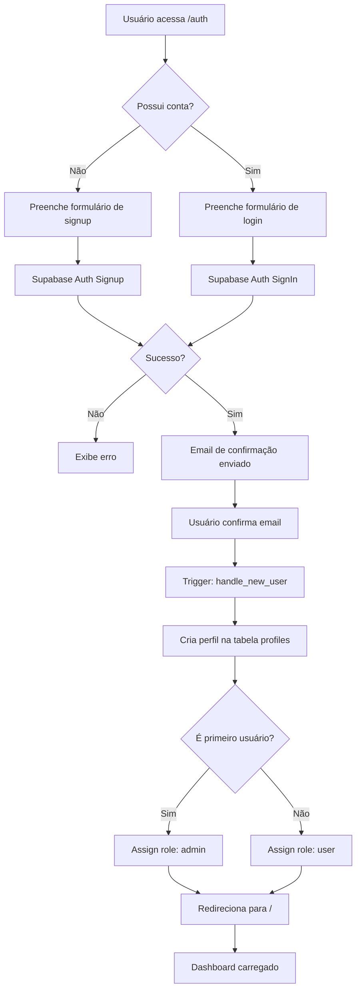
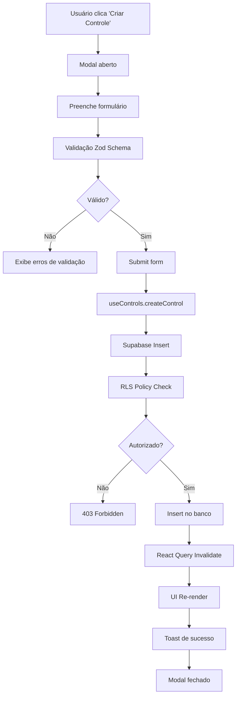
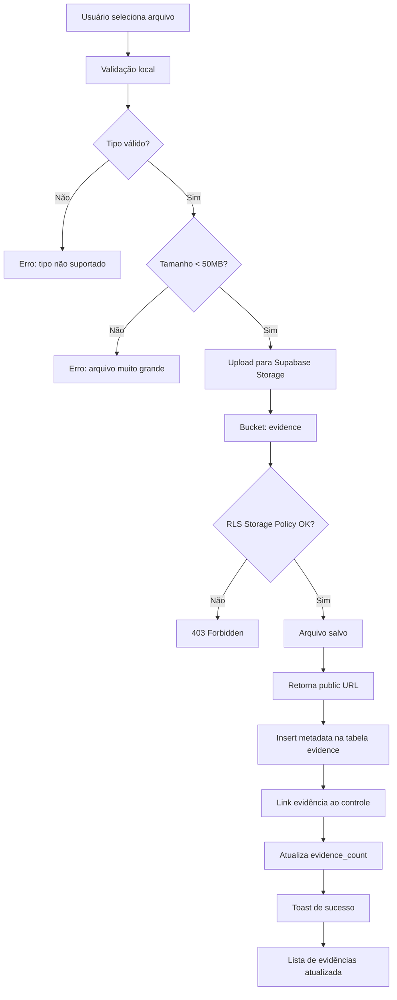
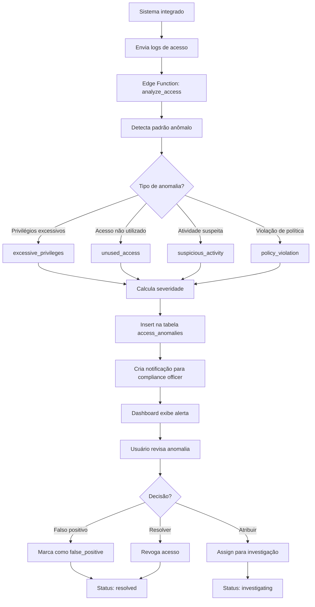
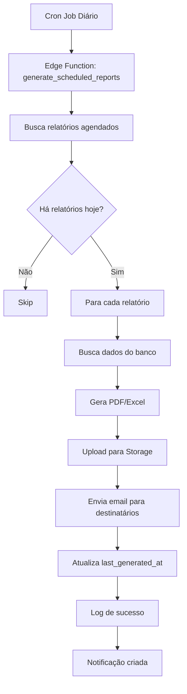
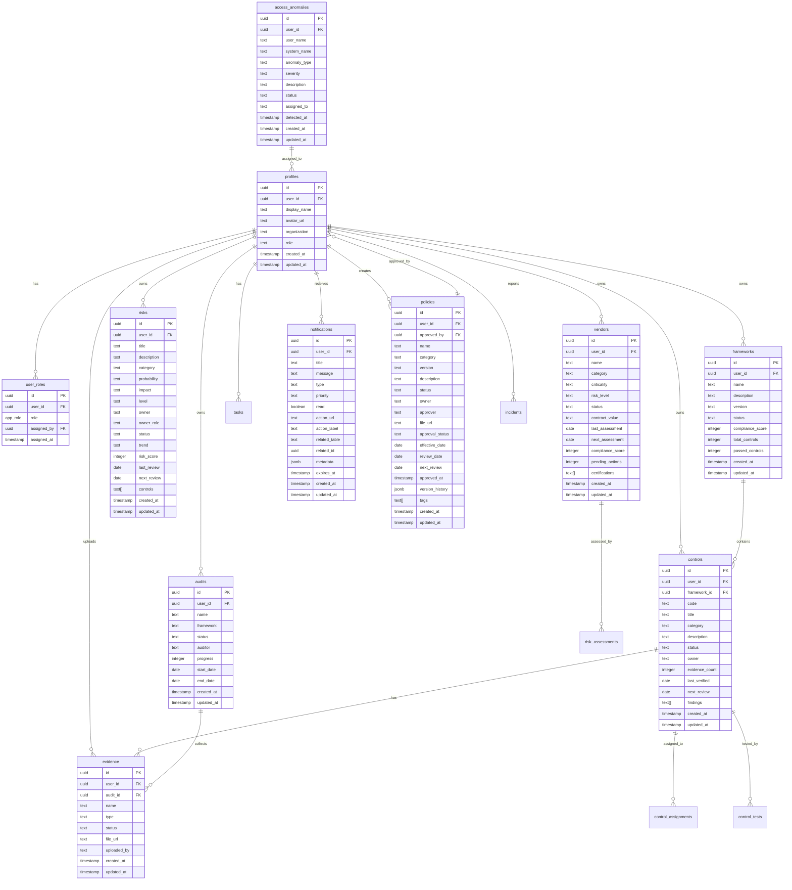
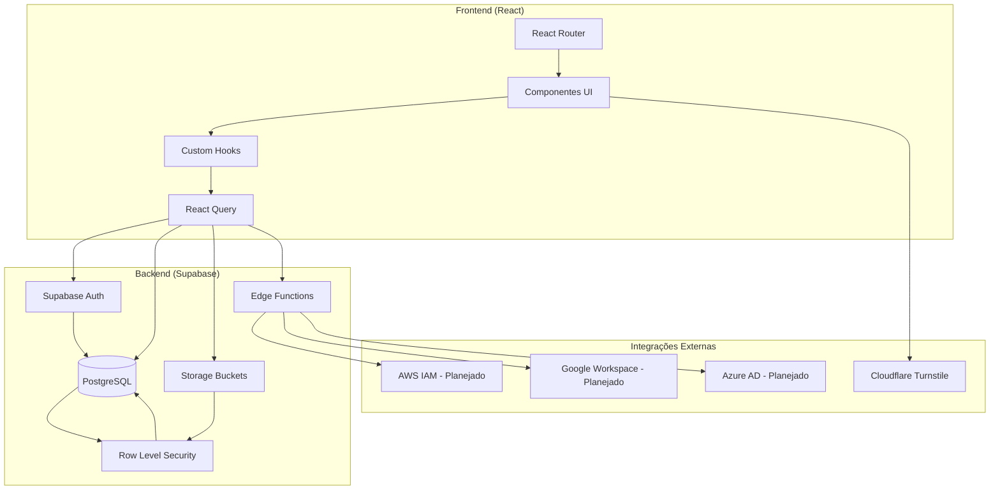

# Documentação Técnica - ComplianceSync

## 📋 Índice

1. [Visão Geral do Sistema](#visão-geral-do-sistema)
2. [Arquitetura e Stack Tecnológico](#arquitetura-e-stack-tecnológico)
3. [Estrutura de Módulos](#estrutura-de-módulos)
4. [Fluxos Principais](#fluxos-principais)
5. [Modelo de Dados](#modelo-de-dados)
6. [Integrações Externas](#integrações-externas)
7. [Regras de Negócio](#regras-de-negócio)
8. [Configuração e Deploy](#configuração-e-deploy)
9. [Cenários de Erro](#cenários-de-erro)
10. [Checklist de Validação](#checklist-de-validação)

---

## 🎯 Visão Geral do Sistema

### Propósito
ComplianceSync é uma plataforma SaaS de Governança, Risco e Compliance (GRC) enterprise que permite organizações gerenciarem:
- Frameworks de compliance (ISO 27001, SOC 2, LGPD, etc.)
- Controles de segurança e evidências
- Gestão de riscos e fornecedores
- Auditorias contínuas
- Políticas e treinamentos
- Gestão de incidentes e continuidade de negócios
- Revisões de acesso e detecção de anomalias

### Público-Alvo
- Compliance Officers
- CISOs (Chief Information Security Officers)
- Auditores internos e externos
- Risk Managers
- Gestores de TI

### Status Atual
**Beta Avançado** - Sistema funcional para uso interno, requer melhorias de segurança antes de produção externa.

---

## 🏗️ Arquitetura e Stack Tecnológico

### Frontend Stack
```
React 18.3.1          → Framework UI
TypeScript            → Tipagem estática
Vite                  → Build tool e dev server
Tailwind CSS          → Framework CSS utilitário
Shadcn/ui             → Biblioteca de componentes
React Router v6       → Roteamento SPA
React Query           → State management e cache
React Hook Form       → Gestão de formulários
Zod                   → Validação de schemas
Recharts              → Gráficos e dashboards
Lucide React          → Ícones
Sonner                → Notificações toast
```

### Backend Stack
```
Supabase              → Backend-as-a-Service
  ├─ PostgreSQL       → Banco de dados relacional
  ├─ Auth             → Autenticação JWT
  ├─ Storage          → Armazenamento de arquivos
  ├─ RLS              → Row Level Security
  └─ Edge Functions   → Serverless functions
```

### Segurança
```
Cloudflare Turnstile  → Proteção CAPTCHA
Row Level Security    → Isolamento de dados
JWT Tokens            → Autenticação stateless
HTTPS                 → Criptografia em trânsito
```

---

## 📦 Estrutura de Módulos

### Estrutura de Diretórios

```
compliance-sync/
├── src/
│   ├── components/          # Componentes React organizados por feature
│   │   ├── access/          # Revisões de acesso e anomalias
│   │   ├── analytics/       # Dashboards e métricas
│   │   ├── audit/           # Portal de auditoria
│   │   ├── auth/            # Autenticação (login, signup)
│   │   ├── common/          # Componentes reutilizáveis
│   │   ├── controls/        # Frameworks e controles
│   │   ├── dashboard/       # Dashboard principal
│   │   ├── incidents/       # Gestão de incidentes
│   │   ├── integrations/    # Hub de integrações
│   │   ├── layout/          # Layout (Header, Sidebar)
│   │   ├── notifications/   # Centro de notificações
│   │   ├── policies/        # Políticas e treinamentos
│   │   ├── reports/         # Relatórios e exports
│   │   ├── risk/            # Gestão de riscos
│   │   ├── settings/        # Configurações do sistema
│   │   ├── tasks/           # Gestão de tarefas
│   │   └── ui/              # Componentes UI base (Shadcn)
│   │
│   ├── hooks/               # Custom React Hooks
│   │   ├── useAuth.tsx      # Contexto de autenticação
│   │   ├── useAccess.tsx    # Gestão de revisões de acesso
│   │   ├── useAudits.tsx    # Gestão de auditorias
│   │   ├── useControls.tsx  # Gestão de controles
│   │   ├── useFrameworks.tsx# Gestão de frameworks
│   │   ├── useIncidents.tsx # Gestão de incidentes
│   │   ├── useIntegrations.tsx # Gestão de integrações
│   │   ├── usePolicies.tsx  # Gestão de políticas
│   │   ├── useReports.tsx   # Gestão de relatórios
│   │   ├── useRisks.tsx     # Gestão de riscos
│   │   ├── useTasks.tsx     # Gestão de tarefas
│   │   ├── useNotifications.tsx # Notificações
│   │   └── useUserRoles.tsx # Gestão de roles
│   │
│   ├── pages/               # Componentes de página/rota
│   │   ├── Index.tsx        # Dashboard principal (/)
│   │   ├── Auth.tsx         # Login/Signup (/auth)
│   │   ├── ControlsFrameworks.tsx # (/controls)
│   │   ├── RiskManagement.tsx     # (/risks)
│   │   ├── AuditPortal.tsx        # (/audit)
│   │   ├── AccessReviews.tsx      # (/access)
│   │   ├── PoliciesTraining.tsx   # (/policies)
│   │   ├── IncidentsManagement.tsx # (/incidents)
│   │   ├── IntegrationsHub.tsx    # (/integrations)
│   │   ├── ReportsExports.tsx     # (/reports)
│   │   ├── Analytics.tsx          # (/analytics)
│   │   ├── ComplianceReadiness.tsx # (/readiness)
│   │   ├── Tasks.tsx              # (/tasks)
│   │   ├── Notifications.tsx      # (/notifications)
│   │   └── Settings.tsx           # (/settings)
│   │
│   ├── integrations/        # Integrações externas
│   │   └── supabase/
│   │       ├── client.ts    # Cliente Supabase configurado
│   │       └── types.ts     # Tipos gerados do schema DB
│   │
│   ├── lib/                 # Bibliotecas utilitárias
│   │   ├── supabase.ts      # Re-export do cliente
│   │   └── utils.ts         # Funções auxiliares (cn, etc)
│   │
│   ├── App.tsx              # Componente raiz e roteamento
│   ├── main.tsx             # Entry point da aplicação
│   └── index.css            # Estilos globais e design tokens
│
├── supabase/
│   ├── config.toml          # Configuração do Supabase
│   └── migrations/          # Migrações SQL do banco
│
├── docs/                    # Documentação
│   ├── AUDIT_REPORT.md      # Relatório de auditoria
│   └── TECHNICAL_DOCUMENTATION.md # Este arquivo
│
└── public/                  # Arquivos estáticos
```

### Módulos Principais e Responsabilidades

#### 1. **Módulo de Autenticação** (`src/hooks/useAuth.tsx`, `src/components/auth/`)

**O que faz:**
- Gerencia login, signup, logout e recuperação de senha
- Mantém estado global da sessão do usuário
- Integra com Supabase Auth (JWT)

**Entradas:**
- `signIn(email, password)` → Credenciais de login
- `signUp(email, password, metadata)` → Dados de cadastro
- `resetPassword(email)` → Email para recuperação

**Saídas:**
- `user: User | null` → Usuário autenticado
- `session: Session | null` → Sessão ativa
- `loading: boolean` → Estado de carregamento
- `{ error: AuthError | null }` → Erros de autenticação

**Exemplo de uso:**
```typescript
import { useAuth } from '@/hooks/useAuth';

function LoginComponent() {
  const { signIn, user, loading } = useAuth();
  
  const handleLogin = async () => {
    const { error } = await signIn('user@example.com', 'password123');
    if (error) console.error('Login failed:', error);
  };
}
```

**Edge cases:**
- Email não confirmado → Exibir mensagem de verificação
- Senha incorreta → Erro de credenciais inválidas
- Sessão expirada → Redirecionar para /auth

---

#### 2. **Módulo de Controles e Frameworks** (`src/hooks/useFrameworks.tsx`, `src/components/controls/`)

**O que faz:**
- CRUD de frameworks de compliance (ISO 27001, SOC 2, etc.)
- CRUD de controles de segurança
- Tracking de status, evidências e gaps
- Matriz de controles com filtros avançados

**Entradas:**
- Frameworks: `name, description, version, status`
- Controles: `code, title, category, description, status, owner`

**Saídas:**
- Lista de frameworks com métricas (compliance_score, total_controls)
- Lista de controles com status e evidências
- Gap analysis (controles pendentes vs implementados)

**Exemplo de uso:**
```typescript
import { useFrameworks } from '@/hooks/useFrameworks';

function ControlsPage() {
  const { frameworks, createFramework, loading } = useFrameworks();
  
  const addFramework = async () => {
    await createFramework({
      name: 'ISO 27001:2022',
      description: 'Information Security Management',
      version: '2022',
      status: 'active'
    });
  };
}
```

**Fluxo de dados:**
```
Usuário → Form → createFramework() → Supabase Insert → RLS Check → DB Insert → React Query Cache Update → UI Re-render
```

**Edge cases:**
- Framework duplicado → Validar nome único
- Controle sem owner → Permitir null, mas alertar no dashboard
- Evidências ausentes → Marcar controle como "pending"

---

#### 3. **Módulo de Gestão de Riscos** (`src/hooks/useRisks.tsx`, `src/components/risk/`)

**O que faz:**
- CRUD de riscos com scoring (probabilidade × impacto)
- Gestão de fornecedores (vendors) e criticidade
- Risk assessments (questionários de avaliação)
- Matriz de riscos 5×5

**Entradas:**
- Riscos: `title, description, category, probability, impact, owner`
- Vendors: `name, category, criticality, risk_level`
- Assessments: `template, vendor_id, due_date, questions`

**Saídas:**
- Risk registry com níveis calculados
- Vendor scorecards com métricas
- Risk matrix visualization

**Cálculo de Risk Score:**
```typescript
const riskScore = {
  probability: { low: 1, medium: 2, high: 3, critical: 4 },
  impact: { low: 1, medium: 2, high: 3, critical: 4 }
};

const score = riskScore[probability] * riskScore[impact]; // 1-16
```

**Exemplo de uso:**
```typescript
import { useRisks } from '@/hooks/useRisks';

function RiskPage() {
  const { risks, createRisk } = useRisks();
  
  const addRisk = async () => {
    await createRisk({
      title: 'Data Breach Risk',
      probability: 'medium',
      impact: 'critical', // Score = 2 × 4 = 8 (High)
      category: 'Security',
      owner: 'CISO'
    });
  };
}
```

**Edge cases:**
- Risk sem mitigação → Alertar no dashboard
- Vendor sem assessment → Marcar como "pending evaluation"
- Due date expirado → Enviar notificação automática

---

#### 4. **Módulo de Auditorias** (`src/hooks/useAudits.tsx`, `src/components/audit/`)

**O que faz:**
- CRUD de auditorias (internal/external)
- Upload e gestão de evidências no Storage
- Evidence locker com controle de acesso
- Configuração de acesso para auditores externos

**Entradas:**
- Audits: `name, framework, start_date, end_date, status, auditor`
- Evidence: `name, type, status, file_url, audit_id`

**Saídas:**
- Lista de auditorias com progresso
- Evidence library organizada por tipo
- Audit reports gerados

**Fluxo de upload de evidência:**
```
1. Usuário seleciona arquivo → FileUploader component
2. useFileUpload hook → Validação (tipo, tamanho)
3. Supabase Storage Upload → Bucket 'evidence'
4. Insert metadata → Tabela 'evidence'
5. RLS policy check → Apenas owner pode acessar
6. Success toast → UI atualizada
```

**Exemplo de uso:**
```typescript
import { useAudits } from '@/hooks/useAudits';
import { useFileUpload } from '@/hooks/useFileUpload';

function AuditPage() {
  const { audits, createAudit } = useAudits();
  const { uploadFile } = useFileUpload();
  
  const uploadEvidence = async (file: File) => {
    const { url, error } = await uploadFile(file, 'evidence');
    if (url) {
      // Salvar metadata da evidência
      await createEvidence({ name: file.name, file_url: url });
    }
  };
}
```

**Edge cases:**
- Arquivo > 50MB → Rejeitar upload
- Tipo não suportado → Apenas PDF, DOCX, XLSX, PNG, JPG
- Storage quota excedido → Exibir erro e solicitar limpeza

---

#### 5. **Módulo de Revisões de Acesso** (`src/hooks/useAccess.tsx`, `src/components/access/`)

**O que faz:**
- Gestão de campanhas de revisão de acesso
- Inventário de sistemas integrados
- Detecção de anomalias (excessive privileges, unused access)
- Configuração de integrações (AWS IAM, Google Workspace, etc.)

**Entradas:**
- Campaigns: `name, systems, start_date, end_date, reviewers`
- Systems: `name, type, integration_status, user_count`
- Anomalies: `user_name, system_name, anomaly_type, severity`

**Saídas:**
- Active campaigns com progresso
- System inventory
- Anomaly alerts com severidade

**Fluxo de detecção de anomalia:**
```
1. Sistema integrado envia logs de acesso
2. Edge Function analisa padrões
3. Detecta anomalias (ex: acesso não utilizado por 90 dias)
4. Insert na tabela access_anomalies
5. Notificação criada para compliance officer
6. Dashboard exibe alerta
```

**Exemplo de uso:**
```typescript
import { useAccess } from '@/hooks/useAccess';

function AccessPage() {
  const { anomalies, resolveAnomaly } = useAccess();
  
  const handleResolve = async (id: string) => {
    await resolveAnomaly(id, 'resolved', 'Access revoked');
  };
}
```

**Tipos de anomalias detectadas:**
- `excessive_privileges`: Usuário com mais permissões que o necessário
- `unused_access`: Acesso não utilizado por >90 dias
- `suspicious_activity`: Login fora do horário ou localização atípica
- `policy_violation`: Violação de política de acesso (ex: segregação de funções)

**Edge cases:**
- Falso positivo → Usuário pode marcar como "false_positive"
- Anomalia recorrente → Escalar severidade automaticamente
- Sistema não integrado → Exibir apenas alertas manuais

---

#### 6. **Módulo de Políticas e Treinamentos** (`src/hooks/usePolicies.tsx`, `src/components/policies/`)

**O que faz:**
- CRUD de políticas corporativas com versionamento
- Tracking de attestations (confirmações de leitura)
- Gestão de programas de treinamento
- Workflow de aprovação de políticas

**Entradas:**
- Policies: `name, category, version, status, file_url, approver`
- Trainings: `name, category, duration, required_for, completion_rate`
- Attestations: `policy_id, user_id, attested_at`

**Saídas:**
- Policy library com status de aprovação
- Training programs com tracking de completude
- Attestation reports

**Workflow de aprovação:**
```
1. Usuário cria política → Status: 'draft'
2. Envia para aprovação → Status: 'pending_approval'
3. Approver revisa → Aprova ou rejeita
4. Se aprovado → Status: 'approved', effective_date definido
5. Notificações enviadas para usuários relevantes
6. Tracking de attestations iniciado
```

**Exemplo de uso:**
```typescript
import { usePolicies } from '@/hooks/usePolicies';

function PoliciesPage() {
  const { policies, createPolicy, updatePolicy } = usePolicies();
  
  const approvePolicy = async (id: string) => {
    await updatePolicy(id, {
      approval_status: 'approved',
      approved_at: new Date().toISOString(),
      approved_by: currentUser.id,
      effective_date: new Date()
    });
  };
}
```

**Edge cases:**
- Política sem file_url → Permitir, mas alertar
- Review date expirado → Alertar para revisão
- Attestation pendente → Enviar lembretes automáticos

---

#### 7. **Módulo de Incidentes** (`src/hooks/useIncidents.tsx`, `src/components/incidents/`)

**O que faz:**
- Registro e tracking de incidentes de segurança
- Playbooks de resposta a incidentes
- Business Continuity Plans (BCP)
- Testes de continuidade

**Entradas:**
- Incidents: `title, description, severity, status, affected_systems`
- Playbooks: `name, category, severity, steps, triggers`
- BCP Plans: `name, rto, rpo, systems, status`

**Saídas:**
- Active incidents dashboard
- Playbook library
- BCP test results

**Fluxo de resposta a incidente:**
```
1. Incidente reportado → Status: 'open'
2. Sistema sugere playbook baseado em categoria/severidade
3. Playbook atribuído → Passos executados
4. Status atualizado → 'investigating', 'mitigating', 'resolved'
5. Post-mortem documentado
6. Lessons learned → Atualização de playbooks
```

**Severidade e SLA:**
```typescript
const incidentSLA = {
  critical: '1 hour',  // Resposta imediata
  high: '4 hours',     // Resposta urgente
  medium: '24 hours',  // Resposta prioritária
  low: '72 hours'      // Resposta normal
};
```

**Exemplo de uso:**
```typescript
import { useIncidents } from '@/hooks/useIncidents';

function IncidentsPage() {
  const { incidents, createIncident } = useIncidents();
  
  const reportIncident = async () => {
    await createIncident({
      title: 'Suspected Phishing Attack',
      severity: 'high',
      category: 'Security',
      affected_systems: ['Email Server', 'User Workstations']
    });
  };
}
```

**Edge cases:**
- Incidente crítico → Notificação SMS/Email imediata
- SLA breach → Escalar automaticamente
- Playbook não encontrado → Permitir resposta manual

---

#### 8. **Módulo de Integrações** (`src/hooks/useIntegrations.tsx`, `src/components/integrations/`)

**O que faz:**
- Hub central de integrações com sistemas externos
- Configuração de conectores (AWS, GCP, Azure, Google Workspace, etc.)
- Monitoramento de status de conexão
- Sincronização automática de dados

**Status Atual:**
⚠️ **Parcialmente implementado** - Interface pronta, lógica de integração mockada

**Integrações Planejadas:**

| Integração | Propósito | Status |
|------------|-----------|--------|
| AWS IAM | Sincronizar usuários e permissões | Mockado |
| Google Workspace | Gestão de identidades | Mockado |
| Azure AD | SSO e controle de acesso | Mockado |
| GitHub | Auditoria de código | Mockado |
| Jira | Tracking de tasks | Mockado |
| Okta | Identity Provider | Mockado |
| Splunk | Log aggregation | Mockado |
| PagerDuty | Incident management | Mockado |

**Arquitetura de integração (futura):**
```
1. Usuário configura integração → Fornece API keys/OAuth
2. Secrets armazenados → Supabase Vault
3. Edge Function agendada → Cron job (diário/semanal)
4. API externa consultada → Dados normalizados
5. Insert/Update no banco → Tabelas específicas
6. Logs gerados → Auditoria de sincronização
```

**Exemplo de configuração (futuro):**
```typescript
import { useIntegrations } from '@/hooks/useIntegrations';

function IntegrationsPage() {
  const { connectIntegration } = useIntegrations();
  
  const connectAWS = async () => {
    await connectIntegration('aws_iam', {
      access_key_id: 'AKIA...',
      secret_access_key: 'secret...',
      region: 'us-east-1',
      sync_frequency: 'daily'
    });
  };
}
```

**Edge cases:**
- API key inválida → Exibir erro de conexão
- Rate limit excedido → Retry com backoff exponencial
- Dados corrompidos → Skip e logar erro

---

#### 9. **Módulo de Relatórios** (`src/hooks/useReports.tsx`, `src/components/reports/`)

**O que faz:**
- Geração de relatórios de compliance
- Relatórios customizados (SQL queries, filtros)
- Agendamento de relatórios (diário, semanal, mensal)
- Compartilhamento e export (PDF, Excel)

**Status Atual:**
⚠️ **Parcialmente implementado** - Interface pronta, geração de PDF mockada

**Tipos de relatórios:**
- **Executive Summary**: Overview de compliance, riscos e auditorias
- **Control Status**: Status de controles por framework
- **Audit Findings**: Resultados de auditorias
- **Risk Register**: Lista de riscos ativos
- **Vendor Assessment**: Scorecards de fornecedores
- **Incident Report**: Histórico de incidentes

**Exemplo de uso:**
```typescript
import { useReports } from '@/hooks/useReports';

function ReportsPage() {
  const { generateReport, scheduleReport } = useReports();
  
  const createMonthlyReport = async () => {
    await scheduleReport({
      name: 'Monthly Compliance Report',
      type: 'executive_summary',
      frequency: 'monthly',
      recipients: ['ciso@company.com', 'ceo@company.com'],
      format: 'pdf'
    });
  };
}
```

**Edge cases:**
- Report generation timeout → Processar assincronamente
- Destinatário inválido → Validar emails
- Storage cheio → Arquivar reports antigos

---

#### 10. **Módulo de Notificações** (`src/hooks/useNotifications.tsx`, `src/components/notifications/`)

**O que faz:**
- Centro de notificações in-app
- Sistema de prioridade e expiração
- Notificações contextuais (risk alerts, audit deadlines, etc.)
- Batch operations (mark all as read)

**Entradas:**
- `user_id, title, message, type, priority, action_url`

**Saídas:**
- Lista de notificações não lidas
- Contagem de alertas por prioridade

**Tipos de notificações:**
```typescript
type NotificationType = 
  | 'info'        // Informações gerais
  | 'success'     // Ações completadas
  | 'warning'     // Alertas não urgentes
  | 'error'       // Erros críticos
  | 'task'        // Tasks atribuídas
  | 'audit'       // Alertas de auditoria
  | 'risk'        // Alertas de risco
  | 'deadline';   // Prazos se aproximando
```

**Função de criação de notificação (DB Function):**
```sql
SELECT create_notification(
  p_user_id := auth.uid(),
  p_title := 'Control Review Due',
  p_message := 'Control AC-001 requires review',
  p_type := 'deadline',
  p_priority := 'high',
  p_action_url := '/controls/ac-001'
);
```

**Exemplo de uso:**
```typescript
import { useNotifications } from '@/hooks/useNotifications';

function NotificationCenter() {
  const { notifications, markAsRead, markAllAsRead } = useNotifications();
  
  const unreadCount = notifications.filter(n => !n.read).length;
}
```

**Edge cases:**
- Notificações expiradas → Auto-delete após 30 dias
- Spam de notificações → Rate limiting por tipo
- Notificação sem action_url → Exibir apenas informação

---

## 🔄 Fluxos Principais

### 1. Fluxo de Autenticação



**Detalhes técnicos:**
- JWT token armazenado em `localStorage`
- Session auto-refresh a cada 55 minutos
- Confirmação de email obrigatória (pode ser desabilitada em dev)
- Primeiro usuário sempre recebe role `admin`

---

### 2. Fluxo de Criação de Controle



**Validações aplicadas:**
- Campo `code` obrigatório e único
- Campo `title` obrigatório
- Campo `category` deve estar na lista predefinida
- Campo `status` default: 'pending'

---

### 3. Fluxo de Upload de Evidência



**Tipos de arquivo aceitos:**
- Documentos: PDF, DOCX, XLSX, PPTX
- Imagens: PNG, JPG, JPEG
- Outros: TXT, CSV

**Políticas de Storage:**
- Bucket `evidence`: Privado, apenas owner pode ler/escrever
- Bucket `documents`: Privado, apenas owner pode ler/escrever

---

### 4. Fluxo de Detecção de Anomalia de Acesso



**Critérios de detecção:**

| Tipo | Critério | Severidade |
|------|----------|------------|
| Excessive Privileges | Usuário com >5 roles ativos | Medium → High |
| Unused Access | Sem login por >90 dias | Low → Medium |
| Suspicious Activity | Login fora de horário (0-6h) | High |
| Policy Violation | Segregação de funções violada | Critical |

---

### 5. Fluxo de Geração de Relatório Agendado



**Nota:** Geração de PDF está mockada, requer implementação de biblioteca (ex: jsPDF, Puppeteer).

---

## 💾 Modelo de Dados

### Esquema Relacional Completo



### Enums Customizados

```sql
-- Roles do sistema
CREATE TYPE app_role AS ENUM (
  'admin',
  'compliance_officer',
  'auditor',
  'risk_manager',
  'user',
  'master_admin',
  'master_ti',
  'master_governance'
);
```

### Funções do Banco de Dados

#### 1. `has_role(user_id, role)`
**Propósito:** Verifica se um usuário possui um role específico (usado em RLS policies)

```sql
CREATE OR REPLACE FUNCTION public.has_role(_user_id uuid, _role app_role)
RETURNS boolean
LANGUAGE sql
STABLE SECURITY DEFINER
SET search_path = public
AS $$
  SELECT EXISTS (
    SELECT 1
    FROM public.user_roles
    WHERE user_id = _user_id
      AND role = _role
  )
$$;
```

**Exemplo de uso em RLS:**
```sql
CREATE POLICY "Admins can select all rows"
ON public.controls
FOR SELECT
TO authenticated
USING (public.has_role(auth.uid(), 'admin'));
```

---

#### 2. `handle_new_user()`
**Propósito:** Trigger que cria perfil automaticamente quando novo usuário faz signup

```sql
CREATE OR REPLACE FUNCTION public.handle_new_user()
RETURNS trigger
LANGUAGE plpgsql
SECURITY DEFINER
SET search_path = public
AS $$
BEGIN
  INSERT INTO public.profiles (user_id, display_name)
  VALUES (new.id, COALESCE(new.raw_user_meta_data ->> 'display_name', new.email));
  RETURN new;
END;
$$;

CREATE TRIGGER on_auth_user_created
  AFTER INSERT ON auth.users
  FOR EACH ROW EXECUTE FUNCTION public.handle_new_user();
```

---

#### 3. `assign_first_admin()`
**Propósito:** Atribui role 'admin' ao primeiro usuário do sistema

```sql
CREATE OR REPLACE FUNCTION public.assign_first_admin()
RETURNS trigger
LANGUAGE plpgsql
SECURITY DEFINER
SET search_path = public
AS $$
BEGIN
  IF (SELECT COUNT(*) FROM auth.users) = 1 THEN
    INSERT INTO public.user_roles (user_id, role)
    VALUES (NEW.id, 'admin');
  END IF;
  RETURN NEW;
END;
$$;

CREATE TRIGGER on_first_user_admin
  AFTER INSERT ON auth.users
  FOR EACH ROW EXECUTE FUNCTION public.assign_first_admin();
```

---

#### 4. `create_notification()`
**Propósito:** Helper function para criar notificações de forma segura

```sql
CREATE OR REPLACE FUNCTION public.create_notification(
  p_user_id uuid,
  p_title text,
  p_message text,
  p_type text DEFAULT 'info',
  p_priority text DEFAULT 'normal',
  p_action_url text DEFAULT NULL,
  p_action_label text DEFAULT NULL,
  p_related_table text DEFAULT NULL,
  p_related_id uuid DEFAULT NULL,
  p_metadata jsonb DEFAULT '{}',
  p_expires_at timestamp with time zone DEFAULT NULL
)
RETURNS uuid
LANGUAGE plpgsql
SECURITY DEFINER
SET search_path = public
AS $$
DECLARE
  notification_id UUID;
BEGIN
  INSERT INTO public.notifications (
    user_id, title, message, type, priority, action_url, 
    action_label, related_table, related_id, metadata, expires_at
  ) VALUES (
    p_user_id, p_title, p_message, p_type, p_priority, p_action_url,
    p_action_label, p_related_table, p_related_id, p_metadata, p_expires_at
  ) RETURNING id INTO notification_id;
  
  RETURN notification_id;
END;
$$;
```

**Exemplo de uso:**
```sql
SELECT create_notification(
  p_user_id := auth.uid(),
  p_title := 'Risk Review Due',
  p_message := 'Risk R-001 requires quarterly review',
  p_type := 'deadline',
  p_priority := 'high',
  p_action_url := '/risks/r-001'
);
```

---

### Políticas RLS (Row Level Security)

#### Padrão de Segurança
Todas as tabelas com dados do usuário seguem este padrão:

```sql
-- Tabela X (exemplo: risks, controls, frameworks)
CREATE POLICY "Users can manage their own X"
ON public.X
FOR ALL
TO authenticated
USING (auth.uid() = user_id)
WITH CHECK (auth.uid() = user_id);
```

#### Políticas Especiais

**Profiles:**
```sql
-- Usuários e masters podem ver profiles
CREATE POLICY "Users and masters can view profiles"
ON public.profiles
FOR SELECT
TO authenticated
USING (
  (auth.uid() = user_id) OR
  has_role(auth.uid(), 'master_admin') OR
  has_role(auth.uid(), 'master_ti') OR
  has_role(auth.uid(), 'master_governance')
);
```

**User Roles:**
```sql
-- Apenas admins podem gerenciar roles
CREATE POLICY "Admins can manage all roles"
ON public.user_roles
FOR ALL
TO authenticated
USING (has_role(auth.uid(), 'admin'));
```

**Access Anomalies:**
```sql
-- Todos podem ver, apenas admin/compliance officer podem editar
CREATE POLICY "Users can view all anomalies"
ON public.access_anomalies
FOR SELECT
TO authenticated
USING (auth.uid() IS NOT NULL);

CREATE POLICY "Admin and compliance officers can update anomalies"
ON public.access_anomalies
FOR UPDATE
TO authenticated
USING (
  has_role(auth.uid(), 'admin') OR
  has_role(auth.uid(), 'compliance_officer')
);
```

**Audit Logs:**
```sql
-- Apenas admins e auditores podem ler logs
CREATE POLICY "Admins and auditors can view all logs"
ON public.audit_logs
FOR SELECT
TO authenticated
USING (
  has_role(auth.uid(), 'admin') OR
  has_role(auth.uid(), 'auditor')
);

-- Usuários podem criar seus próprios logs
CREATE POLICY "Users can create audit logs"
ON public.audit_logs
FOR INSERT
TO authenticated
WITH CHECK (auth.uid() = user_id);
```

---

### Storage Buckets

#### 1. Bucket: `evidence`
- **Visibilidade:** Privado
- **Propósito:** Armazenar evidências de auditorias
- **Tipos permitidos:** PDF, DOCX, XLSX, PNG, JPG
- **Tamanho máximo:** 50MB por arquivo
- **RLS Policy:**
```sql
CREATE POLICY "Users can upload their own evidence"
ON storage.objects
FOR INSERT
WITH CHECK (
  bucket_id = 'evidence' AND
  auth.uid()::text = (storage.foldername(name))[1]
);

CREATE POLICY "Users can view their own evidence"
ON storage.objects
FOR SELECT
USING (
  bucket_id = 'evidence' AND
  auth.uid()::text = (storage.foldername(name))[1]
);
```

#### 2. Bucket: `documents`
- **Visibilidade:** Privado
- **Propósito:** Armazenar políticas e documentos corporativos
- **Tipos permitidos:** PDF, DOCX, PPTX
- **Tamanho máximo:** 100MB por arquivo

---

## 🔌 Integrações Externas

### 1. Supabase

**Cliente configurado:**
```typescript
// src/integrations/supabase/client.ts
import { createClient } from '@supabase/supabase-js';
import type { Database } from './types';

const SUPABASE_URL = "https://ofbyxnpprwwuieabwhdo.supabase.co";
const SUPABASE_PUBLISHABLE_KEY = "eyJhbGci...";

export const supabase = createClient<Database>(SUPABASE_URL, SUPABASE_PUBLISHABLE_KEY, {
  auth: {
    storage: localStorage,
    persistSession: true,
    autoRefreshToken: true,
  }
});
```

**Serviços utilizados:**
- **Auth:** JWT-based authentication
- **Database:** PostgreSQL com RLS
- **Storage:** File uploads (buckets: evidence, documents)
- **Realtime:** (Não configurado ainda)
- **Edge Functions:** (Planejado para integrações)

**Secrets configurados:**
- `SUPABASE_SERVICE_ROLE_KEY`: Para operações admin
- `SUPABASE_DB_URL`: Connection string do banco
- `SUPABASE_URL`: URL do projeto
- `SUPABASE_PUBLISHABLE_KEY`: Chave pública para cliente

---

### 2. Cloudflare Turnstile

**Propósito:** Proteção CAPTCHA contra bots

**Implementação:**
```typescript
// src/components/auth/AuthModal.tsx
import { Turnstile } from '@marsidev/react-turnstile';

<Turnstile
  siteKey={import.meta.env.VITE_TURNSTILE_SITE_KEY || 'fallback-key'}
  onSuccess={(token) => setTurnstileToken(token)}
/>
```

**⚠️ ATENÇÃO DE SEGURANÇA:**
- Chave hardcoded no fallback: `'fallback-key'`
- **RISCO:** Site key deve ser pública, mas hardcoded fallback pode ser abusado
- **RECOMENDAÇÃO:** Sempre usar variável de ambiente, sem fallback

**Configuração necessária:**
1. Criar conta em Cloudflare Turnstile
2. Obter Site Key e Secret Key
3. Configurar `.env`:
```bash
VITE_TURNSTILE_SITE_KEY=0x4AAAAAAA...
VITE_TURNSTILE_SECRET_KEY=0x4AAAAAAA...
```

---

### 3. Integrações Planejadas (Mock)

Estas integrações possuem interface pronta, mas lógica não implementada:

#### AWS IAM
- **Endpoint:** `https://iam.amazonaws.com`
- **Autenticação:** AWS Access Key ID + Secret Access Key
- **Dados sincronizados:** Usuários, Grupos, Roles, Políticas
- **Frequência:** Diária

#### Google Workspace
- **Endpoint:** `https://admin.googleapis.com`
- **Autenticação:** OAuth 2.0 (Service Account)
- **Dados sincronizados:** Usuários, Grupos, Unidades Organizacionais
- **Frequência:** Diária

#### Azure Active Directory
- **Endpoint:** `https://graph.microsoft.com`
- **Autenticação:** OAuth 2.0 (App Registration)
- **Dados sincronizados:** Usuários, Grupos, Aplicações
- **Frequência:** Diária

#### GitHub
- **Endpoint:** `https://api.github.com`
- **Autenticação:** Personal Access Token
- **Dados sincronizados:** Repositórios, Commits, Pull Requests
- **Frequência:** Semanal

#### Arquitetura de Integração (Proposta)

```typescript
// supabase/functions/sync-integrations/index.ts
import { serve } from "https://deno.land/std@0.168.0/http/server.ts";

interface IntegrationConfig {
  name: string;
  endpoint: string;
  credentials: Record<string, string>;
  syncFrequency: 'daily' | 'weekly' | 'monthly';
}

async function syncIntegration(config: IntegrationConfig) {
  // 1. Fetch data from external API
  const response = await fetch(config.endpoint, {
    headers: {
      'Authorization': `Bearer ${config.credentials.token}`,
    },
  });
  
  // 2. Normalize data
  const data = await response.json();
  const normalized = normalizeData(data, config.name);
  
  // 3. Upsert to database
  const { error } = await supabase
    .from('integration_data')
    .upsert(normalized);
  
  // 4. Log sync result
  await logSync(config.name, error ? 'failed' : 'success');
}

serve(async (req) => {
  // Cron job trigger
  const integrations = await getActiveIntegrations();
  
  for (const integration of integrations) {
    await syncIntegration(integration);
  }
  
  return new Response('Sync completed');
});
```

---

## 📋 Regras de Negócio

### 1. Gestão de Roles

**Hierarquia de permissões:**
```
master_admin (super-admin)
  ├─ master_ti (IT master)
  ├─ master_governance (Governance master)
  └─ admin (org admin)
      ├─ compliance_officer
      ├─ auditor
      ├─ risk_manager
      └─ user (default)
```

**Regras:**
- Primeiro usuário sempre recebe `admin`
- Master roles podem gerenciar usuários de qualquer organização
- `admin` pode atribuir roles até `compliance_officer`
- `user` não pode atribuir roles

**Processo de deleção de usuário:**
```
1. Master admin cria requisição de deleção
2. Requer aprovação de:
   - master_admin (1 aprovação)
   - master_ti (1 aprovação)
   - master_governance (1 aprovação)
3. Após 3 aprovações → Usuário deletado
4. Cascading delete de todos os dados associados
```

---

### 2. Cálculo de Compliance Score

**Fórmula:**
```typescript
const complianceScore = Math.round(
  (passedControls / totalControls) * 100
);
```

**Status do framework baseado no score:**
```typescript
const frameworkStatus = (score: number) => {
  if (score >= 90) return 'compliant';
  if (score >= 70) return 'partial';
  if (score >= 50) return 'needs_improvement';
  return 'non_compliant';
};
```

**Critérios de controle "passed":**
- Status: `implemented`
- Evidências: ≥ 1
- Last verified: < 90 dias
- No findings: `findings.length === 0`

---

### 3. Cálculo de Risk Score

**Matriz de Risco 5x5:**
```typescript
const riskMatrix = {
  probability: { low: 1, medium: 2, high: 3, critical: 4, very_high: 5 },
  impact: { low: 1, medium: 2, high: 3, critical: 4, catastrophic: 5 }
};

const riskScore = (probability: string, impact: string) => {
  return riskMatrix.probability[probability] * riskMatrix.impact[impact];
};

// Score 1-25
const riskLevel = (score: number) => {
  if (score >= 20) return 'critical';
  if (score >= 12) return 'high';
  if (score >= 6) return 'medium';
  return 'low';
};
```

**Exemplo:**
- Probability: `high` (3)
- Impact: `critical` (4)
- Score: 3 × 4 = 12
- Level: `high`

---

### 4. Workflow de Aprovação de Política

**Estados:**
```
draft → pending_approval → approved | rejected
```

**Regras:**
- Apenas owner pode enviar para aprovação
- Apenas approver pode aprovar/rejeitar
- Aprovação requer comentário obrigatório
- Rejeição requer razão obrigatória
- Após aprovação, política entra em vigor na `effective_date`
- Review obrigatório a cada 12 meses

**Tracking de versões:**
```typescript
const versionHistory = [
  {
    version: '1.0',
    approved_at: '2024-01-15',
    approved_by: 'john@company.com',
    changes: 'Initial version'
  },
  {
    version: '1.1',
    approved_at: '2024-06-10',
    approved_by: 'jane@company.com',
    changes: 'Updated data retention clause'
  }
];
```

---

### 5. SLA de Resposta a Incidentes

**Severidade e tempo de resposta:**

| Severidade | Tempo de Resposta | Exemplo |
|------------|-------------------|---------|
| Critical | 1 hora | Data breach, ransomware |
| High | 4 horas | Phishing attack, DDoS |
| Medium | 24 horas | Malware detection, policy violation |
| Low | 72 horas | Minor security alert |

**Escalonamento automático:**
- Se incidente não for atualizado dentro do SLA → Escalar severidade
- Critical sem resposta em 2h → Notificação SMS para CISO
- High sem resposta em 8h → Escalar para Critical

---

### 6. Detecção de Anomalias de Acesso

**Regras de detecção:**

#### Excessive Privileges
```typescript
if (userRoles.length > 5) {
  createAnomaly({
    type: 'excessive_privileges',
    severity: 'medium',
    description: `User has ${userRoles.length} active roles`
  });
}
```

#### Unused Access
```typescript
const daysSinceLastLogin = Math.floor(
  (Date.now() - user.last_sign_in_at) / (1000 * 60 * 60 * 24)
);

if (daysSinceLastLogin > 90) {
  createAnomaly({
    type: 'unused_access',
    severity: 'low',
    description: `No login for ${daysSinceLastLogin} days`
  });
}
```

#### Suspicious Activity
```typescript
const loginHour = new Date(login.timestamp).getHours();

if (loginHour >= 0 && loginHour < 6) {
  createAnomaly({
    type: 'suspicious_activity',
    severity: 'high',
    description: 'Login outside business hours'
  });
}
```

#### Policy Violation
```typescript
// Segregação de funções
const conflictingRoles = ['admin', 'auditor'];
const userRoleNames = userRoles.map(r => r.role);

const hasConflict = conflictingRoles.every(role => 
  userRoleNames.includes(role)
);

if (hasConflict) {
  createAnomaly({
    type: 'policy_violation',
    severity: 'critical',
    description: 'Segregation of duties violation detected'
  });
}
```

---

## ⚙️ Configuração e Deploy

### Variáveis de Ambiente

**Desenvolvimento (.env.local):**
```bash
# Supabase
VITE_SUPABASE_URL=https://ofbyxnpprwwuieabwhdo.supabase.co
VITE_SUPABASE_ANON_KEY=eyJhbGci...

# Cloudflare Turnstile
VITE_TURNSTILE_SITE_KEY=0x4AAAAAAA...

# Opcional
VITE_ENABLE_ANALYTICS=false
```

**⚠️ PROBLEMA ATUAL:**
O projeto não usa variáveis de ambiente corretamente. As credenciais estão hardcoded em:
```typescript
// src/integrations/supabase/client.ts
const SUPABASE_URL = "https://ofbyxnpprwwuieabwhdo.supabase.co";
const SUPABASE_PUBLISHABLE_KEY = "eyJhbGci...";
```

**RECOMENDAÇÃO:**
```typescript
const SUPABASE_URL = import.meta.env.VITE_SUPABASE_URL;
const SUPABASE_PUBLISHABLE_KEY = import.meta.env.VITE_SUPABASE_ANON_KEY;

if (!SUPABASE_URL || !SUPABASE_PUBLISHABLE_KEY) {
  throw new Error('Missing Supabase environment variables');
}
```

---

### Build e Deploy

**Scripts disponíveis:**
```json
{
  "dev": "vite",              // Dev server (localhost:5173)
  "build": "tsc && vite build", // Production build
  "preview": "vite preview",   // Preview production build
  "lint": "eslint ."           // Linting
}
```

**Build de produção:**
```bash
npm run build
# Gera pasta dist/ com assets otimizados
```

**Deploy em Lovable:**
1. Clique em "Publish" no topo direito
2. Escolha domínio (ex: compliance-sync.lovable.app)
3. Clique em "Update" para deploy
4. Frontend é servido via CDN

**Deploy Supabase:**
- Migrações aplicadas automaticamente via Lovable CLI
- Edge Functions (quando implementadas) deployed via Supabase CLI:
```bash
supabase functions deploy function-name
```

---

### Requisitos de Sistema

**Frontend:**
- Node.js ≥ 18.x
- npm ou bun
- Navegador moderno (Chrome, Firefox, Safari, Edge)

**Backend:**
- Supabase project (gratuito até 500MB DB)
- PostgreSQL 15+
- Storage: ~10GB para evidências

**Integrações externas:**
- Cloudflare Turnstile (gratuito)
- AWS/GCP/Azure (para integrações futuras)

---

## 🚨 Cenários de Erro

### 1. Erros de Autenticação

#### Email não confirmado
```json
{
  "error": "Email not confirmed",
  "message": "Please check your email and click the confirmation link"
}
```
**Solução:** Usuário deve confirmar email ou admin pode desabilitar confirmação em Supabase Dashboard.

#### Sessão expirada
```json
{
  "error": "Session expired",
  "message": "Your session has expired. Please login again."
}
```
**Solução:** Auto-refresh falhou, forçar logout e redirecionar para /auth.

#### Credenciais inválidas
```json
{
  "error": "Invalid credentials",
  "message": "Email or password is incorrect"
}
```
**Solução:** Validar entrada ou oferecer recuperação de senha.

---

### 2. Erros de Upload de Arquivo

#### Arquivo muito grande
```json
{
  "error": "File too large",
  "message": "Maximum file size is 50MB"
}
```
**Solução:** Validar tamanho no frontend antes do upload.

#### Tipo não suportado
```json
{
  "error": "Unsupported file type",
  "message": "Only PDF, DOCX, XLSX, PNG, JPG are allowed"
}
```
**Solução:** Validar extensão e MIME type.

#### Storage quota excedido
```json
{
  "error": "Storage quota exceeded",
  "message": "You have reached your storage limit"
}
```
**Solução:** Deletar arquivos antigos ou aumentar quota no Supabase.

---

### 3. Erros de Permissão (RLS)

#### 403 Forbidden
```json
{
  "error": "Permission denied",
  "code": "42501",
  "message": "new row violates row-level security policy"
}
```
**Causa:** Usuário tentou acessar/modificar dados que não possui permissão.

**Solução:** 
- Verificar RLS policies
- Confirmar que `user_id` está correto
- Validar role do usuário

---

### 4. Erros de Integração

#### API externa indisponível
```json
{
  "error": "Integration failed",
  "message": "Unable to connect to AWS IAM API"
}
```
**Solução:** Retry com backoff exponencial, logar erro.

#### Credenciais inválidas
```json
{
  "error": "Authentication failed",
  "message": "Invalid AWS Access Key ID"
}
```
**Solução:** Usuário deve reconfigurar integração com credenciais válidas.

#### Rate limit excedido
```json
{
  "error": "Rate limit exceeded",
  "message": "Too many requests. Try again in 60 seconds."
}
```
**Solução:** Implementar rate limiting no frontend + backoff no backend.

---

### 5. Erros de Validação

#### Schema Zod inválido
```json
{
  "errors": [
    {
      "path": ["email"],
      "message": "Invalid email format"
    },
    {
      "path": ["password"],
      "message": "Password must be at least 8 characters"
    }
  ]
}
```
**Solução:** Exibir erros no formulário, prevenir submit.

---

## ✅ Checklist de Validação

### Autenticação
- [ ] Login com email/senha funciona
- [ ] Signup cria perfil automaticamente
- [ ] Primeiro usuário recebe role admin
- [ ] Logout limpa sessão
- [ ] Recuperação de senha envia email
- [ ] Confirmação de email funciona (se habilitada)
- [ ] Sessão persiste após refresh
- [ ] Auto-refresh de token funciona
- [ ] Redireciona para /auth se não autenticado

### Frameworks e Controles
- [ ] CRUD de frameworks funciona
- [ ] CRUD de controles funciona
- [ ] Compliance score é calculado corretamente
- [ ] Filtros e busca funcionam
- [ ] Gap assessment exibe controles pendentes
- [ ] Matriz de controles renderiza
- [ ] Evidence count atualiza automaticamente
- [ ] Next review date é respeitado

### Gestão de Riscos
- [ ] CRUD de riscos funciona
- [ ] Risk score calculado corretamente (probability × impact)
- [ ] Risk matrix visualização funciona
- [ ] Trend tracking funciona (increasing/decreasing/stable)
- [ ] CRUD de vendors funciona
- [ ] Vendor assessments podem ser criados
- [ ] Compliance score de vendor calculado

### Auditorias
- [ ] CRUD de auditorias funciona
- [ ] Upload de evidências funciona
- [ ] Evidências associadas ao controle correto
- [ ] Evidence locker filtra por tipo
- [ ] Acesso de auditor pode ser configurado
- [ ] Download de evidências funciona
- [ ] Search de evidências funciona

### Revisões de Acesso
- [ ] CRUD de campanhas funciona
- [ ] System inventory exibe sistemas
- [ ] Anomalias são detectadas
- [ ] Usuário pode marcar como falso positivo
- [ ] Usuário pode resolver anomalia
- [ ] Assign responsável funciona
- [ ] Add comment funciona
- [ ] View history exibe eventos

### Políticas
- [ ] CRUD de políticas funciona
- [ ] Workflow de aprovação funciona
- [ ] Versionamento funciona
- [ ] Upload de arquivo funciona
- [ ] CRUD de treinamentos funciona
- [ ] Attestation tracking funciona
- [ ] Send reminders funciona

### Incidentes
- [ ] CRUD de incidentes funciona
- [ ] Severity influencia SLA
- [ ] Playbooks podem ser criados
- [ ] Playbook pode ser atribuído a incidente
- [ ] BCP plans CRUD funciona
- [ ] Testes de BCP podem ser registrados

### Integrações
- [ ] Lista de integrações disponíveis exibida
- [ ] Status de conexão exibido (mockado)
- [ ] Modal de configuração abre
- [ ] Integração pode ser desconectada (mockado)

### Relatórios
- [ ] Lista de relatórios prontos
- [ ] Relatório pode ser gerado (mockado)
- [ ] Relatório pode ser compartilhado
- [ ] Schedule de relatório pode ser criado
- [ ] Recipients podem ser gerenciados

### Notificações
- [ ] Centro de notificações exibe alertas
- [ ] Mark as read funciona
- [ ] Mark all as read funciona
- [ ] Notificações expiradas são ocultadas
- [ ] Action URL redireciona corretamente
- [ ] Badge de contador atualiza

### Settings
- [ ] Perfil pode ser editado
- [ ] Avatar pode ser alterado
- [ ] Password pode ser alterada
- [ ] 2FA pode ser habilitado (mockado)
- [ ] Sessions podem ser visualizadas (mockado)
- [ ] Backup de dados pode ser solicitado (mockado)
- [ ] User roles podem ser gerenciados (admin only)
- [ ] Audit logs podem ser visualizados (admin/auditor only)
- [ ] Account deletion funciona

### Segurança
- [ ] RLS policies impedem acesso não autorizado
- [ ] Roles são checados corretamente
- [ ] Storage policies impedem upload não autorizado
- [ ] Turnstile CAPTCHA funciona
- [ ] JWT tokens são renovados automaticamente
- [ ] Passwords são hasheadas (Supabase bcrypt)

### Performance
- [ ] Páginas carregam em < 2s
- [ ] React Query cache funciona
- [ ] Infinite scroll funciona (se aplicável)
- [ ] Imagens são lazy-loaded
- [ ] Bundle size < 1MB (gzip)

---

## 📊 Diagrama de Fluxo de Dados



---

## 🎓 Glossário de Termos

| Termo | Significado |
|-------|-------------|
| **GRC** | Governance, Risk and Compliance |
| **RLS** | Row Level Security (segurança a nível de linha no PostgreSQL) |
| **JWT** | JSON Web Token (formato de autenticação stateless) |
| **BCP** | Business Continuity Plan (plano de continuidade de negócios) |
| **RTO** | Recovery Time Objective (tempo máximo de recuperação) |
| **RPO** | Recovery Point Objective (ponto máximo de recuperação de dados) |
| **SLA** | Service Level Agreement (acordo de nível de serviço) |
| **SSO** | Single Sign-On (autenticação única) |
| **IAM** | Identity and Access Management (gestão de identidades) |
| **SoD** | Segregation of Duties (segregação de funções) |
| **CISO** | Chief Information Security Officer |
| **LGPD** | Lei Geral de Proteção de Dados (Brasil) |
| **ISO 27001** | Padrão internacional de gestão de segurança da informação |
| **SOC 2** | Service Organization Control 2 (auditoria de controles) |

---

## 🚀 Próximos Passos Recomendados

### 1. Crítico (1-2 semanas)
- [ ] Habilitar "Leaked Password Protection" no Supabase
- [ ] Implementar validação Zod em todos os formulários
- [ ] Remover fallback hardcoded do Turnstile
- [ ] Mover credenciais Supabase para variáveis de ambiente
- [ ] Implementar rate limiting básico
- [ ] Adicionar CORS policies
- [ ] Implementar input sanitization

### 2. Alto (1 mês)
- [ ] Implementar geração real de PDF (jsPDF ou Puppeteer)
- [ ] Criar edge functions para integrações (AWS, GCP, etc.)
- [ ] Implementar envio de emails (Resend, SendGrid)
- [ ] Adicionar busca global (Algolia ou ElasticSearch)
- [ ] Completar 2FA (TOTP com QR code)
- [ ] Implementar audit logs completos
- [ ] Adicionar versionamento de dados

### 3. Médio (2 meses)
- [ ] Escrever testes unitários (Vitest)
- [ ] Escrever testes E2E (Playwright)
- [ ] Configurar CI/CD (GitHub Actions)
- [ ] Implementar monitoramento (Sentry)
- [ ] Adicionar analytics (Plausible ou PostHog)
- [ ] Melhorar acessibilidade (ARIA labels, keyboard nav)
- [ ] Internacionalização (i18n)

### 4. Baixo (contínuo)
- [ ] Otimizar bundle size
- [ ] Implementar PWA (offline mode)
- [ ] Adicionar temas customizáveis
- [ ] Implementar exports avançados (CSV, JSON)
- [ ] Criar mobile app (React Native)

---

## 📝 Conclusão

ComplianceSync é um sistema GRC completo e bem estruturado, com arquitetura moderna e escalável. O projeto está em estado **Beta Avançado**, pronto para uso interno, mas requer correções críticas de segurança antes de produção externa.

**Pontos Fortes:**
- Arquitetura limpa e bem organizada
- Separação clara de responsabilidades
- RLS implementado corretamente
- UI moderna e responsiva
- Boa cobertura de features GRC

**Pontos de Atenção:**
- Validação de entrada insuficiente
- Integrações mockadas
- Falta de testes automatizados
- Algumas features incompletas (2FA, PDF generation)

**Recomendação Final:**
Priorizar correções de segurança críticas antes de onboarding de clientes externos. Após isso, focar em completar features core e adicionar testes automatizados.

---

**Versão:** 1.0  
**Data:** 2025-01-13  
**Última atualização:** Este documento  
**Autores:** Equipe ComplianceSync

